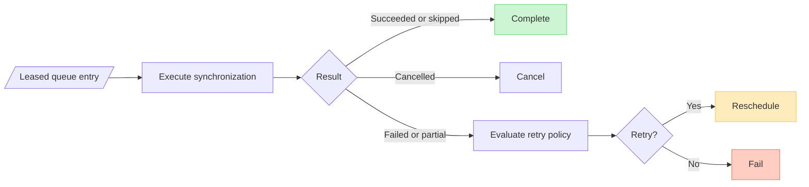

# Queued Synchronization Retry Flow (DL-027)

## Purpose

This document defines the retry evaluation flow that bridges a
`SynchronizationResult` returned by the synchronization coordinator to a
`QueueEntryExecutionOutcome` decision emitted by
`QueuedSynchronizationExecutionHandler`.

---

## Retry evaluation sequence



> [!CAUTION]
> Current offline deferral is incorrectly represented as retry rescheduling:
> an initially deferred entry is assigned `RetryAttempt(1)` even though no
> `RetryPolicy` evaluation occurred. Expired-lease recovery also clears genuine
> retry history. V1 requires an explicit non-retry deferral transition and
> exact attempt preservation across deferral, persistence, and recovery.

---

## Retry attempt accounting

The handler computes the next `RetryAttempt` before calling the evaluator:

```text
entry.retryAttempt == null -> nextAttempt = RetryAttempt(1)
entry.retryAttempt == RetryAttempt(N) -> nextAttempt = RetryAttempt(N + 1)
```

The same `RetryAttempt` value is:
- passed unchanged to `RetryPolicy.evaluate` inside the evaluator
- stored unchanged in `QueueEntryExecutionOutcome.Reschedule.retryAttempt`

---

## Error extraction

| `SynchronizationResult` | Errors evaluated |
|---|---|
| `Failed(error)` | Single error: `listOf(error)` |
| `PartiallySucceeded(errors)` | All errors in order |
| `Succeeded` / `Skipped` / `Cancelled` | None (not evaluated) |

The first error in the list is the primary error preserved in every outcome.

---

## Decision aggregation

| Decision mix | Outcome |
|---|---|
| At least one `Retry` decision | `ShouldRetry` with maximum delay |
| All decisions are `Stop` | `StopRetry` |

The maximum delay is selected across all `Retry` decisions. If two decisions
produce equal delays, either may be selected (implementation uses
`maxByOrNull`).

---

## Overflow-safe timestamp arithmetic

```text
epochMillis   = clock.now().epochMilliseconds
delayMillis   = selectedDelay.milliseconds
sum           = epochMillis + delayMillis
availableAt   = if (sum < 0L) Long.MAX_VALUE else sum
```

Wrap-around to a negative value is detected and clamped to `Long.MAX_VALUE`.

---

## Shared utility boundary

`extractRetryErrors` and `selectMaxRetryDelay` are package-internal functions
in `io.dataloom.runtime.retry`. They are reused by both
`SynchronizationRetryEvaluator` and `SynchronizationRetryOrchestrator`.

Neither function is part of the public API surface.

---

## Constraints

- `SchedulerProvider` is never invoked during retry evaluation.
- `QueueProvider` is never invoked directly by the handler or evaluator.
- The `DataLoomClock` is injected into `SynchronizationRetryEvaluator`; no
  system clock is read. `QueuedSynchronizationExecutionHandler` does not read
  the clock directly.
- `CancellationException` propagates normally and is not caught.
- Unexpected exceptions from the resolver or coordinator are not swallowed.
- No payload or credential is present in any outcome or evaluation result.

---

## Delivery semantics

The `DurableQueueExecutionProcessor → QueuedSynchronizationExecutionHandler`
pipeline provides **at-least-once** delivery semantics, not exactly-once.

A queue entry may be processed more than once if:

- The consumer crashes or loses its lease after executing the pipeline but
  before the `QueueProvider` records the outcome transition.
- The `QueueProvider` transition call fails after the synchronization result
  is produced.

The `QueueEntryExecutionOutcome.Reschedule` path re-enqueues the entry for
another execution cycle. When retry is approved, the rescheduled entry carries
an incremented `retryAttempt` counter so applications and policies can detect
repeated attempts.

Applications that require idempotent or exactly-once semantics must implement
deduplication logic in their synchronization pipelines, storage providers, or
transport providers. DataLoom does not guarantee that the coordinator or
pipeline is invoked at most once per entry.

---

## Queue rescheduling vs SchedulerProvider scheduling

These are distinct mechanisms:

| Mechanism | Interface | Who initiates | Effect |
|---|---|---|---|
| Queue rescheduling | `QueueProvider` (via `QueueRescheduleRequest`) | `DurableQueueExecutionProcessor` | Re-enqueues an entry for future re-acquisition from the durable queue. Driven by `QueueEntryExecutionOutcome.Reschedule`. |
| Scheduler scheduling | `SchedulerProvider` | `SynchronizationRetryOrchestrator` (DL-024) | Registers a future synchronization trigger through the platform scheduler (e.g. `WorkManager`). Used by DL-024 outside the queue path. |

`QueuedSynchronizationExecutionHandler` (DL-027) uses **queue rescheduling**
only. It never invokes `SchedulerProvider`.

`SynchronizationRetryOrchestrator` (DL-024) uses **scheduler scheduling** only.
It never interacts with the durable queue.

---

## Relationship to DL-024 retry orchestration

`SynchronizationRetryOrchestrator` (DL-024) and
`SynchronizationRetryEvaluator` (DL-027) share the same package-internal
error extraction and delay selection utilities. The orchestrator delegates
to the same helpers and preserves its existing decision ordering and maximum
delay selection semantics. No public DL-024 API was changed.
