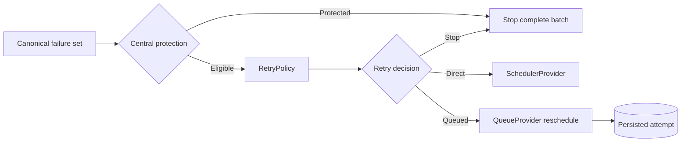

# DataLoom retry boundaries

This document defines ownership for retry classification, policy evaluation,
queue persistence, scheduling, and platform integration.

> [!IMPORTANT]
> DataLoom now enforces a shared fail-closed boundary before invoking custom
> retry policy. Standard backoff and durable circuit breaking are still under
> implementation, so this is not a complete V1 retry engine.

## Canonical producer responsibility

Providers and pipelines own mapping platform-specific failures to sanitized
`DataLoomError` values. They must provide truthful `category` and
`recoverability` fields and must not rely on exception-name or message parsing
inside the retry engine.

## Central runtime protection

The runtime scans the complete ordered error set before custom policy
invocation. Automatic retry is blocked by:

- `Recoverability.NON_RECOVERABLE`;
- `Recoverability.UNKNOWN`;
- authentication;
- authorization;
- serialization;
- validation;
- configuration;
- policy;
- conflict; and
- security failures.

When one protected error exists, the whole batch stops. Custom policy and
scheduler are not invoked. The first protected error remains the primary
blocking evidence.

This rule prevents a retryable sibling failure in a partial result from hiding
a protected failure.

## Policy responsibility

`RetryPolicy` is responsible for eligible errors only:

- accept a `RetryEvaluationRequest`;
- return `Retry` or `Stop` deterministically;
- use already available information; and
- remain platform-independent and free of I/O.

A policy must not execute operations, block, sleep, access network or storage,
call providers, refresh credentials, wait for connectivity, schedule work,
mutate queue state, log sensitive context, or translate cancellation.

Application policies cannot bypass central protection through an ordinary
`RetryDecision.Retry`.

## Runtime responsibility

The runtime owns:

- protected-failure enforcement;
- construction of policy requests;
- decision aggregation;
- attempt advancement at the queue boundary;
- overflow-safe availability calculation;
- routing accepted retry decisions to queue or scheduler transitions; and
- future standard budgets, circuit state, hints, manual operations, and
  observability.

## Queue responsibility

The durable queue owns:

- persisted retry attempts;
- lease-guarded transitions;
- retry availability timestamps;
- deferral without attempt consumption; and
- expired-lease recovery without resetting genuine retry history.

A `RetryDecision` does not mutate the queue directly. The queue processor
translates a runtime outcome into exactly one provider transition.

## Scheduler responsibility

`SchedulerProvider` accepts a canonical schedule request after retry has been
approved. It does not classify recoverability or evaluate policy.

A requested delay is a minimum intent, not an exact platform execution time.

## Connectivity boundary

Connectivity preflight is an execution constraint. An unmet requirement is a
non-retry deferral:

- retry policy is bypassed;
- no error is manufactured;
- no attempt is consumed; and
- existing retry history is preserved.

## Cancellation

`SynchronizationResult.Cancelled` is terminal and not retryable. A thrown
`CancellationException` propagates and must not be converted into a retry stop
reason, provider error, or orchestration status.

## Android boundary

The shared engine does not expose WorkManager types. The Android adapter maps
canonical `ScheduleRequest` values to WorkManager. WorkManager does not own
classification, attempt calculation, or delay-policy selection.

## Kotlin Multiplatform boundary

Retry contracts and runtime rules live in common code. Native Android, KMP
Android, and KMP iOS must expose equivalent observable classification,
attempt, delay, circuit, cancellation, and recovery behavior. Platform limits
must be explicit degraded or unsupported results rather than silent omission.

## Security and privacy

Retry metadata, diagnostics, events, logs, and traces must not contain payloads,
credentials, tokens, keys, authorization headers, checkpoint values, personal
data, or unbounded-cardinality labels.

## Remaining V1 ownership

The shared retry engine still must add standard immediate/fixed/linear/
exponential policies, jitter/random boundaries, attempt and elapsed budgets,
server hints, timeout separation, durable closed/open/half-open circuit state,
controlled probes, manual retry/reclassification, complete observability, and
restart/concurrency/platform qualification.
