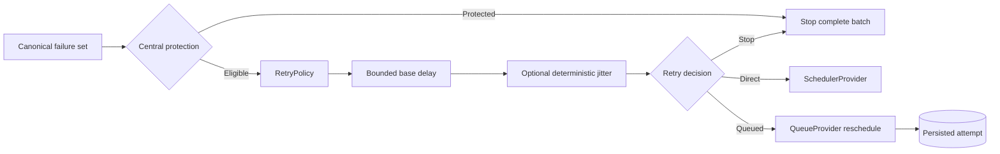

# DataLoom retry boundaries

This document defines ownership for retry classification, policy evaluation,
backoff, jitter, queue persistence, scheduling, and platform integration.

> [!IMPORTANT]
> DataLoom enforces a shared fail-closed boundary before invoking custom retry
> policy and ships deterministic immediate, fixed, linear, and exponential
> backoff, full/equal jitter through an injected deterministic random source, and
> an attempt budget. Durable circuit breaking and the remaining time, hint,
> observability, and administration gates are incomplete, so this is not yet the
> complete V1 retry engine.

## Canonical producer responsibility

Providers and pipelines own mapping platform-specific failures to sanitized
`DataLoomError` values. They must provide truthful `category` and
`recoverability` fields and must not rely on exception-name or message parsing
inside the retry engine.

## Central runtime protection

The runtime scans the complete ordered error set before custom policy
invocation. Automatic retry is blocked by:

- `Recoverability.NON_RECOVERABLE`;
- `Recoverability.UNKNOWN`;
- authentication;
- authorization;
- serialization;
- validation;
- configuration;
- policy;
- conflict; and
- security failures.

When one protected error exists, the whole batch stops. Custom policy, random
source, queue rescheduling, and scheduler are not invoked. The first protected
error remains the primary blocking evidence.

This rule prevents a retryable sibling failure in a partial result from hiding
a protected failure.

## Policy responsibility

`RetryPolicy` is responsible for eligible errors only:

- accept a `RetryEvaluationRequest`;
- return `Retry` or `Stop` deterministically;
- use already available information; and
- remain platform-independent and free of I/O.

A policy must not execute operations, block, sleep, access network or storage,
call providers, refresh credentials, wait for connectivity, schedule work,
mutate queue state, log sensitive context, or translate cancellation.

Application policies cannot bypass central protection through an ordinary
`RetryDecision.Retry`.

## Standard policy ownership

`StandardRetryPolicy` owns configuration-only retry decisions for eligible
errors:

- immediate delay;
- fixed delay;
- linear backoff;
- exponential backoff;
- maximum retry attempts;
- optional full jitter; and
- optional equal jitter.

Linear and exponential calculations clamp before overflow. Attempt one uses the
configured initial delay, and attempt `N` is accepted only when it is within the
configured retry-attempt budget.

The compatibility constructor applies no jitter and preserves the exact base
delay. The jitter-enabled constructor requires an explicit `RetryRandomSource`.
Jitter is applied after base-delay clamping and never raises the configured base
delay or maximum.

The standard policy does not own queue transitions, clocks, elapsed windows,
scheduler invocation, circuit persistence, provider retry hints, or manual
administrative actions.

## Jitter and randomness responsibility

`RetryJitterStrategy` defines three closed modes:

- `None`: preserve the base delay and consume no sample;
- `Full`: choose from `0..baseDelay`; and
- `Equal`: choose from `ceil(baseDelay / 2)..baseDelay`.

A zero base delay and a zero-width equal-jitter window bypass the random source.
Protected failures and exhausted attempts also bypass it.

`RetryRandomSource` is an injected common-code boundary. It receives a
`RetryRandomRequest` containing only:

- policy ID;
- workflow ID;
- session ID;
- operation;
- canonical error code;
- attempt; and
- inclusive upper bound.

It does not receive payloads, arbitrary metadata, provider instances,
credentials, tokens, or exception messages.

A source must be deterministic for equal requests, bounded, non-blocking,
side-effect free, and thread-safe. DataLoom checks its output and fails policy
evaluation when the source violates the requested range rather than silently
clamping it.

`SeededRetryRandomSource` is the built-in stateless implementation. It derives a
bounded sample from the non-secret seed and stable request identity. The same
seed and request produce the same value across JVM, Android, and Kotlin/Native,
independent of concurrent evaluation order. This makes the result reproducible
after restart when the durable identity and seed are restored.

The seeded source is not a cryptographic random-number generator and must not be
used for key, nonce, credential, or security-token generation.

## Runtime responsibility

The runtime owns:

- protected-failure enforcement;
- construction of policy requests;
- decision aggregation;
- attempt advancement at the queue boundary;
- overflow-safe availability calculation;
- routing accepted retry decisions to queue or scheduler transitions; and
- future elapsed and aggregate budgets, circuit state, hints, manual operations,
  and observability.

The runtime treats a policy's final delay, including jitter, as one canonical
minimum delay. It must not apply a second implicit jitter layer.

## Queue responsibility

The durable queue owns:

- persisted retry attempts;
- lease-guarded transitions;
- retry availability timestamps;
- deferral without attempt consumption; and
- expired-lease recovery without resetting genuine retry history.

A `RetryDecision` does not mutate the queue directly. The queue processor
translates a runtime outcome into exactly one provider transition.

The current queue schema does not persist random-source configuration or a
separate jitter record. Restart determinism therefore depends on restoring the
same configured source and the same durable policy/request identity. General
versioned retry-policy configuration persistence remains part of the wider V1
foundation work.

## Scheduler responsibility

`SchedulerProvider` accepts a canonical schedule request after retry has been
approved. It does not classify recoverability, calculate backoff, apply jitter,
or evaluate policy.

A requested delay is a minimum intent, not an exact platform execution time.

## Connectivity boundary

Connectivity preflight is an execution constraint. An unmet requirement is a
non-retry deferral:

- retry policy is bypassed;
- random source is bypassed;
- no error is manufactured;
- no attempt is consumed; and
- existing retry history is preserved.

## Cancellation

`SynchronizationResult.Cancelled` is terminal and not retryable. A thrown
`CancellationException` propagates and must not be converted into a retry stop
reason, provider error, or orchestration status.

## Android boundary

The shared engine does not expose WorkManager types. The Android adapter maps
canonical `ScheduleRequest` values to WorkManager. WorkManager does not own
classification, attempt calculation, delay-policy selection, or jitter.

## Kotlin Multiplatform boundary

Retry contracts and runtime rules live in common code. Native Android, KMP
Android, and KMP iOS must expose equivalent observable classification, attempt,
base-delay, jitter, circuit, cancellation, and recovery behavior. Platform
limits must be explicit degraded or unsupported results rather than silent
omission.

## Security and privacy

Retry metadata, random requests, diagnostics, events, logs, and traces must not
contain payloads, credentials, tokens, keys, authorization headers, checkpoint
values, personal data, full exception messages, or unbounded-cardinality labels.

The deterministic seed is configuration, not secret material. Random-source
implementations must not log stable request identifiers.

## Remaining V1 ownership

The shared retry engine still must add elapsed-time and aggregate-delay budgets,
server hints, timeout separation, durable closed/open/half-open circuit state,
controlled probes, manual retry/reclassification, complete observability, and
restart/concurrency/platform qualification.
