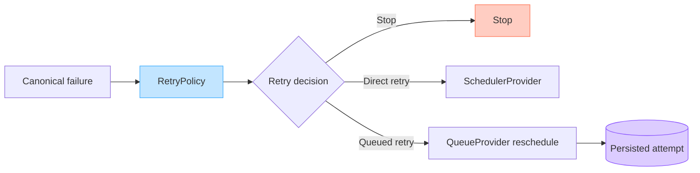

# DataLoom Retry Boundaries (DL-013)

This document describes the architectural boundaries for retry evaluation in
DataLoom. It defines which components are responsible for which retry-related
concerns and what is explicitly outside the scope of the current implementation.

> [!IMPORTANT]
> DL-013 introduced only the policy boundary. Later work added custom retry
> evaluation, direct scheduler-backed orchestration, and queue rescheduling.
> V1 still lacks a standard exponential/jitter policy, attempt and elapsed-time
> enforcement, server-hint policy, durable circuit breaking, and trustworthy
> retry history across every deferral/recovery path.



---

## Policy Responsibility

`RetryPolicy` is responsible for:

- Accepting a `RetryEvaluationRequest`
- Returning a `RetryDecision` (either `Retry` or `Stop`)
- Evaluating already-available information synchronously and deterministically
- Remaining platform-independent and free of I/O

`RetryPolicy` must not:

- Execute the failed operation
- Block the current thread or sleep
- Access network services
- Access application storage
- Schedule work
- Mutate queue state
- Call providers
- Refresh credentials
- Wait for connectivity
- Automatically log sensitive context
- Catch or translate coroutine cancellation

---

## Runtime Responsibility

The DataLoom runtime is responsible for:

- Invoking `RetryPolicy.evaluate()` with the appropriate `RetryEvaluationRequest`
- Acting on the returned `RetryDecision`
- Creating and incrementing `RetryAttempt` values
- Passing `previousDelay` to subsequent evaluations
- Enforcing attempt and elapsed-time limits in the V1 standard engine
- Routing `RetryDecision.Retry` to the scheduler
- Routing `RetryDecision.Stop` to workflow termination or failure handling

---

## Scheduler Responsibility

`SchedulerProvider` is responsible for:

- Accepting a schedule request from the runtime after a `RetryDecision.Retry`
- Delegating to the platform scheduler (WorkManager, AlarmManager, etc.)
- Not deciding whether an operation is recoverable
- Not evaluating retry policy

The conceptual flow:

```text
RetryPolicy.evaluate()
        ↓
RetryDecision.Retry(delay)
        ↓
DataLoom runtime
        ↓
SchedulerProvider.schedule(...)
```

`RetryPolicy` must not call `SchedulerProvider` directly.

---

## Queue Responsibility

The durable queue is responsible for:

- Storing retry attempts in queue records
- Managing lease-guarded queue entry state transitions
- Recovering expired leases

`RetryDecision` does not interact with the queue:

- A `RetryDecision.Retry` does not insert work into the queue.
- A `RetryDecision.Stop` does not remove work from the queue.
- Attempt limits are a V1 requirement and are not yet enforced by a standard
  built-in policy.
- Failed and rejected work must remain inspectable according to future queue
  policy.
- Queue state transitions are not part of DL-013.

---

## Provider Responsibility

Providers are responsible for:

- Executing the actual operation
- Returning `ProviderOperationResult.Success` or `ProviderOperationResult.Failure`
- Mapping platform-specific exceptions to canonical `DataLoomError` values
- Not deciding retry policy

The conceptual flow:

```text
ProviderOperationResult.Failure
        ↓
DataLoomError
        ↓
RetryPolicy.evaluate(RetryEvaluationRequest)
```

Provider-level failures and event-level acknowledgement retries
(`ChangeAcknowledgementStatus.RETRY`) are distinct. Provider-level retry
evaluation uses `RetryPolicy`. Complete event-level acknowledgement retry
orchestration remains a V1 gap.

---

## WorkManager Boundary

The Android WorkManager integration lives in the dedicated
`dataloom-scheduler-workmanager` adapter.

```text
RetryPolicy
        ↓
RetryDecision.Retry
        ↓
Shared runtime
        ↓
SchedulerProvider
        ↓
WorkManagerSchedulerProvider
        ↓
WorkManager
```

The DL-013 contracts must not expose:

- `Result.retry()`
- `BackoffPolicy`
- `WorkRequest`
- `WorkerParameters`
- WorkManager backoff constants

The current `SynchronizationRetryOrchestrator` converts an accepted retry delay
into a canonical `ScheduleRequest` and calls `SchedulerProvider`.
`WorkManagerSchedulerProvider` implements that provider boundary by translating
the request into WorkManager work. WorkManager does not own retry
classification, attempt calculation, or delay-policy selection. See
[WorkManager Scheduler](../android/workmanager-scheduler.md).

---

## Kotlin Multiplatform Boundary

- Retry policy contracts reside in `commonMain` of `dataloom-api`.
- Retry decisions must be reusable across the mandatory native Android, KMP
  Android, and KMP iOS V1 consumer paths.
- Platform scheduling remains provider-specific.
- Backoff calculation is platform-neutral.
- Provider interfaces are preferred over platform scheduler APIs.
- Timing mechanics may differ by platform, but externally observable retry,
  circuit, and recovery semantics must remain equivalent. Any platform
  limitation must be reported as an explicit degraded or unsupported outcome.
- A requested delay is an intent, not an exact execution guarantee.

---

## Backoff Semantics

`RetryDecision.Retry.delay` is the canonical output of backoff evaluation.

Future application policies may implement:

| Strategy           | Conceptual Formula                                   |
|--------------------|------------------------------------------------------|
| Immediate          | `delay = 0`                                          |
| Fixed              | `delay = configured delay`                           |
| Linear             | `delay = initial delay + attempt-based increment`    |
| Exponential        | `delay` grows according to the attempt number        |
| Custom application | Application-defined formula                          |

**DL-013 does not implement any of these algorithms.** The following are
explicitly deferred:

- Fixed-delay policy
- Exponential-backoff policy
- Linear-backoff policy
- Jitter calculation
- Random-number generation
- Multiplier contracts
- Arithmetic overflow handling
- Maximum-delay clamping

V1 built-in policy implementations belong to the approved retry/policy engine
boundaries in ADR-0002, not the generic public contract module.

---

## Attempt-Limit Boundary

- Attempt-limit enforcement belongs to the runtime, not the policy contract.
- A `RetryPolicy` may return `RetryDecision.Stop(ATTEMPT_LIMIT_REACHED)` based
  on configuration passed through its constructor.
- The `RetryAttempt` value in `RetryEvaluationRequest` allows the policy to
  observe the current attempt number.
- Queue providers persist retry attempts during ordinary rescheduling. V1 must
  preserve those attempts across non-retry deferral and expired-lease recovery.

---

## Cancellation Rules

- Coroutine cancellation must not be converted into a `RetryDecision`.
- `RetryPolicy.evaluate()` must not catch or translate `CancellationException`.
- `CancellationException` must propagate normally outside the retry policy.
- The runtime is responsible for handling cancellation above the policy
  evaluation boundary.

---

## Security Restrictions

- Retry metadata must not include credentials, authentication tokens,
  encryption keys, payload bytes, or personal data.
- Errors must not reveal secrets.
- Policy implementations must not automatically log sensitive context.
- Examples and tests must use placeholder values.
- Provider descriptors must not expose internal credentials.

---

## Current V1 gaps

Later issues implemented custom policy evaluation, scheduler-backed direct
rescheduling, queue rescheduling, retry-attempt persistence, and the Android
WorkManager adapter. V1 still requires:

- standard fixed, linear, exponential, and bounded jitter strategies;
- overflow-safe delay calculation and injectable randomness;
- maximum-attempt and maximum-elapsed-time enforcement;
- safe server retry-hint handling;
- durable circuit-breaker closed/open/half-open state and controlled probes;
- explicit non-retry constraint deferral;
- exact retry-history preservation through process death and lease recovery;
- manual retry authorization and audit;
- event-level acknowledgement retry orchestration; and
- parity/qualification across native Android, KMP Android, and KMP iOS.
