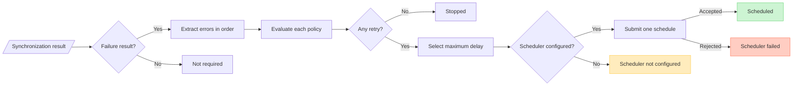

# Retry and Rescheduling Flow (DL-024)

**Module:** `dataloom-runtime`  
**Architecture layer:** Retry orchestration  
**Platform:** Kotlin Multiplatform (commonMain)

---

## Purpose

`SynchronizationRetryOrchestrator` connects `RetryPolicy` evaluation and
`SchedulerProvider` scheduling into a single deterministic operation.

When a synchronization workflow produces a terminal
`SynchronizationResult.Failed` or `SynchronizationResult.PartiallySucceeded`,
the orchestrator:

1. Extracts canonical errors from the result.
2. Evaluates each error through `RetryPolicy` in the original order.
3. Aggregates ordered `RetryDecision` values.
4. If any decision requests retry, selects the maximum `SchedulingDelay`.
5. Submits exactly one `ScheduleRequest` to `SchedulerProvider`.
6. Returns a `RetryOrchestrationResult` describing the terminal outcome.

---

## Sequence Diagram



---

## Eligible SynchronizationResult Variants

| Variant               | Eligible? | Behavior                            |
|-----------------------|-----------|-------------------------------------|
| `Succeeded`           | No        | Returns `NOT_REQUIRED` immediately  |
| `Skipped`             | No        | Returns `NOT_REQUIRED` immediately  |
| `Cancelled` (result)  | No        | Returns `NOT_REQUIRED` immediately  |
| `Failed`              | Yes       | Single `error` evaluated once       |
| `PartiallySucceeded`  | Yes       | All `errors` in original order      |

### Cancelled result vs thrown CancellationException

A `SynchronizationResult.Cancelled` is a terminal outcome produced by the
synchronization runtime. It is not eligible for automatic retry.

A thrown `CancellationException` is a coroutine-cancellation signal from
`SchedulerProvider.schedule`. It propagates normally and is never converted
into a `RetryOrchestrationResult`.

---

## Canonical Error Extraction

### `SynchronizationResult.Failed`

```text
Failed.error  →  [ DataLoomError ]  (list of one)
```

### `SynchronizationResult.PartiallySucceeded`

```text
PartiallySucceeded.errors  →  [ err0, err1, ..., errN ]  (original order preserved)
```

Errors are not sorted, deduplicated, or filtered before policy evaluation.

---

## RetryPolicy Evaluation

For each canonical error, a `RetryEvaluationRequest` is built with:

```kotlin
RetryEvaluationRequest(
    synchronizationRequest = request.synchronizationRequest,
    operation             = request.retryOperation,
    error                 = canonicalError,
    attempt               = request.retryAttempt,   // NOT incremented
    previousDelay         = null,
    provider              = null,
)
```

`RetryPolicy.evaluate` is invoked **synchronously** once per error.

**RetryAttempt is not incremented by this orchestrator.** Attempt advancement
belongs to its caller; the queue-backed handler computes the next attempt
before evaluation.

Unexpected exceptions from `RetryPolicy` propagate normally.

---

## Multi-Error Decision Aggregation

When multiple errors are evaluated, their decisions are preserved in the
original evaluation order:

```text
error[0]  →  RetryPolicy.evaluate()  →  decision[0]
error[1]  →  RetryPolicy.evaluate()  →  decision[1]
error[2]  →  RetryPolicy.evaluate()  →  decision[2]
```

`RetryOrchestrationResult.decisions` preserves this order unchanged.

Stop decisions alongside retry decisions do not prevent scheduling — stopped
errors do not block retryable work.

---

## Maximum-Delay Selection

When one or more decisions are `RetryDecision.Retry`, the
**maximum** `SchedulingDelay` is selected:

```text
decisions:
  Retry(500ms)   ←  retryable error
  Stop(...)      ←  non-retryable error
  Retry(2000ms)  ←  retryable error
  Retry(1000ms)  ←  retryable error

selected delay:  2000ms  (maximum)
```

**Why maximum?** Scheduling earlier than one of the policy decisions would
violate that policy's minimum retry delay.

Rules:

- Stop decisions do not contribute a delay.
- Decision order does not affect selection.
- No jitter, average, or random delay is introduced.
- No system clock is accessed.

---

## Single Schedule Operation

At most one `ScheduleRequest` is submitted per `evaluateAndSchedule`
invocation.

```text
[err0 → Retry(500ms)]   ─┐
[err1 → Stop]            ├─→ ONE ScheduleRequest(delay=2000ms)
[err2 → Retry(2000ms)]  ─┘
```

---

## ScheduleRequest Shape

```kotlin
ScheduleRequest(
    id                    = request.scheduleId,          // supplied, not generated
    synchronizationRequest = request.synchronizationRequest, // unchanged
    delay                 = selectedMaxDelay,
    constraints           = configuration.constraints,
    existingPolicy        = configuration.existingSchedulePolicy,
)
```

No new `ScheduleId` is generated. The original `SynchronizationRequest` is
not mutated.

---

## No-Retry Path

```text
SynchronizationRetryOrchestrator
    │
    ├─ evaluate each error
    │     └─→ RetryDecision.Stop (all)
    │
    └─→ RetryOrchestrationResult(
              status   = STOPPED,
              decisions = [Stop, Stop, ...],
              selectedDelay = null,
              scheduleReceipt = null,
              schedulerError = null,
          )
```

---

## Scheduler-Failure Path

```text
SynchronizationRetryOrchestrator
    │
    ├─ evaluate → Retry(1000ms)
    ├─ select delay = 1000ms
    ├─ schedulerProvider.schedule(...)
    │     └─→ ProviderOperationResult.Failure(canonicalError)
    │
    └─→ RetryOrchestrationResult(
              status        = SCHEDULER_FAILED,
              decisions     = [Retry],
              selectedDelay = 1000ms,
              scheduleReceipt = null,
              schedulerError  = canonicalError,
          )
```

`RetryPolicy` is not re-evaluated. `SchedulerProvider` is not called again.
The canonical error is preserved unchanged.

---

## Boundaries

### Does Not Execute Synchronization

The orchestrator does not call any synchronization pipeline,
`SynchronizationExecutionCoordinator`, storage provider, or transport
provider. It schedules a future execution request; it does not run
synchronization itself.

### Does Not Process Durable Queue Entries

`QueueProvider` is not called. The orchestrator does not enqueue, acquire,
update, or complete queue entries. Durability depends entirely on the supplied
`SchedulerProvider`.

### Does Not Check Connectivity

`ConnectivityProvider` is not called. The orchestrator does not query current
connectivity, delay until online, observe network changes, or modify
`ScheduleConstraints` based on runtime connectivity state.

### Does Not Dispatch Events

No `RetryScheduled` event, observer notification, or progress event is emitted.
The `RetryOrchestrationResult` contains sufficient information for a future
event layer to emit a `RetryScheduled` event.

### Does Not Initialize Providers

Provider lifecycle methods (`initialize`, `health`, `close`) are not called.
The orchestrator requires providers to be already initialized.

### Does Not Own a CoroutineScope

The orchestrator is a stateless `suspend` function. It does not own a
`CoroutineScope`, select a dispatcher, or create any thread.

---

## Module Placement

```text
dataloom-runtime/src/commonMain/kotlin/io/dataloom/runtime/retry/
    SynchronizationRetryRequest.kt
    RetrySchedulingConfiguration.kt
    RetryOrchestrationStatus.kt
    RetryOrchestrationResult.kt
    SynchronizationRetryOrchestrator.kt

dataloom-runtime/src/commonTest/kotlin/io/dataloom/runtime/retry/
    SynchronizationRetryOrchestratorTest.kt
```

---

## Dependencies

`dataloom-runtime` retry orchestration depends on:

| Contract                  | Source module     |
|---------------------------|-------------------|
| `RetryPolicy`             | `dataloom-api`    |
| `RetryEvaluationRequest`  | `dataloom-api`    |
| `RetryDecision`           | `dataloom-api`    |
| `RetryAttempt`            | `dataloom-api`    |
| `RetryOperation`          | `dataloom-api`    |
| `SchedulerProvider`       | `dataloom-api`    |
| `ScheduleRequest`         | `dataloom-api`    |
| `ScheduleReceipt`         | `dataloom-api`    |
| `ScheduleConstraints`     | `dataloom-api`    |
| `ExistingSchedulePolicy`  | `dataloom-api`    |
| `SchedulingDelay`         | `dataloom-api`    |
| `SynchronizationResult`   | `dataloom-api`    |
| `DataLoomError`           | `dataloom-api`    |
| `ProviderOperationResult` | `dataloom-api`    |

No production dependency on `dataloom-testing`.
No Android API.
No JVM-only API.

---

## Related Documentation

- [Retry Policy Contracts (DL-013)](../api/retry-policy.md)
- [Scheduler Provider (DL-012)](../api/scheduler-provider.md)
- [Retry Boundaries (DL-013)](retry-boundaries.md)
- [Background Execution Boundaries (DL-012)](background-execution-boundaries.md)
- [Retry Orchestration API Reference (DL-024)](../api/retry-orchestration.md)
