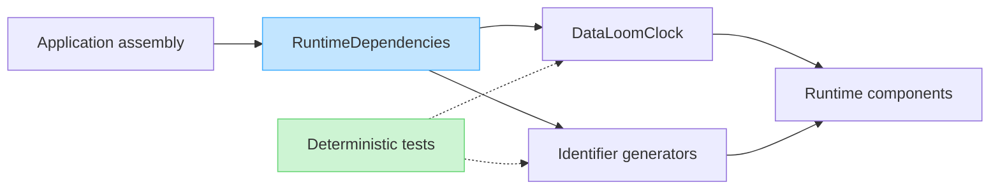

# Runtime Dependencies (DL-017)

**Package:** `io.dataloom.core.runtime`

## Overview

`RuntimeDependencies` is the initial dependency container for the DataLoom
shared runtime. It groups every infrastructure dependency that runtime
components need to perform their work — currently the wall-clock source and
the identifier generators.

This document describes why runtime dependencies are explicit, how ownership
is structured, and how the container fits into the broader DataLoom
architecture.

---

## Why runtime dependencies are explicit

DataLoom components must be testable in isolation. If components read a
system clock or generate identifiers through global state, tests cannot
control the values produced. Deterministic testing requires that every
source of time and every source of identifiers can be replaced with a
test-controlled implementation.

Making every dependency explicit:

- Removes hidden platform-clock access from production components.
- Removes hidden randomness from test scenarios.
- Makes every dependency visible to the caller.
- Enables any injection approach the application team prefers.



---

## Clock ownership

`RuntimeDependencies.clock` holds the single `DataLoomClock` instance
used by the runtime when a current `DataLoomInstant` is required.

The runtime:

- Calls `clock.now()` only when it needs to record a timestamp.
- Passes the resulting `DataLoomInstant` explicitly to model constructors.
- Does not cache the result of `clock.now()` for reuse across operations.

Models:

- Receive `DataLoomInstant` as an explicit constructor parameter.
- Do not call the clock themselves.

---

## Identifier-generator ownership

`RuntimeDependencies.identifiers` holds a `RuntimeIdentifierGenerators`
instance that groups all generator types required by the current runtime
contracts:

| Property | Type | Use |
|---|---|---|
| `synchronizationEventIds` | `IdentifierGenerator<SynchronizationEventId>` | New lifecycle events |
| `queueEntryIds` | `IdentifierGenerator<QueueEntryId>` | New queue entries |
| `queueLeaseIds` | `IdentifierGenerator<QueueLeaseId>` | New queue leases |
| `conflictIds` | `IdentifierGenerator<ConflictId>` | Detected conflicts |

Generators for application-owned identifiers are not included in
`RuntimeIdentifierGenerators`.

---

## Absence of global singletons

`RuntimeDependencies` and `RuntimeIdentifierGenerators` do not expose any
global singleton, companion-object mutable field, service locator, or
thread-local state. All dependencies are held as immutable properties and
passed explicitly.

There is no `DataLoomRuntime.instance`, no `RuntimeDependencies.default`,
and no `GlobalClock`.

---

## Hilt, Koin, and manual construction

DataLoom runtime behavior is independent of the dependency-injection
mechanism used by the host application.

Applications may construct `RuntimeDependencies` using any approach:

**Manual construction:**
```kotlin
val dependencies = RuntimeDependencies(
    clock = applicationClock,
    identifiers = RuntimeIdentifierGenerators(
        synchronizationEventIds = eventIdGenerator,
        queueEntryIds = queueEntryIdGenerator,
        queueLeaseIds = queueLeaseIdGenerator,
        conflictIds = conflictIdGenerator,
    ),
)
```

**Hilt:** Hilt may validate and create these objects at compile time using
`@Provides` methods in a Hilt module.

**Koin:** Koin may resolve them at runtime using a module definition.

DataLoom itself does not depend on Hilt, Dagger, Koin, or any other
dependency-injection framework.

---

## Android-first and KMP considerations

`RuntimeDependencies` and `RuntimeIdentifierGenerators` are declared in
`dataloom-core` common code and are used by the implemented shared runtime.
The shared modules currently declare JVM plus host-gated Apple targets; they
do not yet declare the explicit KMP Android target required for V1.

Neither class depends on Android APIs, `java.time`, or any third-party
date-time library. Both are safe for use in Kotlin Multiplatform common code.
`DataLoomClock` and `DataLoomInstant` are now sourced from the dependency-root
`dataloom-model` module while retaining their existing
`io.dataloom.api.time` fully qualified names.

Platform-specific clock or identifier implementations must be supplied through
the injection boundary, not hard-coded into the runtime container.

---

## Provider and runtime integration

The DL-017 `RuntimeDependencies` scope remains deliberately narrow: the class
contains only the clock and identifier generators. It does not own provider
selection, provider lifecycle, policy configuration, or observers.

Provider and runtime construction now exist through separate components,
including `ProviderRegistry`, `ProviderLifecycleCoordinator`,
`DataLoomBuilder`, and the runtime facade. Keeping those components separate
from `RuntimeDependencies` avoids turning the deterministic clock/identifier
container into a service locator.

---

## Current synchronization-runtime status

Shared foundations now exist for synchronization orchestration, durable queue
processing, retry evaluation and rescheduling, conflict orchestration, event
dispatch, and connectivity-aware execution. These implementations consume the
explicit runtime dependencies where time or identifiers are required.

This is an implemented foundation, not a complete V1 support claim. Standard
retry/circuit-breaker behavior, generic conflict persistence and built-in
policies, production observability, mandatory platform adapters, and
native Android/KMP Android/KMP iOS consumer qualification still require
completion before release.
