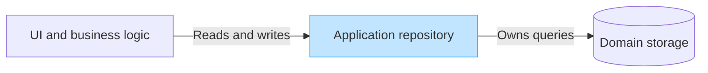
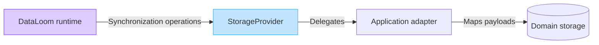

# DataLoom Storage Boundaries

## Overview

This document defines the storage boundaries in DataLoom. It explains what
application code owns, what DataLoom owns, and how the two interact through the
`StorageProvider` SPI.

---

## Application Repository Ownership

The host application owns all domain data and domain queries. The application
repository is the authoritative API through which UI and business logic read
and modify domain data.

DataLoom does not replace, wrap, or proxy the application repository.
DataLoom does not provide general-purpose query methods such as `getCustomer`,
`observeOrders`, `readEntity`, `queryTable`, or `executeSql`.

---

## Application Domain Storage

The application continues to own:

- Domain models
- Database schemas
- DAOs and queries
- Repository implementations
- Mapping between domain entities and DataLoom payloads
- Transactions
- Encryption policy
- Secure-storage policy

DataLoom does not prescribe storage technology, schema structure, or query
patterns for domain data.

---

## DataLoom Synchronization Adapter

DataLoom interacts with application storage through the `StorageProvider` SPI:

`StorageProvider` is a **synchronization adapter**, not a general-purpose
database API. Its role is limited to:

- Reading outbound change sets for DataLoom to push to the remote
- Applying inbound change sets received from the remote

---

## Why DataLoom Does Not Provide Domain Queries

Domain queries belong to the host application for several reasons:

- The application owns entity models, schemas, and relationships.
- Query complexity, performance, and caching strategies are business concerns.
- Exposing general queries through DataLoom would couple the SDK to
  application-specific data shapes.
- Applications using Room, SQLDelight, DataStore, or custom storage each have
  their own idiomatic query patterns.

DataLoom remains neutral to these choices.

---

## DataLoom Infrastructure Storage

DataLoom infrastructure persistence is separate from application domain
storage. Infrastructure concerns include:

- Durable synchronization queue persistence
- Retry records
- Idempotency records

The current `dataloom-queue-room` module provides Android durable queue
persistence through `QueueProvider`.

DL-011 introduces the `readCheckpoint` and `writeCheckpoint` operations on
`StorageProvider` for persisting opaque `SynchronizationCheckpoint` values,
but no concrete checkpoint storage implementation is provided. Checkpoint
deletion and standalone durable retry/idempotency-record persistence remain
unimplemented and must not share schemas or DAOs with application domain
storage.

---

## Room Guidance

Room is appropriate for:

- Android application domain data
- Complex local queries
- Transactional application of remote changes
- Current Android DataLoom queue persistence through the dedicated
  `dataloom-queue-room` module

`dataloom-queue-room` implements `QueueProvider` only. It is not a general
Room-backed `StorageProvider` for application domain data or synchronization
checkpoints. A reusable Room-backed `StorageProvider` remains unimplemented,
and its V1 technology and artifact boundary are not yet decided.

DL-009 did not provide a concrete Room implementation; the later queue module
must not be misrepresented as filling that broader storage-provider scope.

---

## SQLDelight Guidance

SQLDelight is appropriate for:

- Kotlin Multiplatform persistence
- Android and Apple shared storage implementations
- Potential KMP provider integration

Applications using SQLDelight may implement `StorageProvider` using
SQLDelight-generated queries inside the adapter, keeping SQLDelight types
outside the shared DataLoom public surface.

DataLoom has not selected SQLDelight as its cross-platform persistence
technology. Whatever technology is selected must implement and qualify the
mandatory KMP iOS persistence and recovery capability for V1.

---

## DataStore Guidance

DataStore is appropriate primarily for:

- Small configuration values
- Lightweight checkpoints
- Runtime preferences
- Small opaque state

DataStore should not be presented as the default storage for large change sets
or durable synchronization queues. Applications may use DataStore inside a
`StorageProvider` adapter for appropriate use cases.

---

## SharedPreferences Guidance

SharedPreferences is supported only through application-defined or legacy
adapters where appropriate.

It should not be recommended for complex synchronization state or large change
sets. New applications should prefer DataStore for preference-like storage.

---

## Custom Storage

Applications may implement `StorageProvider` using any technology that
satisfies the contract. The `StorageProvider` SPI imposes no requirement on
the underlying storage engine.

---

## Encryption Boundary

`StorageProvider` receives and delivers opaque `DataLoomPayload` values.

- Payloads may be plaintext or already encrypted according to application
  policy.
- Storage-provider implementations must not assume plaintext.
- DataLoom core does not automatically encrypt or decrypt payloads.
- Encryption-provider contracts will be defined separately in a later issue.
- Applications remain responsible for key management and secure-storage policy.

Do not implement encryption in `StorageProvider` implementations unless the
application explicitly applies it before passing payloads to DataLoom.

---

## Boundary Summary

| Concern | Owner |
|---|---|
| Domain models, schemas, DAOs | Host application |
| Application queries (domain reads) | Host application |
| Application repository | Host application |
| Mapping domain entities to DataLoom payloads | Host application |
| Transactions, encryption, key management | Host application |
| Outbound change-read adapter | `StorageProvider` implementation |
| Inbound change-apply adapter | `StorageProvider` implementation |
| Outbound acknowledgement recording | `StorageProvider` implementation |
| Checkpoint read/write persistence | `StorageProvider` implementation |
| Checkpoint apply-before-advance timing | DataLoom inbound runtime pipeline |
| Synchronization orchestration | DataLoom runtime |
| DataLoom workflow queue persistence | `QueueProvider` implementation |

---

## Related Documentation

- [`StorageProvider` API](../api/storage-provider.md)
- [Provider SPI](../api/provider-spi.md)
- [Transport Boundaries](./transport-boundaries.md)
- [Platform Strategy](./platform-strategy.md)
- [Modules](./modules.md)
- [Acknowledgement Contracts](../api/acknowledgement-contracts.md)
- [Checkpoint Contracts](../api/checkpoint-contracts.md)
