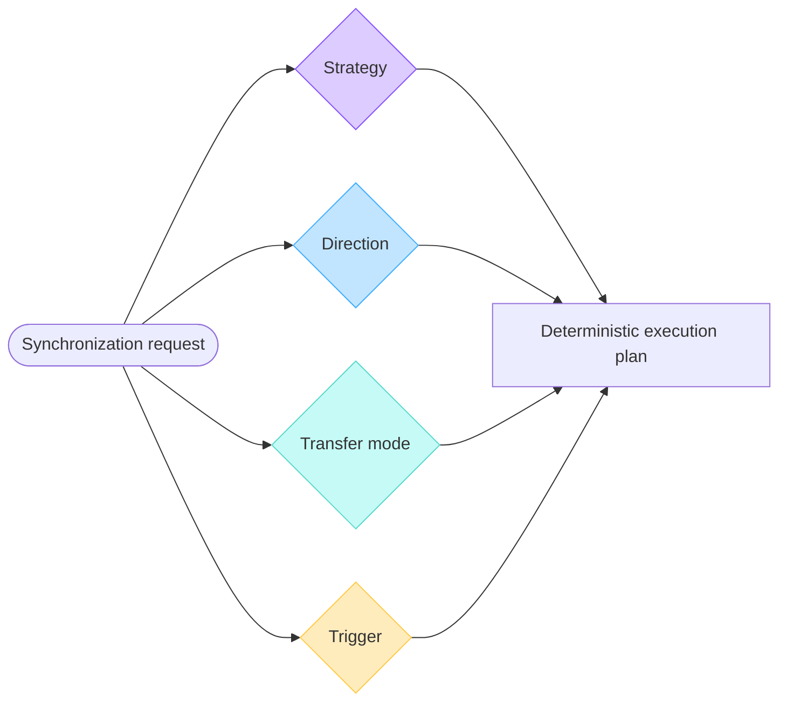
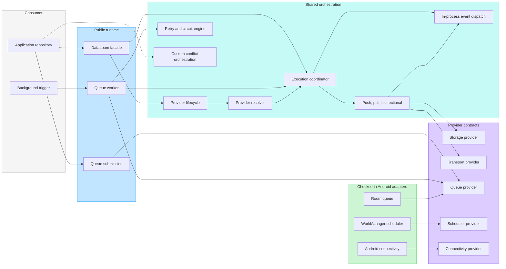
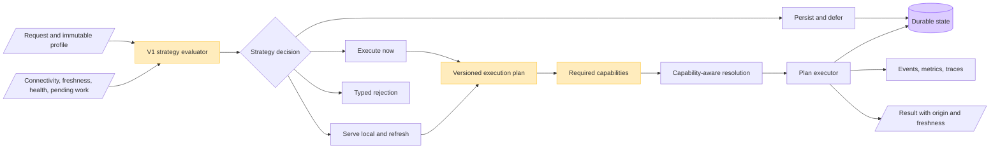
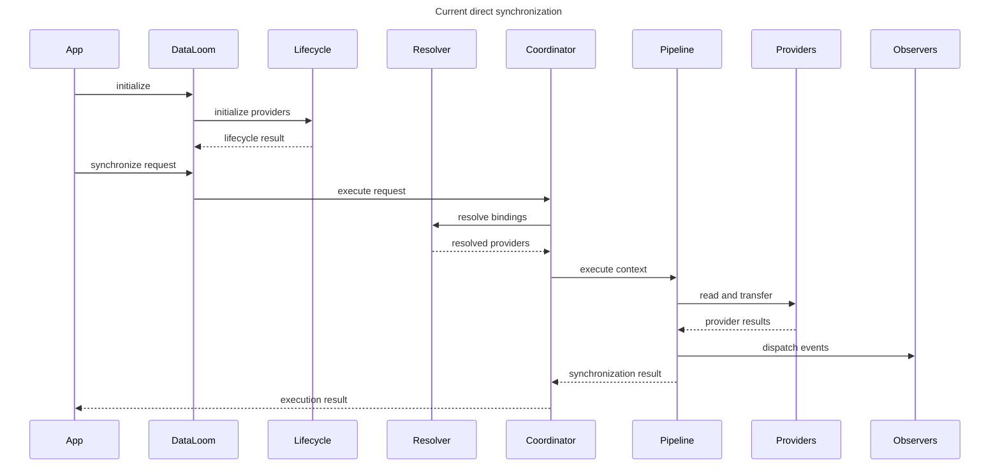
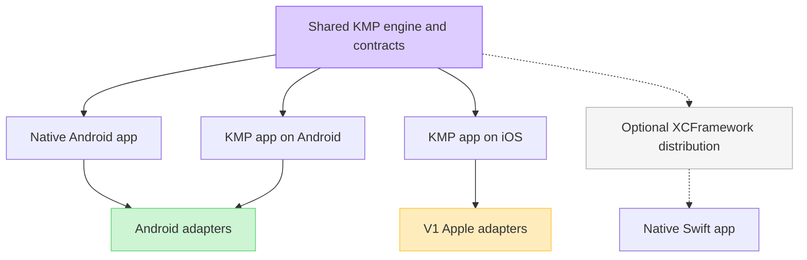

# DataLoom system overview

DataLoom is a policy-driven synchronization SDK. It coordinates data movement,
durability, retry, conflict handling, and operational signals while leaving
domain data models and server contracts with the application.

> [!IMPORTANT]
> This page shows both the **current repository foundation** and the
> **mandatory V1 target**. Amber components in target diagrams are release
> requirements, not claims that the current code already implements them.

## Product purpose

Applications should be able to select a synchronization strategy without
rebuilding orchestration for each platform or transport:

| Strategy | Primary intent |
|---|---|
| Offline-first | Accept local intent durably and synchronize when possible |
| Remote-first | Prefer authoritative remote data with an explicit safe fallback |
| Cache-first | Return a fresh cache immediately and refresh by policy |
| Network-only | Use the remote source without storage or queue side effects |
| Hybrid | Compose explicit local, remote, cache, and reconciliation rules |
| Adaptive | Deterministically select an allowed concrete strategy from runtime evidence |

All six are required for V1. See the
[strategy guide](../strategies/README.md) for their behavior contracts.

## Four independent dimensions

DataLoom must not encode strategy as a synonym for direction or scheduling.

The dimensions answer different questions:

- **Strategy** — which source is authoritative, when fallback is allowed, what
  may be returned, and what must be persisted?
- **Direction** — does data move out, in, or both ways?
- **Transfer mode** — is the transfer full or incremental?
- **Trigger** — was work requested manually, periodically, by an event, or by
  another runtime condition?

## Current repository foundation

The current implementation provides shared contracts and runtime foundations,
not the complete V1 strategy engine.

### What is present

- shared request, payload, change, result, progress, and provider contracts;
- deterministic provider registration, lifecycle, binding, and resolution;
- outbound push, inbound pull, and bidirectional pipelines;
- durable queue processing, application-owned work encoding, and bounded
  strategy-decision identity across in-memory, Room, and Apple stores;
- versioned contracts and deterministic planning for all six strategies, plus
  direct network-only and remote-first execution;
- the standard retry/circuit engine, six timeout boundaries, durable Room/Apple
  state, authorized administration, and bounded telemetry foundations;
- custom conflict contracts plus orchestration foundations;
- in-process lifecycle, progress, retry, conflict, and operational event
  dispatch;
- Android connectivity, Room queue, and WorkManager adapters; and
- Kotlin/Native Apple targets, file-backed queue/retry/circuit state,
  XCFramework assembly, header audit, and Swift smoke validation.

### What is not yet complete

- complete offline-first, cache-first, hybrid, and adaptive runtime semantics,
  plus immutable accepted execution-plan reconstruction and replay;
- complete connectivity/cache/fallback/retry/conflict/restart matrices for all
  six strategies;
- real Android and Apple process-termination/relaunch evidence and genuine
  cross-process circuit-probe contention where supported;
- generic built-in conflict policies, durable conflict records, and recovery;
- durable operational events, metrics, tracing exporters, and operational
  read models;
- asset upload/download with chunking, streaming, integrity, and resume;
- a permission-bounded plugin platform beyond provider interfaces;
- tenant isolation, administration, policy governance, and audit controls; and
- complete native Android, KMP Android, and KMP iOS consumer qualification.

Use the [audit index](../audits/README.md) for the current conformance record
and the original expanded-V1 requirement baseline.

## V1 target execution model

V1 planning must happen before provider resolution. That prevents the current
“storage plus transport for every request” assumption from making
network-only, cache-only, or deferred plans impossible.

The evaluator returns a concrete decision and plan, not another loose label.
The plan records required steps and capabilities. A network-only plan can
therefore require transport without storage, while offline-first can require a
transactional local-intent/outbox boundary and durable scheduling.

## Current direct-execution sequence

This sequence reflects the current shared runtime at a high level. Individual
pipeline pages define their exact provider call order.

Connectivity preflight and rejection can occur before pipeline execution.
Direct execution does not automatically enqueue rejected work. Queue-backed
execution is a separate path.

## Product boundary

| DataLoom owns | Application or service owns |
|---|---|
| Strategy evaluation and deterministic execution plans | Domain models and business invariants |
| Synchronization lifecycle and provider orchestration | API endpoints and server authorization |
| Durable queue, retry, circuit, and recovery semantics | Credential acquisition and secure storage |
| Conflict policy framework and built-in generic policies | Domain-specific merge meaning when required |
| Transfer/checkpoint/acknowledgement coordination | UI state, repositories, and product workflows |
| Operational event model, metrics, traces, and audit hooks | Monitoring backend choice and alert response |
| Asset transfer protocol orchestration | Asset business ownership and retention rules |
| Plugin permission and lifecycle boundaries | Which trusted plugins are enabled |

DataLoom may provide safe generic policies and utilities, but it must not infer
business truth from opaque payloads.

## Platform model

Native Android support does not create an iOS artifact for a purely native
Android application. KMP consumers share common code and select Android and
iOS targets in the same multiplatform project.

## Read next

- [Synchronization strategy guide](../strategies/README.md)
- [Module architecture](./modules.md)
- [Platform strategy](./platform-strategy.md)
- [Runtime assembly](./runtime-assembly.md)
- [ADR-0002: V1 artifact and foundation architecture](../adr/ADR-0002-v1-artifact-and-foundation-architecture.md)
- [V1 production-readiness audit](../audits/DL-AUDIT-004-v1-production-readiness.md)
