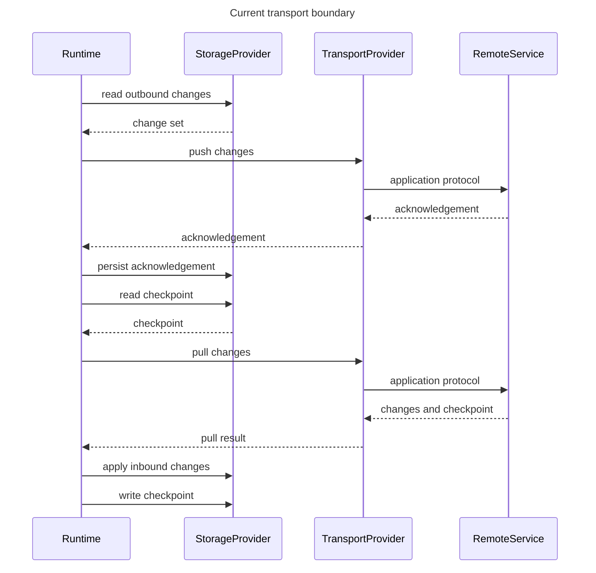

# DataLoom Transport Boundaries

This document describes the architectural boundary between DataLoom transport
orchestration and application-owned remote communication integrations.

## DataLoom transport orchestration

DataLoom runtime coordinates synchronization direction and workflow policy.

### Bidirectional

The runtime coordinates push and pull according to workflow policy.
`TransportProvider` must not independently decide synchronization direction.

### Critical checkpoint rule (DL-011)

> A next checkpoint must not be persisted until all inbound changes
> associated with that checkpoint have been applied successfully.

`TransportProvider` must not modify storage directly, and `StorageProvider`
must not perform transport. The checked-in outbound and inbound pipelines
enforce this order. Complete strategy-aware planning, streaming transports,
and V1 qualification remain open.
See [Checkpoint Contracts](../api/checkpoint-contracts.md) and
[Acknowledgement Contracts](../api/acknowledgement-contracts.md).

## Application ownership of API contracts

The host application owns:

- Remote API contracts
- Endpoint definitions
- Authentication and authorization
- Token refresh
- Certificate pinning
- Request and response DTOs
- Serialization and deserialization
- Encryption and compression policy
- Protocol-specific configuration
- Business validation

DataLoom owns synchronization orchestration and shared transport SPI contracts.

## REST guidance

A concrete provider may adapt `ChangeSet` values to application-owned REST
clients and DTOs. The shared SPI must not expose URLs, HTTP methods, headers,
status codes, request builders, or HTTP client types.

A future `dataloom-retrofit` artifact may offer Retrofit-based adaptation while
keeping Retrofit types outside DataLoom shared APIs.

## GraphQL guidance

`dataloom-transport-graphql` is an optional, independently consumable reference
[`TransportProvider`](../api/transport-provider.md) implementation backed by
Apollo Kotlin 4.x. It maps a DataLoom push to a GraphQL mutation and a pull to
a GraphQL query. The module is schema-agnostic: application-owned generated
Apollo operation types and response adapters are supplied by the application
subclass; they never enter the shared DataLoom API surface.

GraphQL documents, generated models, and Apollo client types must remain outside
the shared DataLoom contracts. `dataloom-transport-graphql` depends only on
`dataloom-api` and the Apollo Kotlin runtime; core modules (`dataloom-model`,
`dataloom-api`, `dataloom-core`, `dataloom-runtime`) do not gain Apollo as a
dependency.

See `dataloom-transport-graphql/README.md` for integration guidance and the
quickstart.

## gRPC guidance

A future provider may map opaque payloads to application-owned protobuf
messages or gRPC stubs. Generated message types and service definitions must
not be exposed through DataLoom public contracts.

## WebSocket and streaming limitations

Streaming lifecycle, subscriptions, persistent connections, and related
contracts are deferred. The initial transport SPI represents request-response
synchronization operations only.

## Ktor and KMP guidance

A future `dataloom-ktor` artifact may provide Kotlin Multiplatform-compatible
transport integration. The shared SPI remains KMP-safe by avoiding Ktor client
APIs or any platform-specific transport client type.

## Authentication boundary

Authentication is application-owned.

- Transport providers may integrate with application-controlled token sources
  and authentication systems.
- `SynchronizationRequest`, `ExecutionContext`, and `DataLoomMetadata` must not
  contain raw credentials or access tokens.
- DataLoom does not refresh tokens automatically in this scope.
- Provider failures must map authentication problems to `DataLoomError`.
- Credentials must not be logged.

No authentication provider is introduced by DL-010.

## Serialization boundary

`DataLoomPayload` is opaque.

- Concrete transport providers may use application-controlled serializers.
- DataLoom shared APIs do not assume JSON, XML, protobuf, CBOR, or another
  format.
- Payload content type is caller-declared metadata only.
- Content type does not prove that payload bytes are valid.

Serialization-provider contracts are deferred.

## TLS and encryption boundary

Transport security is configured by the application or a concrete transport
provider.

- TLS, certificate pinning, and mTLS are outside DataLoom shared API scope.
- Payload-level encryption may be introduced later through an
  `EncryptionProvider`.
- Transport providers must not assume plaintext payloads.
- DataLoom core does not manage certificates or private keys.
- Secrets, credentials, and key material must not be placed in metadata.

## Why DataLoom does not expose protocol-client types

DataLoom keeps protocol-client types out of the shared API to preserve:

- Platform independence for common Kotlin Multiplatform code
- Strict module boundaries between orchestration and infrastructure
- Application ownership of remote API evolution
- Freedom to use REST, GraphQL, gRPC, WebSocket, MQTT, Bluetooth, NFC, local
  IPC, or custom enterprise protocols without changing shared contracts
- Testability without real network stacks or platform-specific clients

Concrete transport providers may depend on protocol libraries in dedicated
artifacts, but the shared SPI must remain technology-neutral.
