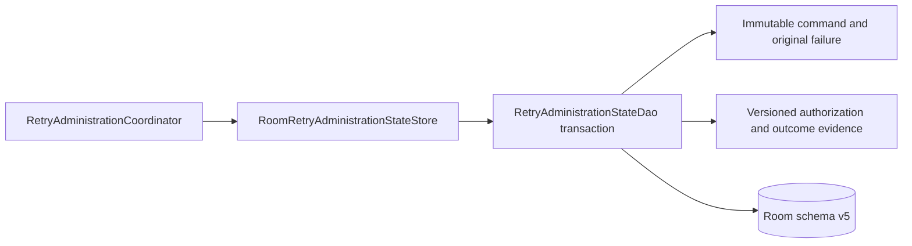

# DL-040 Android retry-administration persistence checkpoint

## Scope

This checkpoint adds the production native Android `RetryAdministrationStateStore`
using AndroidX Room. It persists authorized manual retry command admission,
idempotency, reclassification evidence, terminal outcomes, and redacted audit
history across process death and database reopen.

It does not implement queue mutation. A queue-provider-specific
`RetryAdministrationExecutor` still requires live terminal-state validation and
an atomic command receipt in the same queue transaction.

## Architecture

Room and SQLite types remain internal. The public boundary is the existing
platform-neutral retry-administration store contract.

## Durable model

The `retry_administration_states` table stores:

- command, queue-entry, and principal identifiers;
- request time, action, and bounded sanitized reason;
- immutable original error code, category, severity, and recoverability;
- command status;
- authorization identifier and effective recoverability;
- update time and rejection reason;
- optional redacted execution-failure classification; and
- monotonic record version.

Payloads, credentials, headers, stack traces, raw exception text, provider
instances, and arbitrary metadata are excluded.

## Compare-and-set invariants

1. Create uses insert-if-missing and starts at version zero.
2. Update requires the exact persisted version.
3. The DAO loads and verifies immutable command input inside the same Room
   transaction before mutation.
4. Reuse of a command id with changed immutable input returns the exact current
   record as a conflict.
5. Only mutable authorization/outcome evidence is updated.
6. Version exhaustion is rejected before Room access.
7. Partial execution-failure column groups fail closed during reconstruction.
8. Model and enum invariant failures map to a canonical non-recoverable state
   error.
9. Database failures are sanitized and recoverable; cancellation propagates.

## Schema and migration

- Room database version: 5
- Added migration: `MIGRATION_4_5`
- Added table: `retry_administration_states`
- Existing queue and circuit rows remain unchanged.
- The migration test verifies a version-4 queue row survives, the new table is
  present and empty, and the database opens through the complete migration set.
- Committed schema identity: `b274874ff22c955b568d8b61c4e64dbc`

## Qualification

The one-time schema evidence lane generated the exact Room v5 schema, verified
its identity and expected table set, ran Room unit tests, compiled Android
instrumentation tests, committed the schema, and removed itself.

Before merge, one clean trusted head must pass:

1. Pull Request Validation;
2. Android static/unit validation;
3. committed Room schema verification;
4. Room managed-device migration tests; and
5. Apple regression validation.

## Remaining DL-040 work

- queue-provider-specific retry-administration execution;
- atomic command receipts for Android Room and the Apple queue format;
- executable restart and forced-process-death evidence;
- app-group/multi-process and high-contention fault injection;
- complete retry/circuit observability and health integration; and
- Book 2 `AC-FUNC-004` reference-flow qualification.
