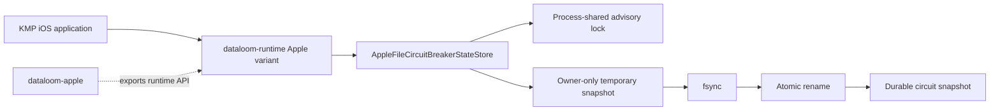
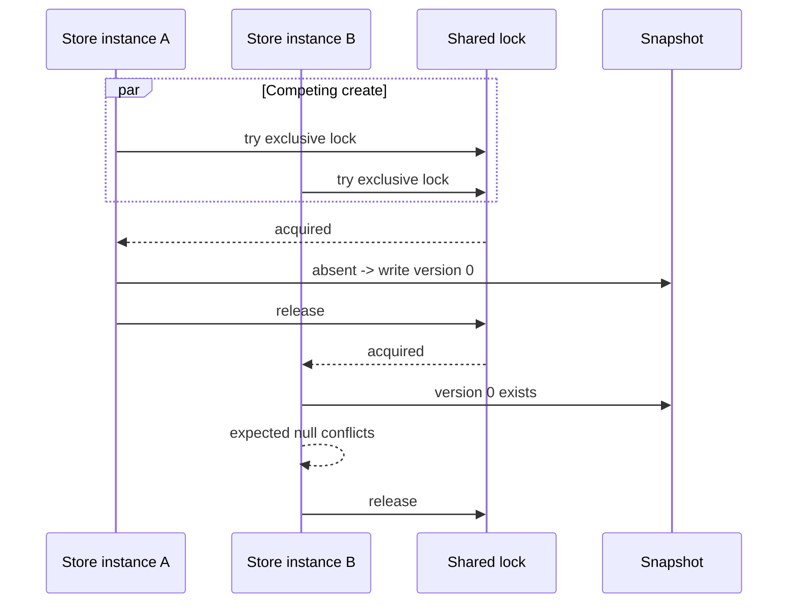

# DL-040 Apple file circuit-store checkpoint

## Scope

This checkpoint adds the first production KMP Apple retry-family persistence
adapter: `AppleFileCircuitBreakerStateStore` for durable circuit-breaker state.

It intentionally does not claim complete KMP iOS retry persistence. Queue-owned
retry attempts, elapsed budgets, workflow deadlines, and transition state still
require a production Apple durable queue implementation.

## Architecture decision

The Apple umbrella module remains a thin distribution boundary and contains no
provider implementation. The store therefore lives in the `iosMain` source set
of `dataloom-runtime`, whose public symbols are exported by the existing Apple
umbrella.

No Foundation or POSIX type enters the shared public API. Consumers provide only
an absolute directory `String` and optional file-name `String`.

## CAS invariants

1. Every load and compare-and-set acquires the same configured lock.
2. A null expected version succeeds only when the scope is absent.
3. A non-null expected version succeeds only on an exact version match.
4. Conflicts return the exact current record, including null when absent.
5. Versions begin at zero and increment by one.
6. `Long.MAX_VALUE` fails before directory or file access.
7. A successful result is returned only after the replacement snapshot is
   fsynced, atomically renamed, and the parent directory is fsynced.
8. A failed pre-rename write leaves the previous snapshot authoritative.
9. Scope reconstruction and all `CircuitBreakerState` invariants are revalidated
   on every read.
10. Duplicate persisted scopes fail closed.
11. The temporary snapshot descriptor is closed at most once, including every
    fsync, close, and rename failure path.

## Concurrency and cancellation

Lock acquisition uses `LOCK_NB` and a short coroutine delay between attempts.
Caller cancellation is checked before each attempt and before mutation. Two
independent store instances targeting one directory therefore serialize their
CAS operations without a process-local singleton.

The bounded POSIX read/write section is synchronous and cannot be hard-
interrupted after a syscall starts. The 4 MiB snapshot cap bounds memory and
non-suspending work; platform hard-interruption remains a separate DL-040 gap.

## File-format invariants

- versioned header: `DATALOOM_CIRCUIT_STATE<TAB>1`;
- one record per circuit scope;
- deterministic scope ordering;
- UTF-8 identifiers encoded as hexadecimal;
- strict integer, boolean, enum, null-marker, and field-count parsing;
- strict UTF-8 decoding;
- no payload, credential, header, exception, checkpoint, or arbitrary metadata;
- complete snapshot limit: 4 MiB.

The snapshot is not a public interchange format. A future format revision must
add explicit migration or fail with a bounded unsupported/corrupt outcome; it
must not silently reinterpret records.

## Error mapping

| Boundary failure | Public code | Safety behavior |
|---|---|---|
| Directory, lock, read, write, fsync, or rename | `CIRCUIT_APPLE_FILE_IO_FAILURE` | recoverable provider failure; no raw path/error text |
| Malformed or invariant-invalid state | `CIRCUIT_APPLE_STATE_CORRUPT` | fail closed, non-recoverable |
| Snapshot over 4 MiB | `CIRCUIT_APPLE_STATE_LIMIT_EXCEEDED` | fail closed, non-recoverable |
| Version at `Long.MAX_VALUE` | `CIRCUIT_STATE_VERSION_EXHAUSTED` | reject before I/O |

Underlying exceptions and persisted content are excluded from the returned
error.

## Focused qualification

`AppleFileCircuitBreakerStateStoreTest` covers:

- missing/create/load/reopen;
- exact stale-create conflict evidence;
- exact update versioning;
- two-instance concurrent first creation;
- every supported scope shape and Unicode identifier encoding;
- half-open probe generation and lease restoration;
- corrupt snapshot sanitization;
- version exhaustion before file access;
- caller cancellation; and
- unsafe constructor path rejection.

The Apple external-consumer probe compiles the production constructor from the
Apple variants without exposing implementation-only helpers.

The one-time same-repository macOS lane completed on generated evidence head
`57045267a8aea3ded5cd04f62dc6c4b1b91aeaa6` and passed:

1. runtime JVM tests and `iosSimulatorArm64Test`;
2. external JVM, `iosArm64`, `iosSimulatorArm64`, and `iosX64` compilation;
3. exact runtime and Apple Kotlin/Native ABI generation and checks;
4. runtime public ABI-boundary validation; and
5. Apple release XCFramework assembly.

That lane also applied the reviewed Kotlin/Native deterministic-ordering and
POSIX mode conversions, corrected the temporary descriptor lifecycle so an
error path cannot close the same descriptor twice, committed the exact runtime
ABI declaration, and removed itself.

The permanent Pull Request, Android, and Apple/Swift workflows remain the final
merge gate on the trusted review head.

## Remaining DL-040 / KMP iOS work

- production Apple durable queue and retry-budget persistence;
- executable process-relaunch and forced-process-death qualification;
- high-contention and app-group multi-process evidence;
- Data Protection and backup-exclusion integration evidence;
- authorized/idempotent/audited retry and circuit administration;
- complete logs, metrics, traces, reason codes, and redaction evidence;
- full native Android, KMP Android, and KMP iOS AC-FUNC-004 flows.
