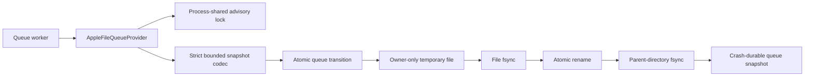

# DL-040 Apple file queue checkpoint

## Scope

This checkpoint adds `AppleFileQueueProvider`, the production KMP Apple
implementation of the existing `QueueProvider` contract. It closes the missing
platform persistence boundary for queue entries, leases, retry attempts, retry
budgets, availability, canonical errors, and immutable workflow timeout
information.

It does not claim complete KMP iOS execution support. Background scheduling,
connectivity, executable relaunch evidence, administration persistence, and
end-to-end strategy flows remain separate work.

## Architecture

The implementation lives in `dataloom-runtime` `iosMain`; the Apple umbrella
continues to export runtime symbols without owning storage behavior.

No POSIX, Foundation, file, lock, cursor, or serialization type crosses the
public `QueueProvider` boundary.

## Core invariants

1. Every state-changing operation is serialized by one configured shared lock.
2. Eligible selection and lease assignment occur in one locked durable update.
3. Acquisition ordering matches the Android Room implementation:
   `availableAt`, then `enqueuedAt`, then queue entry id.
4. One acquisition batch uses one exact lease for every returned entry.
5. Complete, reschedule, defer, and fail require the exact active lease.
6. Deferral and expired-lease recovery do not fabricate or consume retry
   attempts and preserve retry-budget and workflow-timeout evidence.
7. Reschedule persists the runtime-supplied attempt, budget, availability, and
   canonical sanitized error without evaluating policy.
8. Terminal entries and unexpired leases are never acquired.
9. Duplicate enqueue is rejected and never replaces existing work.
10. Successful mutation is returned only after temporary-file fsync, exact-once
    close, atomic rename, and parent-directory fsync.
11. A post-rename synchronization failure is explicit and is not represented as
    a confirmed rollback.
12. Every read reconstructs public models and re-applies their invariants.
13. Corrupt, duplicate, oversized, or impossible state fails closed.
14. Cancellation propagates while waiting for the shared lock.

## Persisted model

The version-1 snapshot retains all fields currently flattened by the Android
Room queue implementation:

- complete `SynchronizationRequest` and `ExecutionContext` identity;
- deterministic execution and entry metadata;
- queue state, enqueue time, and availability;
- retry attempt and the complete `RetryBudgetState`;
- immutable `WorkflowTimeoutState` start and deadline;
- lease identity, consumer, acquisition, and expiry;
- canonical error classification and sanitized message.

The format uses a versioned header, fixed field count, strict UTF-8, hexadecimal
string encoding, deterministic metadata ordering, and unique entry ids. It is
an internal persistence format, not a public interchange contract.

## Bounded behavior

- maximum snapshot size: 32 MiB;
- maximum persisted entries: 10,000;
- lock retry delay: bounded internal polling with cancellation checks;
- no payload bodies, credentials, tokens, encryption keys, stack traces, raw
  exception text, filesystem paths, or POSIX messages in durable state or
  provider errors.

## Focused tests

`AppleFileQueueProviderTest` verifies:

- descriptor type;
- enqueue, restart, and complete request/context/metadata/deadline restoration;
- duplicate enqueue rejection;
- deterministic batch ordering and `maxEntries`;
- two-provider contention without duplicate acquisition;
- stale-lease rejection and expired-lease recovery;
- reschedule and defer preservation of retry budgets and workflow deadlines;
- restart-safe recovery of a leased retry entry;
- completed, failed, dead-lettered, and cancelled entries remain ineligible;
- codec reconstruction of canonical errors and all durable optional groups;
- redacted corruption failure;
- cancellation propagation; and
- constructor path validation without side effects.

The external Apple consumer probe constructs the provider through the public
runtime API for `iosArm64`, `iosSimulatorArm64`, and `iosX64`.

## Qualification plan

Before merge, one clean reviewed head must pass:

1. runtime JVM and iOS Simulator tests;
2. all external JVM and Apple consumer compiles;
3. exact runtime and Apple Kotlin/Native ABI generation/checks;
4. runtime public-boundary validation;
5. Apple XCFramework assembly, exported-header audit, and Swift smoke compile;
6. Pull Request Validation; and
7. Android validation including Room schema and managed-device tests.

## Remaining DL-040 / KMP iOS work

- executable process-relaunch and forced-process-death qualification;
- app-group multi-process and high-contention fault injection;
- Apple scheduler/connectivity and complete runtime lifecycle ownership;
- Data Protection and backup policy evidence;
- durable retry-administration state plus a queue-specific authorized executor;
- future file-format migration policy;
- complete retry/circuit observability; and
- Book 2 `AC-FUNC-004` reference flows across mandatory platforms.
