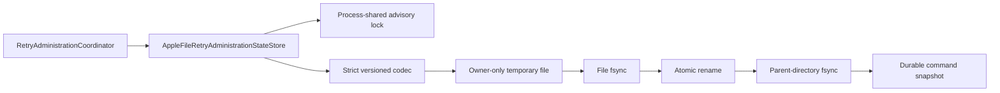

# DL-040 Apple retry-administration state-store checkpoint

## Scope

This checkpoint adds `AppleFileRetryAdministrationStateStore`, the production KMP Apple implementation of the existing `RetryAdministrationStateStore` contract.

It closes Apple persistence for authorized manual retry command admission and terminal command recording. It does not claim that administrative retry execution is complete: a queue-specific idempotent executor and queue receipt migration remain open.

## Architecture

No POSIX, Foundation, file, lock, or serialization type crosses the public state-store boundary.

## Core invariants

1. One command id maps to at most one record.
2. Creation requires a missing record and starts at version `0`.
3. Update requires the exact persisted version and increments by one.
4. A matching version cannot replace the immutable command request.
5. Compare-and-set conflict returns the exact current record.
6. Version exhaustion is rejected before filesystem access.
7. Every read reconstructs public models and re-applies their invariants.
8. Every operation is serialized by one configured shared lock.
9. Successful mutation is returned only after temporary-file `fsync`, atomic rename, and parent-directory `fsync`.
10. Corrupt, duplicate, oversized, excessive, or invariant-invalid state fails closed.
11. Cancellation propagates while waiting for the lock.
12. Durable errors are canonical and exclude raw file content or POSIX diagnostics.

## Persisted model

The version-1 snapshot stores immutable command identity and request evidence, original failure classification, authorization evidence, effective recoverability, lifecycle status, rejection reason, redacted execution-failure classification, update time, and record version.

The format uses a versioned header, fixed field count, strict UTF-8, hexadecimal string encoding, deterministic command ordering, complete nullable groups, and unique command ids. It is an internal persistence format rather than a public interchange contract.

## Focused qualification

The iOS Simulator test suite covers:

- missing/create/reopen behavior;
- exact conflict evidence and version increments;
- immutable request replacement rejection;
- two-instance first-create contention;
- all six durable command status shapes;
- corrupt snapshot redaction;
- version exhaustion before I/O;
- caller cancellation; and
- path validation without construction side effects.

The external consumer probe constructs the store through public runtime API for `iosArm64`, `iosSimulatorArm64`, and `iosX64`.

The one-time same-repository Apple Retry Administration Store Evidence lane completed successfully on source head `5e5aa035538673db74324ab55c1d86671cc36d2d`. It ran runtime JVM and iOS Simulator tests, compiled the external JVM and all Apple consumers, generated and checked exact runtime and Apple Kotlin/Native ABI, validated runtime public boundaries, assembled the release XCFramework, committed the generated declaration, and removed itself.

Evidence head `f80fee6fc64330670af3f086f5a3a0d03a1c11e4` contains the reviewed production, test, documentation, external-consumer, and exact ABI files only. Permanent Pull Request, Android, and Apple/Swift workflows are the final merge gate on one trusted head.

## Remaining DL-040 work

- queue-provider-specific retry-administration execution;
- atomic command receipt and Apple queue file-format migration;
- Android production retry-administration persistence;
- executable process-relaunch and forced-process-death evidence;
- app-group multi-process and higher-contention fault injection;
- Data Protection and backup-policy integration evidence;
- complete retry/circuit observability; and
- Book 2 `AC-FUNC-004` reference flows.
