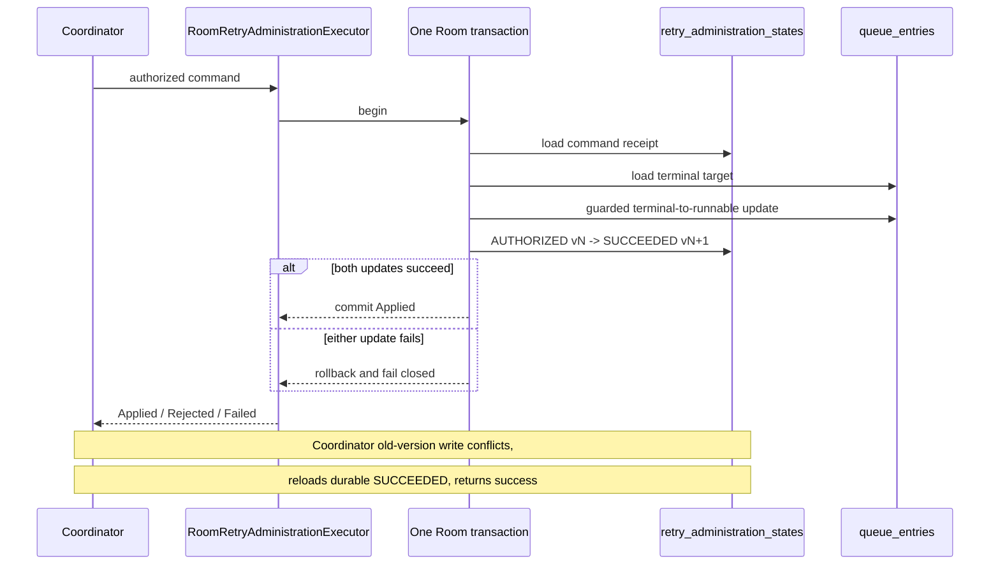

# DL-040 Android Room retry-administration executor checkpoint

## Scope

This checkpoint adds `RoomRetryAdministrationExecutor`, the production Android
Room implementation of the host-owned `RetryAdministrationExecutor` boundary.
It closes the Android crash window between an administrative queue mutation and
its durable command receipt.

The executor requires the queue entry and `RetryAdministrationStateStore`
record to use the same `DataLoomRoomDatabase`. It does not add a second database,
a new schema table, or a Room migration; it uses the existing schema-version-5
`queue_entries` and `retry_administration_states` tables.

## Transaction model

## Validation before mutation

The Room transaction validates:

1. the command id exists;
2. every immutable request field matches the durable command row;
3. durable status is `AUTHORIZED`, or already `SUCCEEDED` for idempotent replay;
4. authorization id and effective recoverability match the supplied command;
5. effective recoverability is `RECOVERABLE`;
6. `REQUEUE` remains recoverable and outside protected categories, while
   `RECLASSIFY_AND_REQUEUE` is explicit;
7. wall-clock evidence does not regress behind the durable command/request;
8. record version is not exhausted;
9. the target exists and is `FAILED` or `DEAD_LETTER`;
10. the target contains a complete canonical durable error; and
11. stored code, category, severity, and recoverability exactly match the
    immutable original failure snapshot.

Missing, stale, unauthorized, conflicting, non-terminal, or mismatched targets
return bounded stable rejection reason codes without mutation.

## Atomic mutation

The guarded queue update:

- returns entries without retry history to `PENDING`;
- returns entries with retry history to `RETRY_WAITING`;
- sets `available_at_ms` to the executor's explicit observed instant;
- clears any lease columns;
- clears the terminal canonical error; and
- preserves request/context identity, metadata, enqueue time, retry attempt,
  retry-budget columns, and workflow start/deadline columns.

The command update changes only mutable audit state:

- `AUTHORIZED` becomes `SUCCEEDED`;
- `updated_at_ms` becomes the observed instant;
- record version advances by one; and
- rejection/execution-failure columns are cleared.

Both guarded updates must affect exactly one row. Any unexpected zero-row result
throws an internal integrity signal, causing Room to roll back the whole
transaction.

## Idempotency and coordinator compatibility

After a committed mutation, the command row itself is the durable receipt. A
redelivery with identical immutable command, authorization id, and effective
recoverability sees `SUCCEEDED` and returns `Applied` before touching the queue.

The common coordinator originally admitted the command at version `N`. After
the executor commits `SUCCEEDED` at `N+1`, the coordinator's normal terminal CAS
using expected version `N` conflicts. The coordinator then reloads the command,
recognizes the terminal `SUCCEEDED` record, and returns the exact durable result.
This resolves the generic post-execution recording window without changing the
common coordinator contract.

## Canonical failures

The public executor maps internal outcomes to sanitized errors:

| Code | Category | Recoverability | Meaning |
|---|---|---|---|
| `RETRY_ADMIN_ROOM_EXECUTOR_DATABASE_FAILURE` | `STORAGE` | `RECOVERABLE` | Room transaction failed |
| `RETRY_ADMIN_ROOM_EXECUTOR_STATE_CORRUPT` | `STATE` | `NON_RECOVERABLE` | Durable command or queue state was invalid |
| `RETRY_ADMIN_STATE_VERSION_EXHAUSTED` | `STATE` | `NON_RECOVERABLE` | Command record cannot advance safely |
| `RETRY_ADMIN_EXECUTION_CLOCK_REGRESSION` | `STATE` | `NON_RECOVERABLE` | Observed wall clock regressed |

Error messages exclude SQL text, database paths, payloads, credentials, raw
exception text, stack traces, and arbitrary metadata. Caller cancellation
propagates unchanged.

## Focused evidence

Unit coverage verifies:

- applied and semantic-rejection result mapping;
- canonical clock-regression, integrity, version-exhaustion, and database errors;
- redaction of internal exception text; and
- unchanged cancellation propagation.

The managed-device Room test verifies with real SQLite transactions:

- a queue entry accumulates retry attempt and retry-budget history;
- it becomes a terminal failure with canonical error evidence;
- an authorized command and queue mutation commit atomically;
- the command reaches `SUCCEEDED` version 1;
- replay returns `Applied` without a second queue mutation;
- retry attempt, retry budget, and workflow deadline survive;
- the terminal error is cleared;
- exactly one subsequent queue acquisition succeeds; and
- mismatched failure evidence leaves both command and queue unchanged.

Source head `e96bc5757416f182fbd0bf62ab1ee47a45df09f9` passed:

- Pull Request Validation #432;
- Android Validation #270, including unchanged schema-v5 verification and the
  managed-device transaction tests; and
- Apple Platform Validation #280, including Kotlin/Native regression,
  XCFramework slice/header validation, and Swift smoke compilation.

## Remaining DL-040 work

- Apple queue-format migration and atomic retry-administration command receipts;
- builder/facade and operations API assembly;
- complete retry/circuit administration events, metrics, logs, and traces;
- executable process-loss/relaunch evidence;
- app-group and higher-contention fault injection; and
- complete Book 2 `AC-FUNC-004` reference-flow qualification across mandatory
  platforms.
