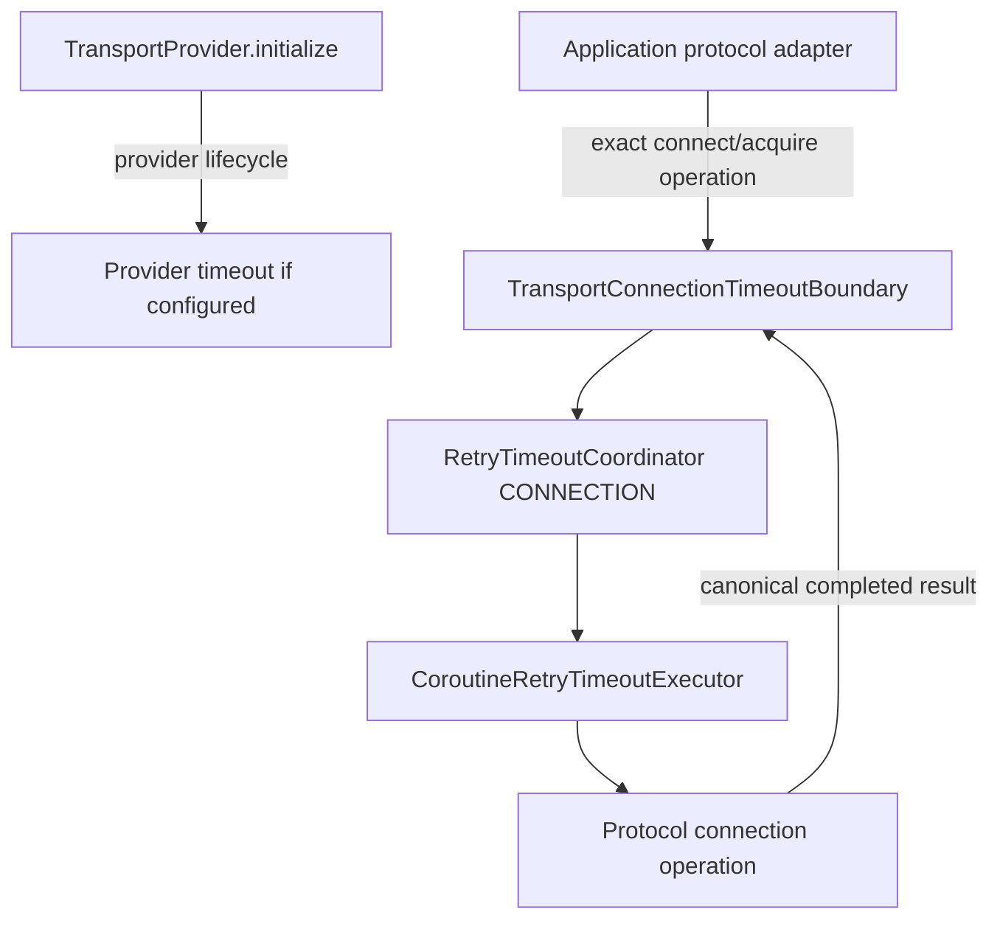
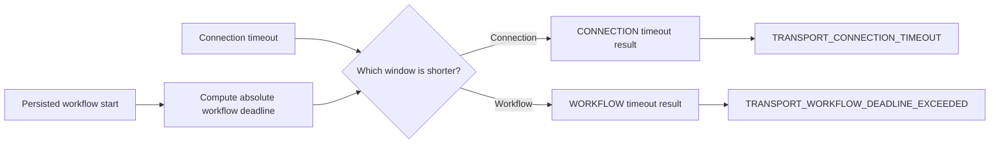

# DL-040 transport connection timeout checkpoint

## Scope

This checkpoint adds the independent `CONNECTION` timeout boundary required by
FR-RETRY-006 without reclassifying `TransportProvider.initialize()` as remote
connection establishment.

The public `TransportConnectionTimeoutBoundary` wraps one explicit
application-owned suspending operation that establishes or acquires a protocol
connection. It returns canonical `ProviderOperationResult<T>` values and is
assembled by `TransportConnectionTimeoutRuntime` with the production cooperative
coroutine timeout executor.

## Ownership decision

A shared `TransportProvider` intentionally hides HTTP clients, sockets, database
sessions, WebSocket handshakes, and other protocol-specific connection types.
Therefore DataLoom cannot honestly infer connection establishment from provider
lifecycle methods.

## Public behavior

- `TransportConnectionTimeoutRuntime.create(...)` accepts an independent
  connection timeout and an optional workflow timeout.
- `TransportConnectionTimeoutBoundary.execute(...)` accepts optional persisted
  `workflowStartedAt` evidence.
- Completed canonical success and failure objects are preserved exactly.
- Zero timeout prevents operation invocation.
- Positive timeout cancels the child operation cooperatively and waits for its
  cleanup.
- Caller cancellation and unexpected exceptions propagate.
- Construction reads no clock and launches no coroutine.

## Failure mapping

| Condition | Code | Category | Recoverability |
|---|---|---|---|
| Connection limit expires | `TRANSPORT_CONNECTION_TIMEOUT` | `NETWORK` | `RECOVERABLE` |
| Workflow already expired or is the limiting runtime window | `TRANSPORT_WORKFLOW_DEADLINE_EXCEEDED` | `NETWORK` | `NON_RECOVERABLE` |
| Clock observation precedes persisted workflow start | `TRANSPORT_CONNECTION_TIMEOUT_CLOCK_REGRESSION` | `STATE` | `NON_RECOVERABLE` |

The connection timeout is recoverable because the boundary owns connection
establishment only. It does not claim that a synchronization request was sent,
accepted, committed, or rolled back. Retry still remains subject to central
classification, attempt/elapsed budgets, circuit permission, and application
policy.

## Workflow precedence

When `workflowStartedAt` is supplied, `RetryTimeoutCoordinator` compares the
remaining workflow window with the configured connection timeout.

A runtime `TimedOut(kind = WORKFLOW)` is deliberately mapped to the workflow
code. The connection adapter must not erase the identity of the limiting
boundary.

## Focused regression evidence

`TransportConnectionTimeoutRuntimeTest` covers:

- exact completed-result identity;
- zero-timeout pre-invocation rejection;
- positive-timeout cooperative cleanup;
- caller cancellation propagation;
- already-expired workflow rejection before invocation;
- shorter workflow timeout during execution;
- clock-regression rejection before invocation; and
- side-effect-free production assembly.

The external consumer probe compiles the public factory from JVM and all three
iOS target variants.

## Qualification plan

The temporary same-repository macOS lane must:

1. run runtime JVM and iOS Simulator tests;
2. compile the external JVM, `iosArm64`, `iosSimulatorArm64`, and `iosX64`
   consumers;
3. generate exact runtime and Apple JVM/Kotlin-Native ABI declarations;
4. check public ABI boundaries and external consumers;
5. assemble the Apple XCFramework; and
6. remove itself before committing the generated evidence.

Permanent Pull Request, Android managed-device, and Apple XCFramework/header/Swift
smoke workflows remain the final merge gate.

## Remaining timeout work

- an explicit idle-progress boundary and protocol integrations;
- hard-interruption adapters for non-cooperative platform operations;
- durable workflow-start propagation through every queue/retry/restart path;
- contention, process-loss, connectivity-change, and failure-injection evidence;
- full native Android, KMP Android, and KMP iOS reference-flow qualification.
