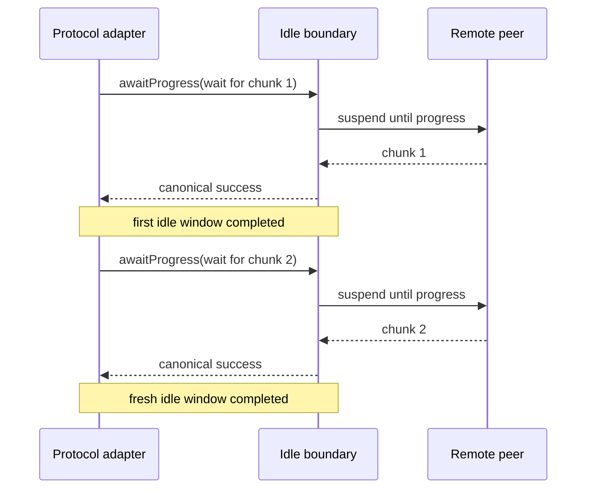
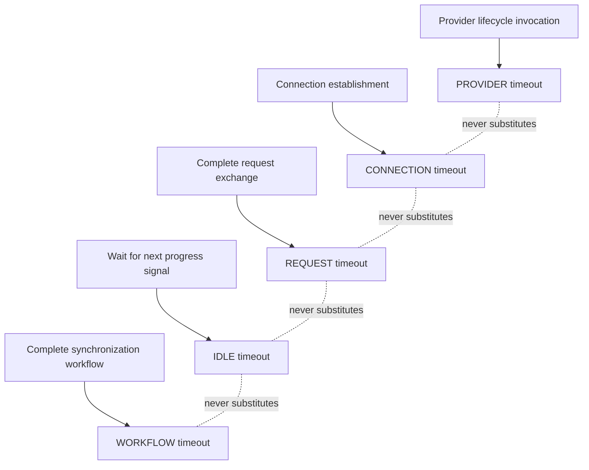

# DL-040 transport idle-progress timeout checkpoint

## Scope

This checkpoint adds the independent `IDLE` timeout boundary required by
FR-RETRY-006 without relabeling a complete request or provider invocation as an
idle wait.

`TransportIdleTimeoutBoundary.awaitProgress(...)` protects exactly one
application-owned suspending wait for the next observable protocol progress
signal. The adapter decides what constitutes progress: a chunk, frame,
acknowledgement, heartbeat, or another bounded event. DataLoom remains
protocol-neutral and does not expose those types through shared API.

## Reset semantics

A true idle timeout restarts when progress is observed. The runtime models that
explicitly by ending one idle window whenever `awaitProgress` completes and
requiring the adapter to call it again for the next progress wait.

Two successive waits may together exceed the idle timeout while both remain
valid if each produces progress within its own window. Total request duration is
owned by the request or workflow boundary, not by idle timeout.

## Public behavior

- `TransportIdleTimeoutRuntime.create(...)` accepts an independent idle timeout
  and optional workflow timeout.
- `TransportIdleTimeoutBoundary.awaitProgress(...)` accepts optional persisted
  `workflowStartedAt` evidence.
- Completed canonical success and failure objects are preserved exactly.
- Zero timeout prevents progress-wait invocation.
- Positive timeout cancels the child wait cooperatively and waits for cleanup.
- Caller cancellation and unexpected exceptions propagate.
- Construction reads no clock and launches no coroutine.

## Failure mapping

| Condition | Code | Category | Recoverability |
|---|---|---|---|
| No progress within idle window | `TRANSPORT_IDLE_TIMEOUT` | `NETWORK` | `UNKNOWN` |
| Workflow already expired or is the limiting runtime window | `TRANSPORT_WORKFLOW_DEADLINE_EXCEEDED` | `NETWORK` | `NON_RECOVERABLE` |
| Clock observation precedes persisted workflow start | `TRANSPORT_IDLE_TIMEOUT_CLOCK_REGRESSION` | `STATE` | `NON_RECOVERABLE` |

Idle timeout recoverability is `UNKNOWN` because cancellation does not prove the
final remote transfer state, whether buffered progress exists, or whether the
peer will complete after local cancellation. Automatic replay remains blocked
without idempotency or reconciliation evidence.

## Ownership model

## Focused regression evidence

`TransportIdleTimeoutRuntimeTest` covers:

- exact completed-result identity;
- zero-timeout pre-invocation rejection;
- positive-timeout cooperative cleanup;
- consecutive progress waits resetting the idle window;
- caller cancellation propagation;
- already-expired workflow rejection before invocation;
- shorter workflow timeout during execution;
- clock-regression rejection before invocation; and
- side-effect-free production assembly.

The external consumer probe compiles the public factory from JVM and all three
iOS target variants.

## Qualification plan

The temporary same-repository macOS lane must:

1. run runtime JVM and iOS Simulator tests;
2. compile the external JVM, `iosArm64`, `iosSimulatorArm64`, and `iosX64`
   consumers;
3. generate exact runtime and Apple JVM/Kotlin-Native ABI declarations;
4. check public ABI boundaries and external consumers;
5. assemble the Apple XCFramework; and
6. remove itself before committing the generated evidence.

Permanent Pull Request, Android managed-device, and Apple XCFramework/header/Swift
smoke workflows remain the final merge gate.

## Remaining timeout work

- hard-interruption adapters for non-cooperative platform/protocol operations;
- durable workflow-start/deadline propagation through every remaining nested
  execution path;
- contention, process-loss, connectivity-change, long-running transfer, and
  failure-injection evidence;
- full native Android, KMP Android, and KMP iOS reference-flow qualification.
