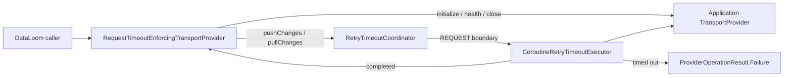

# DL-040 transport request timeout checkpoint

## Status

This checkpoint records the first independently governed protocol-facing timeout boundary in DataLoom V1: transport **request** timeout enforcement for `pushChanges` and `pullChanges`.

The implementation is additive. It does not replace the existing provider timeout, and it does not infer connection, idle, policy, queue, or workflow timeout behavior.

## Public runtime

`TransportRequestTimeoutRuntime.create(...)` wraps an application-owned `TransportProvider` with a cooperative `RetryTimeoutKind.REQUEST` boundary.

```kotlin
val protectedTransport = TransportRequestTimeoutRuntime.create(
    transportProvider = transportProvider,
    clock = clock,
    requestTimeout = SchedulingDelay(5_000L),
)
```

The runtime is side-effect free during construction: it does not invoke the provider, read the clock, launch a coroutine, perform I/O, or generate identifiers.

## Execution boundary



Only transport request operations are protected:

| Operation | Request timeout applied | Reason |
|---|---:|---|
| `initialize` | No | Provider lifecycle boundary |
| `health` | No | Provider lifecycle boundary |
| `close` | No | Provider lifecycle boundary |
| `pushChanges` | Yes | Remote request boundary |
| `pullChanges` | Yes | Remote request boundary |

## Result and failure semantics

Completed provider results and the provider descriptor are returned unchanged.

A request timeout returns:

- code: `TRANSPORT_REQUEST_TIMEOUT`
- category: `NETWORK`
- severity: `ERROR`
- recoverability: `UNKNOWN`

`UNKNOWN` is intentional for both push and pull. Cooperative timeout or cancellation does not prove that a remote system rolled back or never processed the request. Automatic replay therefore requires a separate idempotency, reconciliation, or policy decision.

The decorator also preserves canonical workflow-deadline and clock-regression outcomes produced by its injected timeout coordinator:

- `TRANSPORT_WORKFLOW_DEADLINE_EXCEEDED`
- `TRANSPORT_REQUEST_TIMEOUT_CLOCK_REGRESSION`

Caller cancellation and unexpected exceptions are not translated into DataLoom timeout failures.

## Safety invariants

1. Request timeout configuration is independent from provider timeout configuration.
2. Lifecycle calls bypass the request timeout.
3. A zero request timeout prevents push or pull delegate invocation.
4. Completed success and failure results retain identity.
5. Timed-out remote completion remains ambiguous.
6. No protocol-specific request or response type enters the shared public API.
7. Construction remains side-effect free.
8. Connection and idle timeouts remain separate future adapters.

## Qualification evidence

The branch qualification lane performed the following before removing itself:

```text
:dataloom-runtime:jvmTest
:dataloom-runtime:iosSimulatorArm64Test
:runtime-external-consumer:compileKotlinJvm
:runtime-external-consumer:compileKotlinIosArm64
:runtime-external-consumer:compileKotlinIosSimulatorArm64
:runtime-external-consumer:compileKotlinIosX64
:dataloom-runtime:updateKotlinAbi
:dataloom-apple:updateKotlinAbi
:dataloom-runtime:checkKotlinAbi
:dataloom-runtime:checkPublicAbiBoundaries
:dataloom-apple:checkKotlinAbi
:runtime-external-consumer:checkRuntimeExternalConsumer
:dataloom-apple:assembleDataLoomReleaseXCFramework
```

Exact JVM and Kotlin/Native ABI declarations are committed. Permanent Pull Request, Android, and Apple workflows remain the final merge gate on a non-bot head commit.

## Focused regression coverage

`TransportRequestTimeoutRuntimeTest` verifies:

- descriptor and completed canonical result identity
- lifecycle bypass at a zero request timeout
- zero-timeout push and pull pre-invocation rejection
- cooperative cleanup after an executing request times out
- caller cancellation propagation
- workflow-deadline and clock-regression mapping
- side-effect-free production assembly

## Remaining DL-040 timeout work

- protocol-specific connection timeout adapters
- protocol-specific idle timeout adapters
- explicit workflow-deadline propagation into protocol adapters where the execution contract carries an accepted workflow start/deadline
- platform contention, restart, and failure-injection qualification
