# DL-AUDIT-004: V1 Production-Readiness Audit

## Decision

**V1 is currently a release NO-GO.**

The repository contains a useful synchronization foundation, but it does not
yet implement the full V1 scope approved in issue #92. Across the 72 mandatory
functional requirements in retry, conflict handling, events, assets, plugins,
and enterprise governance, this audit finds:

| Assessment | Count |
|---|---:|
| Implemented | 1 |
| Partial | 16 |
| Missing | 55 |
| Total | 72 |

```mermaid
flowchart LR
    foundation[Current synchronization foundation]
    strategies[Six-strategy engine]
    retry[Retry and circuit]
    conflict[Conflict]
    events[Events and observability]
    assets[Assets]
    plugins[Plugins]
    enterprise[Enterprise governance]
    qualification[V1 qualification]
    release{Production V1?}
    noGo[NO-GO]

    foundation --> strategies
    strategies --> retry
    strategies --> conflict
    retry --> events
    conflict --> events
    events --> assets
    events --> plugins
    assets --> enterprise
    plugins --> enterprise
    enterprise --> qualification
    qualification --> release
    release -->|Current evidence| noGo

    style foundation fill:#C2E5FF,stroke:#3DADFF
    style qualification fill:#FFECBD,stroke:#FFC943
    style noGo fill:#FFCDC2,stroke:#FF7556
```

This is not a reason to weaken validation or repeatedly rerun workflows. It is
a dependency and implementation backlog. The safest course is to complete the
shared foundations first, implement each bounded subsystem against explicit
acceptance criteria, verify locally, and spend GitHub Actions credits only on
review-ready changes.

## Audit baseline

| Field | Value |
|---|---|
| Repository | `dataloom-sdk/dataloom` |
| Audited commit | `e855894bc45fa06c5388ae4e5ce46f6ee6319bb7` |
| Audit date | 2026-07-27 |
| Release target supplied by product owner | 2026-08-27 |
| Scope authority | DataLoom Books 1–10 in ChatGPT Library and the full-V1 decision recorded in GitHub issue #92 |
| Related audit issue | #91 |
| Workflow use during this audit | None; no workflow was dispatched or rerun |

GitHub #92 is an issue, not a pull request. Therefore, “after PR 92” is treated
as “after the V1 scope decision recorded in issue #92.”

## Assessment method

- **Implemented**: production code covers the requirement's essential runtime
  behavior and has meaningful automated tests. Final GA qualification may still
  be outstanding.
- **Partial**: a contract, model, documentation boundary, or limited runtime
  path exists, but required production behavior is absent.
- **Missing**: no substantive implementation of the requirement was found.

This audit distinguishes a public contract from a working subsystem. A data
class, SPI, observer callback, or app-provided hook alone does not satisfy a
requirement that calls for built-in policy, persistence, isolation,
orchestration, export, administration, or qualification.

## Current product capability

| Capability | Current state | Evidence and limitation |
|---|---|---|
| Kotlin Multiplatform foundation | Available foundation | Six shared modules (`model`, `provider-api`, `api`, `core`, `runtime`, and `testing`) have JVM and three-target iOS ABI baselines. A true KMP Android library target, published variants, and Android+iOS consumer application are not yet qualified. |
| Provider SPI and lifecycle | Available foundation | Provider descriptors, registry, lifecycle, and resolution exist; this is not a complete plugin platform. |
| Outbound, inbound, and bidirectional synchronization | Available foundation | Runtime pipelines coordinate transport/storage operations; production hardening and the expanded V1 subsystems remain. |
| Core synchronization strategy engine | Partial implementation | Versioned profiles, bounded runtime evidence, typed dispositions, immutable execution plans, plan-derived capabilities, durable decision identity, and deterministic built-in evaluation now cover offline-first, remote-first, cache-first, network-only, hybrid, and adaptive policy. The current facade/provider resolver/pipelines do not yet execute those plans, and queue encoding/resolution does not yet require the durable decision record, so end-to-end behavior and platform qualification remain open. |
| Durable queue processing | Available foundation | Queue contracts, worker coordination, retry rescheduling integration, Room queue, and WorkManager adapter exist. |
| Android integrations | Available foundation | Connectivity, Room queue, and WorkManager modules exist and passed the latest merged validation baseline. No release publication has occurred. |
| KMP iOS compilation foundation | Validation foundation | Shared targets compile and fake-backed common tests run on `iosSimulatorArm64`. Complete iOS lifecycle, connectivity, background execution, secure storage, files/assets, persistence adapters, published KMP variants, consumer integration, and end-to-end qualification remain. |
| Optional native Swift packaging foundation | Validation foundation | XCFramework assembly, slice inspection, and selected-symbol Swift compile smoke exist. The export graph excludes internal core/testing modules; header/API compatibility, runtime, signing, and distribution qualification still remain. |
| Retry engine | Partial | Custom policy evaluation and queue rescheduling exist; standard strategies, jitter, hard limits, server hints, circuit breaker, half-open recovery, and complete persisted state do not. |
| Conflict engine | Partial | Custom detector/resolver contracts and lookup/orchestration exist; built-in strategies, decision application, persistence, audit, precedence, loop protection, and metrics do not. |
| Events and observability | Partial | Lifecycle/progress/retry/conflict callbacks and sequential dispatch exist; canonical envelopes, durable delivery, filtering, back-pressure, metrics, structured logging, tracing/export, and dashboard/read model do not. |
| Asset synchronization | Missing | No asset manifest, chunking, streaming, resume, integrity, quota, cancellation, or temporary-file subsystem was found. |
| Full plugin system | Missing | No manifest, permissions, lifecycle container, execution bounds, ordering, isolation, compatibility validation, audit, or certification subsystem was found. |
| Enterprise administration/governance | Missing | A tenant identifier exists, but tenant isolation, RBAC operations, policy packs, audit trail, residency, support bundles, configuration locks, and fleet administration do not. |
| Production artifact/release | Missing | No complete Maven publication, BOM, signing, checksums, SBOM/provenance, external-consumer qualification, compatibility baseline, release tag, or published V1 artifact is present. |

### Post-baseline DL-039 local checkpoint

The following evidence is newer than audited commit `e855894` and is not part
of that reproducible baseline. DL-039 introduces the dependency-root
`dataloom-model` and narrow `dataloom-provider-api` modules, moves public
runtime dependency inputs to approved public artifacts, and keeps
`dataloom-core` as an implementation dependency.

Exact Kotlin 2.4.10 compilation and ABI extraction produced committed JVM and
KLib references for all six shared modules and a KLib reference for
`dataloom-apple`. Both runtime references are free of `dataloom-core` and
`dataloom-testing` types. A runtime ABI boundary task rejects either namespace
if it appears later. The Apple validation graph compiles an external consumer
for `iosArm64`, `iosSimulatorArm64`, and `iosX64`, rejects internal namespaces
from generated headers, and requires identical headers across XCFramework
slices.

This remains checkpoint evidence rather than GA evidence. Linux cannot produce
or inspect Apple frameworks, so the first review run must execute the macOS
header and external-consumer gates. Full Gradle validation must also run in CI
with the repository's declared dependency graph; a local toolchain/cache
limitation is not recorded as a product failure.

## V1 platform and distribution matrix

The product owner's platform decision makes native Android, KMP Android, and
KMP iOS mandatory release gates. Native Swift is an optional distribution path
that becomes a gate only if enabled. Android-first describes the reference
platform and implementation sequence; it does not defer KMP iOS support.

| Consumer path | Required V1 result | Current audit result |
|---|---|---|
| Native Android | Public/runtime artifacts plus `dataloom-android`; installable reference integration and complete Android qualification | Partial foundation |
| KMP — Android target | Shared `commonMain` API/runtime plus Android source-set adapter and Android end-to-end KMP sample | Missing as a qualified consumer path |
| KMP — iOS target | Shared `commonMain` API/runtime plus `dataloom-ios`, Kotlin/Native device/simulator variants, and iOS end-to-end KMP sample | Partial compilation foundation; platform adapter/product path missing |
| Optional native Swift distribution | XCFramework or Swift package built from the same approved implementation | Swift compile smoke foundation; if shipped, must be fully qualified |

An Android application resolves and packages only Android-compatible variants;
it never embeds iOS frameworks. A KMP application shares DataLoom behavior but
declares Android and iOS platform dependencies separately.

## Core V1 synchronization strategies

Supporting all six strategies through one reusable policy-driven engine is
DataLoom's primary product purpose. V1 must provide complete,
production-qualified built-in implementations for:

- **offline-first**, where accepted local work remains durable and
  reconciliation occurs when policy and connectivity permit;
- **remote-first**, where the remote path is attempted first and fallback,
  failure, or local persistence follows an explicit policy; and
- **cache-first**, with explicit freshness, stale-response, and background
  refresh semantics;
- **network-only**, which performs no local-storage or queue operation and
  returns a typed connectivity/remote outcome;
- **hybrid**, with explicit primary, fallback, return-source, and
  cache-coherence rules; and
- **adaptive**, where a deterministic policy selects only from an approved
  set of concrete strategies using
  operation type, freshness, connectivity, provider health, tenant/workflow
  configuration, and durable state.

`SynchronizationMode.FULL` and `SynchronizationMode.DELTA` describe the amount
of data synchronized; they are not source-priority or consistency strategies.
Similarly, `SynchronizationDirection` and `BidirectionalExecutionOrder` are
execution building blocks, not complete offline/remote/hybrid strategies.

None of these strategies is optional, application-only, or deferred to V2.
The V1 strategy contract must be versioned, composable, and extensible without
requiring applications to replace the whole runtime pipeline. It must capture
source preference, freshness/consistency, remote fallback, connectivity
admission, local durability, queue/defer behavior, reconciliation, retry, and
conflict policy references. The evaluated decision and configuration version
must be persisted with durable work so restart or delayed execution cannot
silently change semantics. Unsupported platform mechanics must return an
explicit unsupported/degraded result rather than silently falling back to a
different strategy.

This is a synchronization-engine boundary, not a generic application
repository or ORM. Applications continue to own domain queries and UI state;
DataLoom governs synchronization admission, transfer, persistence, fallback,
and reconciliation around the registered storage/transport capabilities.

## Functional-requirement matrix

### Retry — 0 implemented, 5 partial, 7 missing

Primary evidence:

- `dataloom-api/src/commonMain/kotlin/io/dataloom/api/retry/RetryPolicy.kt`
- `dataloom-runtime/src/commonMain/kotlin/io/dataloom/runtime/retry/`
- `dataloom-queue-room/src/main/kotlin/io/dataloom/queue/room/`
- `docs/api/retry-policy.md`
- `docs/architecture/retry-boundaries.md`

The repository documentation explicitly states that the retry engine and
built-in algorithms are not implemented. The later runtime work added policy
evaluation and rescheduling, but it did not close the full requirements.

Two confirmed correctness defects make the current durable retry count
untrustworthy:

- Initial queued offline deferral occurs before pipeline execution and without
  `RetryPolicy.evaluate()`, but the runtime fabricates and persists
  `RetryAttempt(1)`. When connectivity later returns, the first genuine
  synchronization failure is therefore evaluated as attempt 2 and loses one
  configured retry.
- Room and in-memory expired-lease recovery clear an existing persisted
  `retryAttempt`. Process death can therefore reset a genuine retry budget and
  allow more retries than policy permits.

Both are V1 release blockers. Constraint deferral must preserve the existing
attempt exactly—`null` before any retry evaluation or `N` after retry N—and
expired-lease recovery must preserve the same durable history.

| ID | Requirement | Status | Repository finding / V1 gap |
|---|---|---|---|
| FR-RETRY-001 | Failure classification | Partial | Canonical error category/recoverability fields exist, but there is no complete enforced classifier for recoverable, non-recoverable, policy-blocked, authentication, conflict, and cancellation outcomes. |
| FR-RETRY-002 | Retry strategies | Missing | An app-provided `RetryPolicy` exists; built-in immediate, fixed, linear, and exponential strategies do not. |
| FR-RETRY-003 | Jitter | Missing | No standard jitter modes, random source abstraction, or deterministic jitter tests exist. |
| FR-RETRY-004 | Attempt limits | Partial | Attempt data is carried and persisted during ordinary retry rescheduling, but limits are not trustworthy: initial offline deferral fabricates attempt 1 without policy evaluation, while expired-lease recovery clears genuine attempt history. Maximum attempts and maximum elapsed retry time are also not enforced by a standard runtime policy. |
| FR-RETRY-005 | Server hints | Missing | No bounded parsing/application of `Retry-After` or equivalent provider hints exists. |
| FR-RETRY-006 | Timeout separation | Missing | No complete independent connection, request, idle, workflow, provider, and policy timeout model exists. |
| FR-RETRY-007 | Circuit breaker | Missing | No closed/open state machine, failure threshold/window, rejection behavior, or persistence exists. |
| FR-RETRY-008 | Half-open probe | Missing | No controlled half-open probe or recovery transition exists. |
| FR-RETRY-009 | Retry persistence | Partial | Room persists retry attempt and availability during ordinary rescheduling, but offline deferral is incorrectly encoded as a retry and both Room and in-memory expired-lease recovery reset attempt history. Generic policy state, elapsed limits, circuit state, and restart-safe recovery metadata are also absent. |
| FR-RETRY-010 | Retry observability | Partial | `RetryScheduled` events contain useful data, but structured logs, metrics, traces, stable reason taxonomy, and full correlation are absent. |
| FR-RETRY-011 | Manual retry | Missing | No authorized requeue service with immutable attempt history and audit exists. |
| FR-RETRY-012 | Non-retryable protection | Partial | A policy may stop, but the runtime does not centrally block retries of non-recoverable failures unless an authorized reclassification is recorded. |

Required acceptance sequence:

1. Separate non-retry constraint deferral from retry-policy rescheduling and
   preserve attempt history across deferral, acquisition, process death, and
   expired-lease recovery.
2. Deterministic delay strategies with overflow-safe clamping and injectable
   randomness.
3. Attempt/elapsed-time enforcement and safe server-hint handling.
4. Durable closed/open/half-open circuit-breaker state and controlled probes.
5. Restart recovery, manual retry authorization/audit, and non-retryable guard.
6. Unit, property, persistence, concurrency, and end-to-end qualification,
   including offline-to-online retry-budget tests and the Book 2
   backoff/jitter/open/half-open/recovery scenario.

### Conflict handling — 1 implemented, 5 partial, 6 missing

Primary evidence:

- `dataloom-api/src/commonMain/kotlin/io/dataloom/api/conflict/`
- `dataloom-runtime/src/commonMain/kotlin/io/dataloom/runtime/conflict/`
- `docs/api/conflict-contracts.md`
- `docs/api/conflict-orchestration.md`
- `docs/architecture/conflict-boundaries.md`

The current orchestrator selects an exact custom detector/resolver and returns a
decision. It deliberately does not apply the decision, persist unresolved
conflicts, provide built-in policies, or audit the resolution.

| ID | Requirement | Status | Repository finding / V1 gap |
|---|---|---|---|
| FR-CONFLICT-001 | Conflict detection | Partial | Custom detection is supported, but standard version/vector/timestamp/ETag detection utilities and integration are absent. |
| FR-CONFLICT-002 | Built-in strategies | Missing | Client-wins, server-wins, last-write-wins, timestamp, field-merge, reject, and manual strategies are not implemented. |
| FR-CONFLICT-003 | Custom resolver | Implemented | Public resolver contract, registry, exact lookup, invocation, result modeling, and tests exist. |
| FR-CONFLICT-004 | Resolver context | Partial | Local/remote conflict data and metadata exist, but an explicit base value plus complete version, tenant, trace, and redaction-safe context contract is incomplete. |
| FR-CONFLICT-005 | Resolution result | Partial | Use-local, use-remote, merge, defer, and fail variants exist; runtime application, retry linkage, reject semantics, and explicit user-action lifecycle are incomplete. |
| FR-CONFLICT-006 | Determinism validation | Partial | Scripted test utilities exist, but no resolver certification/determinism harness or repeated-input validation gate exists. |
| FR-CONFLICT-007 | Conflict audit | Missing | No immutable conflict-resolution audit record or provider exists. |
| FR-CONFLICT-008 | Unresolved persistence | Missing | Deferred/manual conflicts are not durably stored and recoverable after restart. |
| FR-CONFLICT-009 | Loop prevention | Missing | No conflict fingerprint, resolution-attempt limit, convergence check, or quarantine path exists. |
| FR-CONFLICT-010 | Strategy precedence | Missing | No entity/workflow/tenant/global policy hierarchy exists. |
| FR-CONFLICT-011 | Sensitive-field handling | Partial | Documentation prohibits secret exposure, but no configurable field redactor/minimizer is enforced across context, audit, events, and diagnostics. |
| FR-CONFLICT-012 | Resolution metrics | Missing | No conflict-rate, resolution-result, convergence, latency, or loop/quarantine metrics exist. |

Required acceptance sequence:

1. Versioned detector and resolver policy model with explicit precedence.
2. Safe built-in strategies, including a schema-aware field-merge extension
   boundary and application-supplied domain rules.
3. Atomic decision application plus unresolved-conflict and audit persistence.
4. Loop prevention, quarantine/manual action, retry integration, and redaction.
5. Determinism, restart, convergence, concurrency, and bidirectional
   end-to-end qualification, including Book 2 AC-FUNC-002.

“Built-in domain conflict rules” means DataLoom must ship a safe policy framework
and useful built-in resolution rules. An application still owns its domain
schema and may register domain-specific mergers; that boundary must not be used
to omit the built-in V1 engine.

### Events and operational observability — 0 implemented, 6 partial, 6 missing

Primary evidence:

- `dataloom-api/src/commonMain/kotlin/io/dataloom/api/synchronization/SynchronizationEvent.kt`
- `dataloom-api/src/commonMain/kotlin/io/dataloom/api/observation/SynchronizationObserver.kt`
- `dataloom-runtime/src/commonMain/kotlin/io/dataloom/runtime/observation/`
- `docs/api/synchronization-events.md`
- `docs/api/synchronization-event-dispatcher.md`
- `docs/architecture/observation-boundaries.md`

The current dispatcher is an in-process sequential callback mechanism. Its
documentation explicitly defers Flow/Channel delivery, persistence, replay,
back-pressure, metrics, and logging providers.

| ID | Requirement | Status | Repository finding / V1 gap |
|---|---|---|---|
| FR-EVENT-001 | Canonical envelope | Partial | Typed events carry workflow/request/time data, but no complete versioned event ID, type, source, trace, correlation, payload, and metadata envelope exists. |
| FR-EVENT-002 | Event categories | Missing | Domain, lifecycle, system, audit, telemetry, and diagnostic categories are not modeled as a stable taxonomy. |
| FR-EVENT-003 | Ordered workflow events | Partial | One dispatcher call visits observers sequentially, but authoritative per-workflow ordering across concurrent calls/restarts is not guaranteed. |
| FR-EVENT-004 | At-least-once delivery | Missing | No durable event outbox, acknowledgement, replay, or redelivery exists. |
| FR-EVENT-005 | Subscription filtering | Missing | No type/workflow/tenant/severity/category filters exist. |
| FR-EVENT-006 | Back-pressure | Missing | No bounded buffer, overflow policy, rate control, or slow-consumer behavior exists. |
| FR-EVENT-007 | Sensitive-data redaction | Partial | Event models avoid raw payloads and docs warn about secrets, but no centralized, configurable redaction/minimization enforcement exists. |
| FR-EVENT-008 | Notification hooks | Partial | General observers can receive some lifecycle events, but explicit policy-controlled notification hooks and delivery semantics are incomplete. |
| FR-EVENT-009 | Schema evolution | Missing | No envelope schema version, compatibility rules, upcaster, or consumer contract tests exist. |
| FR-EVENT-010 | Event persistence | Missing | No durable operational/audit event provider, retention, compaction, or query interface exists. |
| FR-EVENT-011 | Event correlation | Partial | Request/workflow IDs provide limited correlation; complete correlation/causation and trace/span propagation is absent. |
| FR-EVENT-012 | Consumer isolation | Partial | Ordinary observer exceptions are isolated, but there are no execution budgets, queues, timeouts, bulkheads, or protection from slow consumers. |

### Asset transfer — 0 implemented, 0 partial, 12 missing

No asset module, provider, manifest, transfer engine, or persistence model was
found. A `BYTES` progress unit and Android test-assets directory are not an
asset synchronization subsystem.

| ID | Requirement | Status | V1 implementation required |
|---|---|---|---|
| FR-ASSET-001 | Asset manifest | Missing | Versioned manifest with size, media type, checksums, chunks, encryption, and compression metadata. |
| FR-ASSET-002 | Chunked transfer | Missing | Bounded upload/download chunk pipeline with negotiated part sizing. |
| FR-ASSET-003 | Resume | Missing | Durable upload/download session, confirmed offset/parts, restart recovery, and stale-session handling. |
| FR-ASSET-004 | Integrity verification | Missing | Per-chunk and whole-object verification with safe failure/quarantine behavior. |
| FR-ASSET-005 | Streaming | Missing | Bounded-memory source/sink APIs with no mandatory whole-file buffering. |
| FR-ASSET-006 | Parallelism control | Missing | Global, tenant, workflow, and asset concurrency limits with fairness. |
| FR-ASSET-007 | Compression | Missing | Negotiated/configurable compression with integrity and content-type safety. |
| FR-ASSET-008 | Encryption metadata | Missing | Algorithm/key-reference/nonce metadata without key material leakage. |
| FR-ASSET-009 | Temporary-file safety | Missing | Private placement, unpredictable names, atomic promotion, cleanup, and crash recovery. |
| FR-ASSET-010 | Storage quota | Missing | Preflight and continuous quota enforcement with explicit diagnostics. |
| FR-ASSET-011 | Transfer cancellation | Missing | Cooperative cancellation, durable resumability, cleanup policy, and no false completion. |
| FR-ASSET-012 | Content-policy hooks | Missing | Pluggable allow/deny/scan/quarantine policy before commit or exposure. |

### Plugin platform — 0 implemented, 0 partial, 12 missing

The provider SPI is a useful dependency, but it does not satisfy a full plugin
system. No plugin module or runtime container was found.

| ID | Requirement | Status | V1 implementation required |
|---|---|---|---|
| FR-PLUGIN-001 | Extension points | Missing | Stable policy, conflict, diagnostics, event, metrics, and workflow-interceptor extension points. |
| FR-PLUGIN-002 | Manifest | Missing | Identity, version, vendor, SDK range, capabilities, permissions, and dependencies. |
| FR-PLUGIN-003 | Explicit enablement | Missing | Deny-by-default registration/activation controlled by configuration and policy. |
| FR-PLUGIN-004 | Lifecycle | Missing | Load, validate, initialize, active, degraded, disabled, and unload states. |
| FR-PLUGIN-005 | Permission model | Missing | Declared/validated least-privilege capabilities with denied-operation diagnostics. |
| FR-PLUGIN-006 | Execution bounds | Missing | Time, memory/resource, concurrency, cancellation, and failure boundaries appropriate to each supported platform. |
| FR-PLUGIN-007 | Ordering | Missing | Deterministic interceptor ordering, dependency validation, and cycle rejection. |
| FR-PLUGIN-008 | Failure isolation | Missing | Bulkheading/degradation so one plugin cannot corrupt or stop unrelated workflows. |
| FR-PLUGIN-009 | Hot disable | Missing | Audited disable path that safely drains or cancels in-flight calls. |
| FR-PLUGIN-010 | Compatibility validation | Missing | SDK/API-range and capability validation before activation. |
| FR-PLUGIN-011 | Audit | Missing | Install/enable/configure/disable/invoke/failure security and operations trail. |
| FR-PLUGIN-012 | Certification | Missing | Repeatable compatibility, behavior, security, resource, and failure-isolation test kit. |

### Enterprise administration and governance — 0 implemented, 0 partial, 12 missing

`TenantId` and optional execution-context tenancy are identifiers only; they do
not enforce isolation or supply administration/governance.

| ID | Requirement | Status | V1 implementation required |
|---|---|---|---|
| FR-ENT-001 | Tenant isolation | Missing | Enforced isolation for queue, configuration, credentials, storage, telemetry, and policy. |
| FR-ENT-002 | Policy packs | Missing | Versioned, signed, centrally governed policy bundles with validation and rollback. |
| FR-ENT-003 | Audit trail | Missing | Tamper-evident/redaction-safe governance and operational audit records. |
| FR-ENT-004 | Role-based operations | Missing | Authorization for view, pause, resume, cancel, quarantine, retry, configure, and export operations. |
| FR-ENT-005 | Fleet diagnostics | Missing | Aggregated version, configuration, health, backlog, and failure state without sensitive payload leakage. |
| FR-ENT-006 | LTS support | Missing | Declared compatibility/support policy, maintenance line, and upgrade obligations. |
| FR-ENT-007 | Certified catalog | Missing | Approved provider/plugin catalog with version and certification evidence. |
| FR-ENT-008 | Offline audit buffer | Missing | Durable bounded audit buffering, later delivery, integrity, and overflow policy. |
| FR-ENT-009 | Residency controls | Missing | Policy-enforced storage/transfer/telemetry locality and denied-path diagnostics. |
| FR-ENT-010 | Operational override | Missing | Authorized, idempotent, audited pause/resume/cancel/quarantine/requeue controls. |
| FR-ENT-011 | Support bundle | Missing | Explicitly authorized, redacted diagnostic package with config versions, health, queue summaries, and errors. |
| FR-ENT-012 | Enterprise config lock | Missing | Locked keys/policies, signature validation, local-override prevention, and audit. |

## Observability non-functional requirements

The event requirement family does not by itself complete production
observability. Book 2 also requires the following:

| ID | Requirement | Status | Finding |
|---|---|---|---|
| NFR-OBS-001 | Structured logs | Missing | No stable structured logging provider or schema. |
| NFR-OBS-002 | Metrics coverage | Missing | No production metric instruments/export pipeline. |
| NFR-OBS-003 | Distributed tracing | Missing | No span model, context propagation integration, or exporter. |
| NFR-OBS-004 | Correlation propagation | Partial | Workflow/request IDs exist; full correlation/causation/trace propagation does not. |
| NFR-OBS-005 | Health model | Partial | Provider health concepts exist; subsystem/readiness/degradation aggregation is incomplete. |
| NFR-OBS-006 | Cardinality control | Missing | No metric-tag allowlist/budget or high-cardinality rejection. |
| NFR-OBS-007 | Redaction | Partial | Safe-model/documentation practices exist; centralized enforcement and tests do not. |
| NFR-OBS-008 | Diagnostic codes | Partial | Canonical error codes exist; the operational diagnostic catalog and support mapping are incomplete. |
| NFR-OBS-009 | Telemetry back-pressure | Missing | No bounded telemetry queue, drop/coalesce policy, or isolation. |
| NFR-OBS-010 | Sampling | Missing | No trace/event/log sampling controls. |
| NFR-OBS-011 | Support snapshot | Missing | No redacted point-in-time operational snapshot/read model. |
| NFR-OBS-012 | Clock and duration | Partial | UTC epoch-millisecond clock abstraction exists; monotonic duration measurement and clock-skew handling do not. |

The V1 “operational dashboard” should be implemented as an SDK-owned,
queryable operational read model plus a reference dashboard/adaptor. It must
not force an application UI framework into the core SDK. The application may
render its own UI, while the V1 product still supplies complete health,
metrics, trace, backlog, retry, conflict, asset, plugin, and governance data.

## Cross-cutting prerequisites

The six requested families cannot safely be implemented as unrelated patches.
They share the following prerequisites:

| Foundation | Why it is required |
|---|---|
| Public artifact/API boundary | `dataloom-kmp-core`, `dataloom-api`, configuration, provider/plugin APIs, runtime, assets, Android, iOS, JVM, testing, Apple distribution, and BOM need an intentional published dependency graph. Public runtime APIs must not leak internal `dataloom-core` implementation types. |
| Versioned configuration | Retry, circuit, conflict precedence, event buffering, asset quotas, plugins, and enterprise locks need validated, immutable snapshots, precedence, safe rollout, and rollback. |
| Policy engine | Synchronization-strategy selection, retry reclassification, conflict strategy selection, content policy, plugin permissions, residency, and operational overrides need one deterministic policy contract. |
| Durable state and transactions | Retry/circuit state, unresolved conflicts, event outbox, asset sessions, audit buffer, and administrative commands need versioned persistence, migrations, leases, and atomic transitions. |
| Canonical event/audit envelope | All subsystems need stable identifiers, time, tenant, correlation/causation, trace, schema version, redaction, and retention semantics. |
| Security services | Credential/key references, redaction, least privilege, signatures, integrity, input validation, and supply-chain evidence are cross-cutting V1 gates. |
| Time/randomness/identifiers | Deterministic testing and safe retry/jitter/audit behavior require injected UTC and monotonic clocks, secure/random jitter sources, and stable ID generation. |
| Compatibility and test kits | Public API/ABI, provider/plugin compatibility, persistence migrations, external consumer builds, and failure-injection suites must be established before GA. |

## Dependency-ordered implementation plan

| Order | GitHub issue | Work package | Depends on | Exit condition |
|---:|---|---|---|---|
| 1 | #93 / DL-039 | V1 foundations and public artifact model | #91, #92 | Artifact graph, configuration/policy/state/security/event foundations, compatibility baseline, and external consumer skeleton are approved and tested. |
| 2 | #101 / DL-039A | Native Android, KMP Android, and KMP iOS product paths | #93 | Explicit KMP Android target, `dataloom-ios`, required platform providers, external Android+iOS KMP consumer, platform parity and end-to-end recovery evidence exist. |
| 3 | #102 / DL-039B | Core synchronization strategy engine | #93; platform contracts coordinated with #101 | Built-in offline-first, remote-first, cache-first, network-only, hybrid, and adaptive strategies have versioned contracts, plan-derived provider requirements, durable decisions, typed fallback, and required-path qualification. |
| 4 | #94 / DL-040 | Full retry and circuit-breaker engine | #93 and #102; platform contracts coordinated with DL-039A | FR-RETRY-001–012 and AC-FUNC-004 pass on required consumer paths, including durable restart/relaunch behavior. |
| 5 | #95 / DL-041 | Full conflict engine and persistence | #93 and #102; integrates with #94 and DL-039A | FR-CONFLICT-001–012 and AC-FUNC-002 pass on required consumer paths with convergence, audit, and loop protection. |
| 6 | #96 / DL-042 | Event delivery, observability, and operations read model | #93; instruments #94–#95, #102, DL-039A, and later packages | FR-EVENT-001–012 and NFR-OBS-001–012 pass with bounded delivery, platform parity, and exporter failure isolation. |
| 7 | #97 / DL-043 | Asset synchronization | #93–#96, #101, and #102 | FR-ASSET-001–012 and AC-FUNC-005 pass on Android and iOS for upload/download, streaming, resume, integrity, quota, cancellation, and cleanup. |
| 8 | #98 / DL-044 | Plugin platform and certification | #93, #96, #101, and #102; extension points into #94–#97 | FR-PLUGIN-001–012 and AC-FUNC-008 pass on required targets with explicit permissions and failure isolation. |
| 9 | #99 / DL-045 | Enterprise governance and administration | #93–#98, #101, and #102 | FR-ENT-001–012 and AC-FUNC-010 pass on required targets, including enforced tenant isolation and audited RBAC controls. |
| 10 | #100 / DL-046 | V1 qualification, publication, and production release | #93–#99, #101, and #102 | All functional/NFR/security gates, strategy and consumer/platform matrices, compatibility, supply-chain evidence, docs, license, signing, staging, and release approvals are complete. |

Packages 2–4 and the first vertical slice of package 5 may proceed in parallel
after the relevant foundation contracts are frozen. Package 6 then remains
cross-cutting and must instrument the strategy and feature engines.
Qualification is continuous, but package 10 is the final immutable-candidate
promotion gate.

## Safest immediate correction

The next code change should **not** start with an asset uploader, dashboard UI,
or another isolated retry patch. It should establish the shared V1 foundation:

1. Freeze the public artifact and package ownership model.
2. Introduce versioned configuration/policy snapshots and precedence,
   including built-in offline-first, remote-first, cache-first, network-only,
   hybrid, and adaptive synchronization strategies.
3. Define durable state-store transactions for retry, circuit, conflict,
   event/outbox, asset-session, and audit records.
4. Replace the narrow synchronization callback shape with a compatible
   canonical operational envelope and redaction boundary.
5. Add monotonic time and deterministic randomness abstractions.
6. Add API/ABI and external-consumer test baselines before the public surface
   expands.

This is the lowest-risk correction because every requested subsystem depends on
these decisions. Implementing them separately first would create incompatible
state schemas, duplicate policy precedence, and expensive rewrites.

## Validation and GitHub Actions credit policy

- Do not rerun the already-green PR #90 merge validations.
- Do not dispatch workflows for documentation/issue-planning changes.
- Keep branch work local until a bounded package is review-ready.
- Before the first push, run the smallest relevant local unit/module checks,
  static checks, and Gradle configuration checks.
- Batch related corrections into one locally verified push instead of using CI
  as an interactive debugger.
- Batch the exact Apple compilation and simulator-test task lists into one
  Gradle invocation per phase so macOS runner time is not spent repeatedly
  starting and configuring Gradle; do not remove targets or tests.
- Preserve Android lint/device tests, JVM tests, KMP Android+iOS consumer
  tests, Apple target compilation/simulator tests, migration tests, and
  security/compatibility gates.
- Rerun only a failed job when the failure is demonstrably transient; do not
  rerun successful jobs or the full workflow without evidence.
- At release-candidate time, run the complete matrix once against the exact
  immutable candidate and promote that same candidate.

## Production-release gates

V1 must not be tagged or published until all of the following are evidenced:

- all 72 requirements above and NFR-OBS-001–012 are implemented and qualified;
- relevant security requirements include secure defaults, credential
  isolation, transport security, least privilege, integrity, input validation,
  security audit events, supply-chain evidence, vulnerability response,
  sensitive-data minimization, and cryptographic agility;
- published artifact names, namespaces, versions, dependency metadata, BOM,
  Android AARs, JVM/KMP artifacts, mandatory KMP iOS artifacts, and optional
  native Swift distribution are approved;
- public API/ABI baseline and compatibility checks pass;
- external Gradle consumers and samples resolve only published-style artifacts;
- Room and all other durable schemas have migration, downgrade/failure, and
  restart tests;
- offline/constraint deferral and expired-lease recovery preserve retry history:
  the first genuine failure after initial offline deferral is evaluated as
  `RetryAttempt(1)`, retry N remains N across deferral/recovery, and Room plus
  in-memory parity tests prove that process death cannot consume or reset the
  configured budget;
- offline-first, remote-first, cache-first, network-only, hybrid, and adaptive
  strategy matrices pass with deterministic persisted policy decisions,
  explicit fallback/degradation, forbidden-provider-call assertions, and
  equivalent observable semantics on every mandatory consumer path;
- checksums, signatures, SBOM, provenance, and dependency/license evidence are
  generated from the immutable candidate;
- Android shrinker/consumer rules, AGP matrix, JVM matrix, KMP Android
  consumer, KMP iOS device/simulator matrix, XCFramework/Swift smoke, and
  provider/plugin certification suites pass;
- README, API reference, integration guide, operational guide, migration guide,
  support policy, and release notes match the candidate;
- the exact open-source license text and publication authority receive required
  owner/legal approval;
- a staging publication rehearsal succeeds before production promotion.

## Conclusion

The merged baseline is healthy as a foundation, and its latest validation
results should be preserved. It is not yet the full V1 product described by the
approved scope. The release-critical work is now explicit: build the shared
foundation once, complete the six mandatory subsystems without contract-only
shortcuts, qualify them against the Books' acceptance criteria, and publish one
immutable, evidenced V1 candidate.
