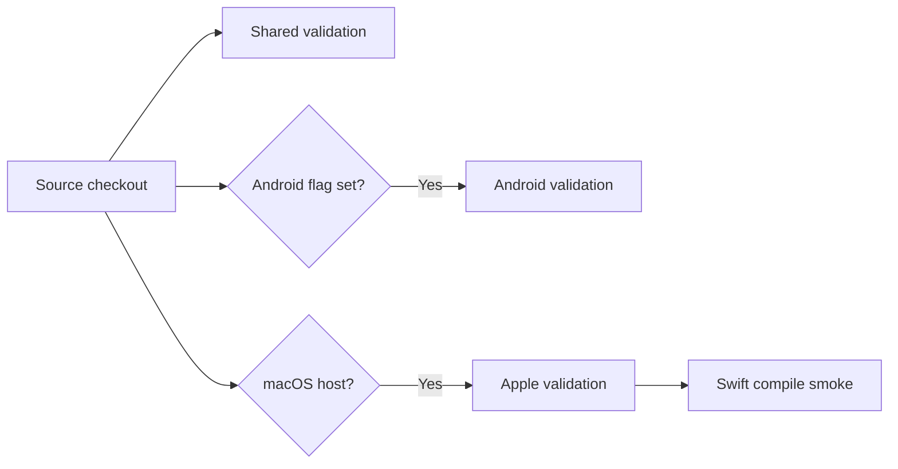

# Build and validate DataLoom locally

> **Audience:** Contributors preparing changes or reproducing validation
> failures
> **Purpose:** Provide repository-grounded shared, Android, and Apple commands
> **Status:** Current source-build workflow; successful builds do not equal V1
> production readiness

[Project overview](../../README.md) ·
[Android guide](../android/README.md) ·
[Apple guide](../apple/README.md) ·
[Testing toolkit](../testing/testing-toolkit.md)

The default project graph contains six shared KMP modules. Android projects
are opt-in through `DATALOOM_ANDROID_BUILD=true`; Apple targets and
`dataloom-apple` are available only on macOS.

## Select the validation lane



## Toolchain

| Tool | Current repository requirement |
|---|---|
| JDK | 17 or newer |
| Gradle | 9.5.0 through the committed Wrapper |
| Kotlin | 2.4.10 |
| Android Gradle Plugin | 9.1.0 when Android projects are enabled |
| Android SDK | Compile SDK 35; minimum SDK 21 |
| Xcode | Required on macOS for Apple linking, simulator tests, and XCFramework assembly |

Always run the Wrapper:

- Unix/macOS: `./gradlew`
- Windows: `.\gradlew.bat`

## Shared validation

From the repository root:

```bash
./gradlew --version
./gradlew projects
./gradlew build --configuration-cache
./gradlew check --configuration-cache
```

Run all shared module test tasks explicitly:

```bash
./gradlew \
    :dataloom-model:allTests \
    :dataloom-provider-api:allTests \
    :dataloom-api:allTests \
    :dataloom-core:allTests \
    :dataloom-runtime:allTests \
    :dataloom-testing:allTests
```

Inspect the runtime classpath:

```bash
./gradlew \
    :dataloom-runtime:dependencies \
    --configuration jvmRuntimeClasspath
```

Validate reviewed Kotlin/KLib ABI baselines:

```bash
./gradlew checkKotlinAbi
```

The
[Pull Request Validation workflow](../../.github/workflows/pr-validation.yml)
currently runs the shared build, checks, module tests, and runtime dependency
inspection. Apple validation additionally runs ABI validation. This guide does
not trigger either workflow.

## Android validation

Android projects are absent unless the environment variable is exactly
`true`.

```bash
DATALOOM_ANDROID_BUILD=true ./gradlew \
    projects \
    --no-configuration-cache
```

### Fast Android build

```bash
DATALOOM_ANDROID_BUILD=true ./gradlew \
    :dataloom-connectivity-android:build \
    :dataloom-scheduler-workmanager:build \
    :dataloom-queue-room:build \
    :dataloom-storage-room:build
```

### Workflow-aligned Android checks

```bash
DATALOOM_ANDROID_BUILD=true ./gradlew \
    :dataloom-connectivity-android:assembleDebug \
    :dataloom-connectivity-android:assembleRelease \
    :dataloom-connectivity-android:testDebugUnitTest \
    :dataloom-connectivity-android:lintDebug \
    :dataloom-scheduler-workmanager:assembleDebug \
    :dataloom-scheduler-workmanager:assembleRelease \
    :dataloom-scheduler-workmanager:testDebugUnitTest \
    :dataloom-scheduler-workmanager:lintDebug \
    :dataloom-queue-room:assembleDebug \
    :dataloom-queue-room:assembleRelease \
    :dataloom-queue-room:assembleDebugAndroidTest \
    :dataloom-queue-room:testDebugUnitTest \
    :dataloom-queue-room:lintDebug \
    :dataloom-storage-room:assembleDebug \
    :dataloom-storage-room:assembleRelease \
    :dataloom-storage-room:assembleDebugAndroidTest \
    :dataloom-storage-room:testDebugUnitTest \
    :dataloom-storage-room:lintDebug
```

The Android workflow also verifies the committed Room schema against KSP
output and then runs the managed-device test:

```bash
DATALOOM_ANDROID_BUILD=true ./gradlew \
    :dataloom-queue-room:pixel2Api35DebugAndroidTest \
    :dataloom-storage-room:pixel2Api35DebugAndroidTest
```

The managed-device task requires Android SDK components, an API 35 x86_64
system image, and hardware virtualization. See
[Android Validation](../../.github/workflows/android-validation.yml) for the
authoritative ordering and schema comparison.

## Apple validation

Run Apple commands on macOS:

```bash
./gradlew \
    :dataloom-model:iosSimulatorArm64Test \
    :dataloom-provider-api:iosSimulatorArm64Test \
    :dataloom-api:iosSimulatorArm64Test \
    :dataloom-core:iosSimulatorArm64Test \
    :dataloom-runtime:iosSimulatorArm64Test \
    :dataloom-testing:iosSimulatorArm64Test
```

Assemble the optional Swift/Objective-C artifact:

```bash
./gradlew :dataloom-apple:assembleDataLoomReleaseXCFramework
```

The Apple workflow additionally compiles `runtime-external-consumer` for all
three iOS targets and compares the generated XCFramework headers. Then follow
the
[Swift smoke fixture](../../apple-smoke/README.md) for the exact
`xcodebuild` command. These producer checks do not replace the missing
executable KMP iOS consumer and real Apple adapter tests.

## Windows

Set the Android flag in PowerShell before invoking Android tasks:

```powershell
$env:DATALOOM_ANDROID_BUILD = "true"
.\gradlew.bat projects --no-configuration-cache
.\gradlew.bat :dataloom-connectivity-android:build
.\gradlew.bat :dataloom-scheduler-workmanager:build
.\gradlew.bat :dataloom-queue-room:build
.\gradlew.bat :dataloom-storage-room:build
```

Shared commands use the same task names with `.\gradlew.bat`. Apple targets
and XCFramework tasks are unavailable on Windows.

## Wrapper integrity

The Wrapper downloads `gradle-9.5.0-bin.zip` and verifies this committed
SHA-256 value:

```text
553c78f50dafcd54d65b9a444649057857469edf836431389695608536d6b746
```

Verify the committed wrapper JAR:

```bash
sha256sum gradle/wrapper/gradle-wrapper.jar
```

Expected SHA-256:

```text
497c8c2a7e5031f6aa847f88104aa80a93532ec32ee17bdb8d1d2f67a194a9c7
```

PowerShell equivalent:

```powershell
Get-FileHash gradle\wrapper\gradle-wrapper.jar -Algorithm SHA256
```

## Troubleshooting

### Android modules are missing

Run `./gradlew projects` with `DATALOOM_ANDROID_BUILD=true` in the same process.
If the flag is absent or has another value, `settings.gradle.kts` intentionally
omits all four Android projects.

### Android plugin or dependency resolution fails

Android validation needs access to the Gradle Plugin Portal, Maven Central, and
Google Maven. The repository already declares these in `settings.gradle.kts`;
do not work around resolution failures by committing generated plugin metadata
or weakening validation. The Android workflow explicitly rejects a root
`META-INF/gradle-plugins` directory.

### Java bytecode version fails

Confirm `java -version` reports JDK 17 or newer and that `JAVA_HOME` points to
that JDK.

### Wrapper download fails

The first run needs the configured Gradle distribution unless it is already
cached or supplied by an approved mirror. Do not change the distribution URL
or checksum merely to bypass a transient network failure.

### Configuration cache fails

Inspect:

```text
build/reports/problems/problems-report.html
```

Use `--no-configuration-cache` only for diagnosis or for tasks that are
explicitly invoked that way by the current workflow. Do not commit a global
configuration-cache disablement without an approved rationale.

## Product-readiness boundary

A green build validates the source graph and covered behavior. It does not
prove complete offline-first, remote-first, cache-first, network-only, hybrid,
or adaptive strategy support, nor platform parity across native Android, KMP
Android, and KMP iOS. Optional native Swift distribution remains a separate
qualification decision.
