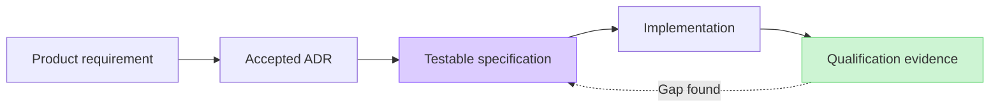

# Specifications

Specifications turn accepted product and architecture decisions into
testable behavior. They sit between ADRs and implementation:

## Current status

The repository has detailed API/architecture documentation and a V1
requirement audit, but it does not yet contain a complete, versioned
specification suite. That absence is a documentation and release-planning gap;
it must not be read as permission to implement behavior ad hoc.

Until dedicated specifications are added, use:

- [ADR-0002](../adr/ADR-0002-v1-artifact-and-foundation-architecture.md)
  for accepted V1 architecture;
- the [six-strategy guide](../strategies/README.md) for required strategy
  semantics and acceptance gates;
- the [API reference](../api/README.md) for checked-in contracts;
- the [architecture hub](../architecture/README.md) for current flows; and
- [DL-AUDIT-004](../audits/DL-AUDIT-004-v1-production-readiness.md) for the
  V1 requirement and release-gate matrix.

## Required specification set

| Specification area | Minimum contents |
|---|---|
| Strategy engine | Six profiles, evaluation inputs, deterministic decisions, fallback, persistence, and result metadata |
| Retry and circuit | Classification, backoff, jitter, hints, attempt/time budgets, durable circuit state, and manual control |
| Conflict | Detection, built-in generic policies, custom policy boundary, persistence, recovery, and audit |
| Events and observability | Event taxonomy, ordering, durability, redaction, metrics, traces, health, and read models |
| Asset transfer | Sessions, chunks, streaming, integrity, encryption, pause/resume, cancellation, cleanup, and restart |
| Plugin platform | Identity, permissions, lifecycle, compatibility, isolation, discovery, health, and governance |
| Enterprise governance | Tenant isolation, policy, administration, audit, retention, access control, and safe operations |
| Platform qualification | Native Android, KMP Android, KMP iOS, and optional Swift distribution matrices |

Each normative requirement should have a stable identifier, explicit
success/failure/cancellation/restart semantics, and traceability to tests and
release evidence.
