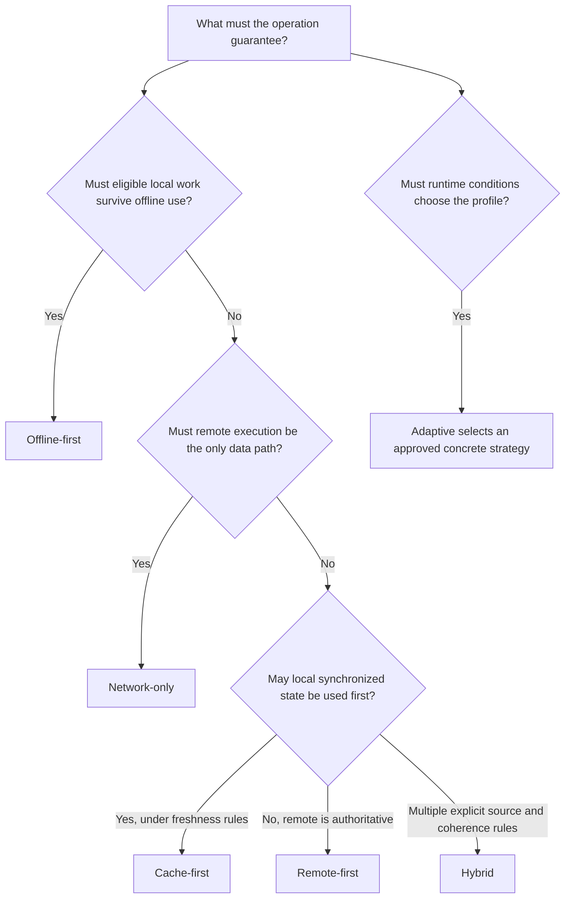
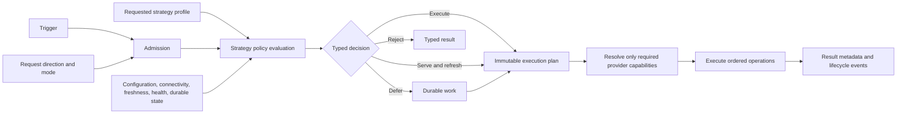

# DataLoom Synchronization Strategies

> [!IMPORTANT]
> This documentation defines the mandatory V1 product contract. The repository
> now contains versioned profile, evidence, decision, execution-plan, and
> durable-decision contracts plus a deterministic planner for all six
> strategies. Plan-aware direct network-only execution is also implemented.
> The other strategy runtimes, persistence, events, and full platform
> qualification are still required before the engine is complete.

DataLoom's primary product purpose is to provide one deterministic,
policy-driven synchronization engine with six complete built-in strategies.
All six are required for V1:

| Strategy | Choose it when | Current repository |
|---|---|---|
| [Offline-first](./offline-first.md) | Eligible local work must be durable before remote availability is required. | Contract and plan evaluation implemented; atomic execution pending |
| [Remote-first](./remote-first.md) | The remote path is authoritative and must be attempted before an explicit local fallback. | Contract and typed plan evaluation implemented; execution pending |
| [Cache-first](./cache-first.md) | Local synchronized state may be used under explicit freshness and refresh rules. | Contract and freshness decision matrix implemented; execution pending |
| [Network-only](./network-only.md) | Remote execution must succeed without local storage or queue access. | Direct transport-only PUSH, PULL, and BIDIRECTIONAL execution implemented; full event/result qualification pending |
| [Hybrid](./hybrid.md) | A declared primary source, fallback, return rule, persistence rule, and coherence rule must be composed. | Contract and finite source plan evaluation implemented; execution pending |
| [Adaptive](./adaptive.md) | A bounded policy must select deterministically from approved concrete strategies. | Deterministic allowlisted selection implemented; durable admission pending |

None of these strategies may be deferred to V2, reduced to application-owned
replacement code, or considered complete merely because a custom pipeline can
be registered. The governing decisions are
[ADR-0002](../adr/ADR-0002-v1-artifact-and-foundation-architecture.md) and the
[V1 production-readiness audit](../audits/DL-AUDIT-004-v1-production-readiness.md).
Implementation and qualification are tracked by
[GitHub issue #102](https://github.com/dataloom-sdk/dataloom/issues/102).
The implemented contracts and examples are documented in the
[Synchronization Strategy API](../api/synchronization-strategy.md).

## Decision guide

Start with the guarantee the application requires, not with the current
pipeline classes:

| Requirement | Recommended strategy | Important qualification |
|---|---|---|
| Accept work while offline and reconcile later | Offline-first | Acceptance requires an atomic durable local-intent and outbox/queue boundary. |
| Prefer the server but permit a controlled local fallback | Remote-first | Fallback is allowed only for configured typed outcomes. |
| Return synchronized local state quickly and refresh it | Cache-first | Freshness, stale use, and refresh durability must be explicit. |
| Make no local-store or queue calls | Network-only | Offline or remote unavailability returns a typed terminal outcome. |
| Combine source and persistence behavior | Hybrid | Every branch and coherence transition must be declared and finite. |
| Choose from several profiles using current conditions | Adaptive | Selection is deterministic, bounded, explainable, and persisted for durable work. |

Adaptive is a selector, not a seventh execution behavior. It chooses one of
the approved concrete profiles and then that profile owns execution and
fallback semantics.

## Four orthogonal axes

Strategy must not be inferred from direction, transfer mode, or trigger:

| Axis | Question answered | Values or examples | It does not answer |
|---|---|---|---|
| **Strategy** | Which source is preferred, what is durable, and when may fallback occur? | Offline-first, remote-first, cache-first, network-only, hybrid, adaptive | Which direction data moves or how much data transfers |
| **Direction** | Which way may synchronization data move? | `PUSH`, `PULL`, `BIDIRECTIONAL` | Source authority, cache policy, durability, or fallback |
| **Transfer mode** | What transfer scope is requested? | `FULL`, `DELTA` | Local-first versus remote-first behavior |
| **Trigger** | What caused admission or execution? | Direct call, durable queue, platform schedule, lifecycle signal, connectivity signal, manual action | Strategy, direction, or transfer scope |

`StrategySynchronizationRequest` accepts a versioned profile, direction,
transfer mode, trigger, runtime evidence, and operation input as separate
axes. The legacy
[`SynchronizationRequest`](../api/synchronization-request.md) facade remains
available for direction-based storage pipelines. A combination may be rejected
by capability validation—for example, a DataLoom durable-queue trigger is
incompatible with network-only's zero-queue-call guarantee—but rejection must
never silently change the selected strategy.

## Current repository

The repository now provides a deterministic strategy-policy layer in addition
to its execution foundations:

- `SynchronizationStrategyProfile` defines immutable, versioned profiles for
  offline-first, remote-first, cache-first, network-only, hybrid, and adaptive.
- `StrategyRuntimeEvidence`, `StrategyEvaluationResult`, and
  `StrategyExecutionPlan` provide bounded evidence, explainable typed
  decisions, ordered operations, and plan-derived provider capabilities.
- `BuiltInSynchronizationStrategyEvaluator` evaluates all six profiles without
  provider calls, clock reads, randomness, or exception-derived fallback.
- `PersistedStrategyDecision` defines the non-sensitive identity durable work
  must retain across retry, lease recovery, and restart.
- `StrategyProviderBindings` and `StrategyProviderResolver` resolve only the
  capabilities required by the evaluated plan.
- `DataLoom.synchronize(StrategySynchronizationRequest)` executes direct
  network-only PUSH, PULL, and BIDIRECTIONAL plans through transport alone and
  preserves completed push evidence when a later pull fails.

The remaining strategies do not yet execute their plans end to end:

- The legacy facade still uses direction-keyed pipelines and universal
  storage-plus-transport bindings. It remains separate from strategy
  execution. See [Execution Coordinator](../architecture/execution-coordinator.md),
  [Provider Bindings](../api/provider-bindings.md), and
  [Provider Resolution](../architecture/provider-resolution.md).
- The built-in push path reads local storage, calls transport, and acknowledges
  storage. See [Outbound Push Pipeline](../api/outbound-push-pipeline.md).
- The built-in pull path reads a local checkpoint, calls transport, applies
  changes to storage, and then writes the checkpoint. See
  [Inbound Pull Pipeline](../api/inbound-pull-pipeline.md).
- Bidirectional configuration can choose outbound-first or inbound-first
  ordering, but ordering alone does not define remote-first behavior. See
  [Bidirectional Pipeline](../api/bidirectional-pipeline.md).
- Durable queue submission and worker startup are explicit host actions. See
  [Queue Submission](../api/queue-submission.md) and
  [Queue Worker Coordinator](../api/queue-worker-coordinator.md).
- Connectivity support is a one-shot preflight and a fixed queued deferral
  path, not adaptive policy evaluation. Direct rejection does not
  automatically enqueue work. See
  [Connectivity-Aware Execution](../api/connectivity-aware-execution.md).

These foundations now provide both the original storage-to-transport flow and
a strict transport-only path. They still do not provide the atomic admission
guarantee required for complete offline-first behavior or the local-fallback
semantics required by remote-first and hybrid.

## V1 common orchestration contract

V1 evaluates all four axes into one immutable effective plan before resolving
plan-specific providers:

The public and runtime contracts must provide:

1. A stable built-in strategy identifier and versioned immutable
   configuration snapshot.
2. A bounded, side-effect-free, deterministic, and explainable strategy
   evaluation.
3. A typed decision: execute, serve-and-refresh, defer, or reject.
4. An immutable plan describing ordered operations, provider capabilities,
   fallback classifications, consistency/freshness, persistence, queueing,
   retry, conflict, and reconciliation references.
5. Provider resolution derived from the selected plan rather than a universal
   storage-plus-transport requirement.
6. A durable record of effective strategy, configuration version, plan
   identity, and non-sensitive decision evidence whenever work is persisted.
7. An explicit authorized transition for re-evaluation; restart or
   reacquisition otherwise uses the recorded decision.

Fallback must never be inferred from an exception class, a missing provider,
the current platform, or registration order. Unknown connectivity or provider
health is a typed policy input, not permission to assume online or offline
behavior.

## Common provider capability rules

| Capability | Required when |
|---|---|
| Transport | The effective plan performs a remote operation. |
| Storage | The plan reads, persists, acknowledges, or reconciles local synchronized state. |
| Queue / durable work store | The plan promises deferred, restart-safe, or background work. |
| Connectivity | Admission or execution depends on a connectivity classification. |
| Scheduler / platform background execution | The plan promises later execution without a foreground caller. |
| Retry and circuit state | The profile permits retries or circuit decisions. |
| Conflict state and resolver | Concurrent local/remote changes can require resolution. |
| Event outbox / operations read model | The plan promises durable, replayable operational evidence. |

The effective plan declares these capabilities. Provider selection remains
explicit, and a missing required capability produces a typed admission failure
or explicit configured degradation—not an implicit strategy switch.

## Failure and fallback rules

Every strategy page defines its own matrix, but these rules are universal:

- Cancellation remains cancellation and is never converted into fallback or
  retry.
- Authentication, authorization, validation, integrity, and policy denial do
  not use availability fallback unless the profile explicitly and safely
  allows it.
- Constraint deferral is not a retry and does not consume retry attempts.
- A retryable failure is evaluated by the retry policy; it is not guessed from
  an arbitrary thrown exception.
- Unresolved conflicts are durably represented before execution reports a
  recoverable conflict state.
- Partial success identifies completed and outstanding effects.
- Provider absence or degradation is explicit and observable.

See [Error Model](../api/error-model.md),
[Retry Orchestration](../api/retry-orchestration.md), and
[Conflict Orchestration](../api/conflict-orchestration.md).

## Result and event metadata

V1 results and events must identify at least:

| Field | Purpose |
|---|---|
| Requested and effective strategy | Distinguish caller intent from the plan that executed. |
| Strategy/configuration version | Reconstruct semantics across delayed execution and restart. |
| Decision and plan ID | Correlate admission, execution, retry, conflict, and diagnostics. |
| Trigger | Explain why the work was admitted or executed. |
| Data origin | `LOCAL`, `REMOTE`, or `MIXED` when applicable. |
| Freshness | Observation time, age/expiry, and whether stale data was permitted. |
| Disposition | Executed, served locally, queued, deferred, refresh scheduled, rejected, or degraded. |
| Fallback evidence | Typed primary outcome and the configured rule that allowed fallback. |
| Persistence/recovery state | Durable record identity and outstanding reconciliation state without sensitive payloads. |

Required strategy lifecycle events include strategy evaluated, plan selected,
fallback activated, local/cache state served, work deferred, refresh
scheduled/completed, reconciliation started/completed, and explicit
degradation. They complement the existing
[Synchronization Events](../api/synchronization-events.md) and
[Runtime Operational Events](../api/runtime-operational-events.md). Durable
delivery and observability remain V1 release work; current event contracts are
not proof of that guarantee.

## Platform parity

The observable strategy contract is identical for:

- native Android applications;
- Kotlin Multiplatform applications on Android; and
- Kotlin Multiplatform applications on iOS.

Android and iOS may use different connectivity, storage, scheduler, and
background-execution mechanisms. Those differences may affect timing, but not
source authority, fallback classification, durability claims, decision
identity, or recovery semantics. A platform limitation returns an explicit
unsupported or degraded outcome. It never silently selects another strategy.

See [Platform Strategy](../architecture/platform-strategy.md),
[Android Integration](../android/README.md), and
[ADR-0001](../adr/ADR-0001-android-first-kmp-core.md).

## V1 acceptance matrix

Each strategy must pass its page-specific gates plus the shared matrix:

| Dimension | Required cases |
|---|---|
| Direction | PUSH, PULL, BIDIRECTIONAL |
| Transfer mode | FULL, DELTA |
| Trigger | Direct and every compatible queued/scheduled/platform trigger |
| Connectivity | Available, unavailable, limited, metered, unmetered, unknown, provider failure |
| Local state | Missing, fresh, stale, dirty, pending, conflicted |
| Remote state | Success, empty/no-change, transient failure, permanent failure, auth/policy denial, malformed/integrity failure |
| Recovery | Cancellation, retry exhaustion, process death at every durable transition, expired lease, application relaunch |
| Provider behavior | Required provider missing, degraded health, timeout, duplicate response, late response |
| Platform | Native Android, KMP Android, KMP iOS |

Tests must assert operation order, durable transitions, idempotency, decision
replay, metadata/events, and forbidden provider calls. CI is run only after the
bounded local matrix passes; successful workflows are not rerun merely to
collect duplicate evidence.

## Strategy pages

- [Offline-first](./offline-first.md)
- [Remote-first](./remote-first.md)
- [Cache-first](./cache-first.md)
- [Network-only](./network-only.md)
- [Hybrid](./hybrid.md)
- [Adaptive](./adaptive.md)
