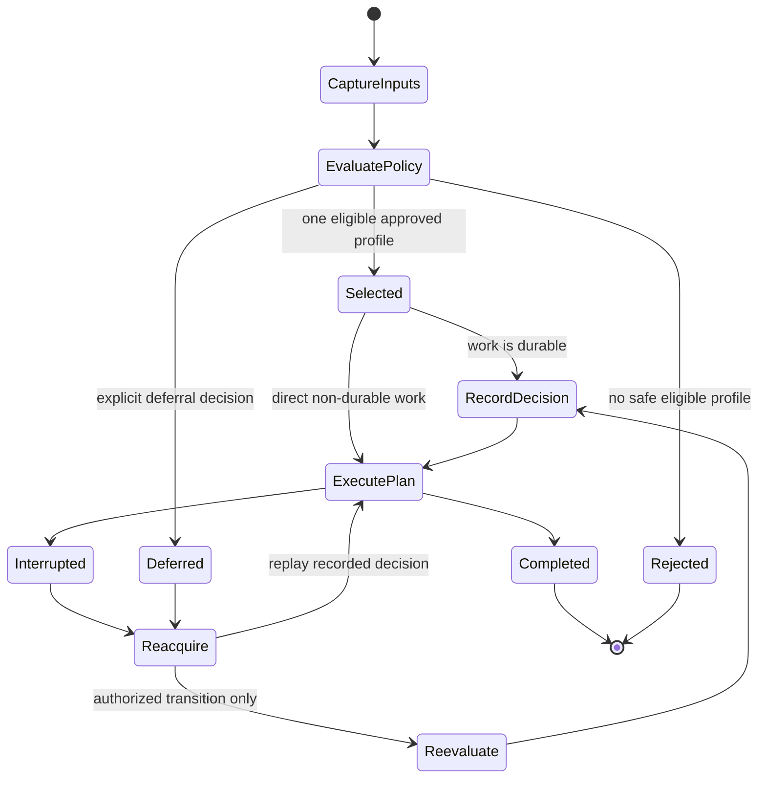

# Adaptive Strategy

> [!WARNING]
> Adaptive is a mandatory built-in V1 strategy. Bounded deterministic selection
> from unique concrete profile IDs is implemented with an explicit safe
> default and no nested adaptive policy. Admission still needs to persist and
> replay the selected decision end to end.

[Strategy index](./README.md) · [Offline-first](./offline-first.md) ·
[Remote-first](./remote-first.md) · [Cache-first](./cache-first.md) ·
[Network-only](./network-only.md) · [Hybrid](./hybrid.md)

## Purpose

Choose adaptive when the runtime must deterministically select one approved
concrete strategy using immutable observations such as operation type,
freshness, connectivity, provider health, tenant/workflow configuration, and
durable state.

Adaptive selects; it does not improvise execution. Once selected,
offline-first, remote-first, cache-first, network-only, or a validated hybrid
profile owns provider ordering, fallback, persistence, retry, conflict, and
reconciliation.

Direction, transfer mode, and trigger remain separate policy inputs:

- `PUSH`, `PULL`, and `BIDIRECTIONAL` constrain eligible plans.
- `FULL` and `DELTA` constrain scope/cost without implying a strategy.
- Direct, queued, scheduled, lifecycle, connectivity, and manual triggers may
  affect an approved selection rule without becoming strategies themselves.

## Current repository

The current connectivity preflight:

- evaluates one builder-wide requirement;
- reads at most one connectivity snapshot per execution;
- classifies it as satisfied, unmet, provider missing, or provider failure;
- rejects direct execution when unmet; and
- fixed-delay reschedules an already queued entry when explicitly unmet.

See [Connectivity-Aware Execution](../api/connectivity-aware-execution.md) and
[Connectivity Preflight and Offline Deferral](../architecture/connectivity-preflight-offline-deferral.md).

The repository has no policy that:

- selects from an allowlist of complete strategy profiles;
- combines freshness, provider health, durable state, tenant/workflow policy,
  operation cost, or trigger inputs;
- records a bounded explainable decision;
- derives provider requirements from the selected plan; or
- replays the same effective strategy after queued delay or restart.

Custom pipeline lookup by direction is not adaptive behavior.

## V1 required behavior

The V1 rule is:

> Evaluate a bounded, side-effect-free, deterministic policy over an immutable
> input snapshot; choose only an allowlisted concrete profile; persist the
> choice with durable work; and execute that profile without hidden
> re-selection.

### Evaluation input

The immutable evaluation context includes, as applicable:

- requested profile and allowlisted concrete profiles;
- direction, transfer mode, operation class, priority, and trigger;
- connectivity snapshot and its observation time;
- cache presence, freshness, invalidation, and pending-local state;
- provider capability and health snapshots;
- retry/circuit, unresolved conflict, and durable-work state;
- tenant, workflow, user-action, data-residency, and governance policy;
- versioned configuration snapshot;
- injected clock/randomness inputs when policy permits them; and
- previous decision when evaluating an authorized transition.

Sensitive payloads, credentials, arbitrary provider objects, stack traces, and
platform-specific exception types are excluded.

### Evaluation output

The decision contains:

- selected concrete profile and version, or typed defer/reject disposition;
- immutable plan identity and plan-derived capability requirements;
- ordered matching rule and non-sensitive reason/evidence codes;
- configuration and input-snapshot versions;
- whether re-evaluation is allowed, at which durable state, and under whose
  authority; and
- expiry/revalidation boundary for observations without changing already
  committed effects.

An evaluation timeout, exception, missing observation, or empty eligible set
uses an explicit safe rule. It never defaults silently to network-only,
offline-first, or whichever provider happens to be registered.

## Provider requirements

| Capability | Requirement |
|---|---|
| Policy evaluator | Always required; bounded, deterministic, side-effect-free, and explainable. |
| Observation sources | Required only for inputs referenced by configured rules; unavailable/unknown values are typed. |
| Selected-plan providers | Derived from the selected concrete strategy and resolved before execution. |
| Durable decision store | Required whenever work is queued, deferred, restart-safe, or re-evaluable. |
| Clock/randomness | Injected and captured when explicitly used; uncontrolled entropy is forbidden. |
| Event/audit state | Required to correlate evaluation, selection, re-evaluation, and execution. |

The evaluator consumes immutable provider capability/health descriptions. It
does not invoke storage or transport side effects while deciding. Provider
operations begin only after a concrete plan is selected.

## Guarantees

- Identical canonical inputs and configuration produce the same decision.
- Only allowlisted, fully validated concrete profiles can be selected.
- Policy evaluation is time- and resource-bounded.
- Rule precedence and tie-breaking are deterministic.
- The decision is explainable without exposing secrets or payloads.
- Durable work retains its selected strategy across deferral, retry, process
  death, and reacquisition.
- Re-evaluation is explicit, authorized, fenced/versioned, and auditable.
- Once execution begins, a provider failure does not trigger hidden adaptive
  re-selection; the selected concrete profile handles it.
- Platform name is not a strategy-selection shortcut.

## Failure and fallback semantics

| Condition | Required behavior |
|---|---|
| Required observation unavailable or unknown | Apply the configured rule for that typed value; do not fabricate a healthy/online/fresh value. |
| Policy timeout or evaluator failure | Return explicit policy failure or safe configured rejection/deferral; emit redacted diagnostics. |
| No eligible allowlisted profile | Reject or defer explicitly. Never select an unapproved default. |
| Equal-priority rules match | Use documented deterministic precedence/tie-breaking. |
| Selected provider becomes unhealthy before execution | Let the selected profile's admission/failure policy handle it, or perform an authorized recorded re-evaluation before side effects. |
| Failure after side effects begin | Do not re-select strategy automatically; resume/compensate through the recorded plan. |
| Configuration changes while work is queued | Keep the recorded version unless an authorized migration/re-evaluation transition succeeds. |
| Cancellation | Propagate cancellation; do not treat it as evidence for another strategy. |

Fallback belongs to the selected concrete strategy. Adaptive policy may select
a configured hybrid profile, but it cannot use exceptions as an unrecorded
cross-strategy fallback mechanism.

## Persistence and restart

Durable adaptive work records:

- policy set, policy version, and configuration snapshot;
- canonical input snapshot identities and observation timestamps;
- selected concrete strategy/profile version;
- decision ID, matched rule, reason/evidence codes, and plan ID;
- capability requirements and validation outcome;
- re-evaluation permission/boundary;
- previous decision and authorized transition evidence, if any;
- execution/retry/conflict/recovery state; and
- trigger, fencing, idempotency, event, and audit correlation.

Reacquisition replays the selected plan. A changed network, cache age, provider
health, or application version does not silently replace it. If policy permits
re-evaluation before a named safe boundary, the runtime records a compare-and-
set transition that preserves both decisions and proves that no incompatible
side effect had begun.

## Result and event metadata

Results must include:

- requested strategy `ADAPTIVE`;
- selected effective concrete strategy and profile version;
- policy/configuration/input-snapshot versions;
- decision ID, matched rule, and redacted reason/evidence;
- trigger, direction, mode, origin, freshness, fallback, and persistence fields
  required by the selected strategy;
- whether re-evaluation occurred and both decision IDs; and
- explicit unsupported, degraded, deferred, or rejected disposition.

Required events include adaptive evaluation started/completed, strategy
selected, no eligible strategy, evaluation failed/timed out, decision
persisted, re-evaluation requested/authorized/rejected/completed, selected plan
started, and selected strategy's normal lifecycle events.

Metrics must use bounded strategy/rule identifiers. Tenant IDs, workflow IDs,
payload attributes, exception messages, and decision evidence with unbounded
cardinality do not become metric labels.

## Platform parity

Native Android, KMP Android, and KMP iOS use the same canonical policy engine,
rule ordering, unknown-value semantics, and profile allowlist. Platform
adapters convert OS-specific connectivity, health, lifecycle, and background
signals into canonical observations.

The same canonical input fixture must select the same strategy on all three
consumer paths. A missing platform capability yields an explicit observation
or unsupported/degraded result, never a platform-specific hidden default.

## Acceptance gates

- Golden tests prove identical inputs/configuration select the same profile,
  plan, reason, and evidence.
- Property tests prove order-independent input serialization, deterministic
  tie-breaking, bounded evaluation, and allowlist enforcement.
- Unknown/missing/stale observations and evaluator timeout/failure produce the
  configured safe outcome.
- Policy evaluation performs zero storage/transport side effects.
- Provider health change before/after the first side effect proves the
  authorized re-evaluation boundary.
- Queued delay, retry, lease expiry, process death, and relaunch preserve the
  selected strategy and configuration version.
- Configuration migration tests prove old work cannot silently adopt new
  semantics.
- Results/events reconstruct the evaluation, selection, any authorized
  re-evaluation, and the selected strategy's execution.
- The selected offline-first, remote-first, cache-first, network-only, and
  hybrid profiles each pass through adaptive admission for compatible
  PUSH/PULL/BIDIRECTIONAL and FULL/DELTA cases.
- Native Android, KMP Android, and KMP iOS select identically from shared
  fixtures and pass end-to-end recovery tests.

## Related documentation

- [Strategy decision guide](./README.md)
- [ADR-0002 V1 architecture](../adr/ADR-0002-v1-artifact-and-foundation-architecture.md)
- [Connectivity Provider](../api/connectivity-provider.md)
- [Provider Lifecycle and Health](../api/provider-lifecycle.md)
- [Runtime Dependencies](../architecture/runtime-dependencies.md)
- [Runtime Assembly](../architecture/runtime-assembly.md)
- [GitHub issue #102: strategy implementation gate](https://github.com/dataloom-sdk/dataloom/issues/102)
