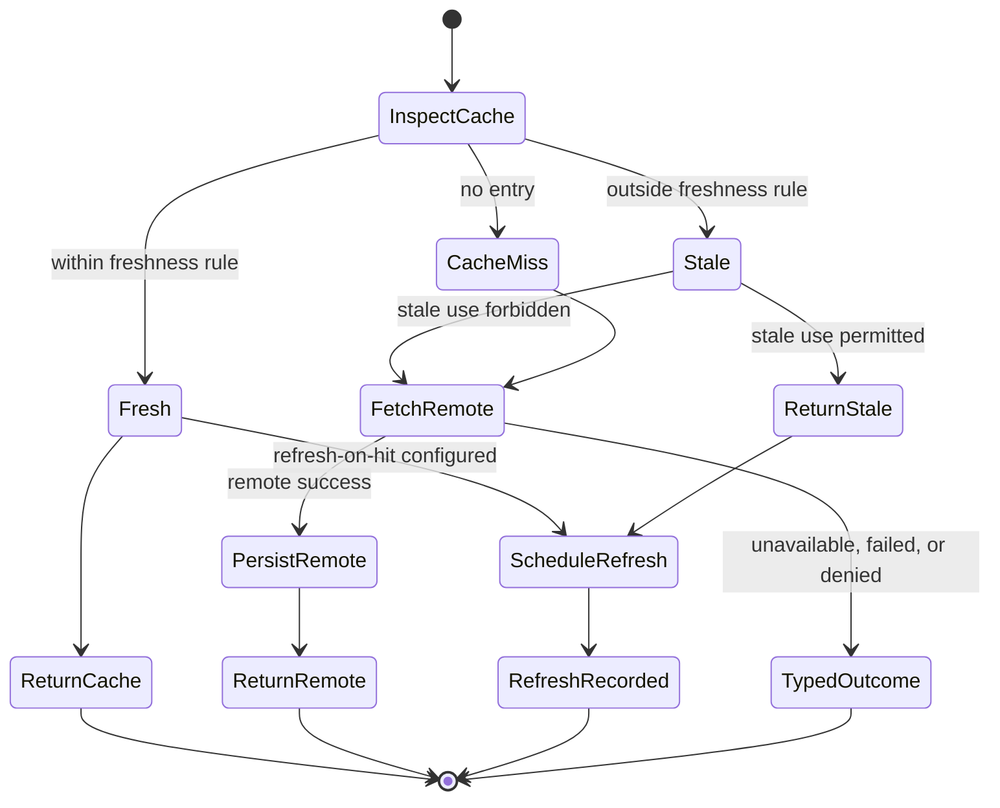

# Cache-First Strategy

> [!WARNING]
> Cache-first is a mandatory built-in V1 strategy. Fresh, stale, missing, and
> unknown policy decisions, provider-observed local serving, protected cache
> verification, the direct storage/transport direction matrix, and a public
> inline-refresh outcome contract are implemented. Inline refresh composition,
> durable refresh admission/recovery, coherence, events, and complete platform
> qualification remain open.

[Strategy index](./README.md) · [Remote-first](./remote-first.md) ·
[Offline-first](./offline-first.md) · [Hybrid](./hybrid.md)

## Purpose

Choose cache-first when synchronized local state may satisfy an operation
before a remote call, but only under explicit freshness and staleness rules.
The profile also defines whether and how a remote refresh occurs.

Cache-first is not “read whatever is local.” It requires a trustworthy
freshness observation, a declared stale policy, a typed miss outcome, and
observable refresh semantics. DataLoom still does not become the application's
generic query API or UI state store; it governs synchronization state,
refresh, persistence, and reconciliation around registered providers.

Direction, transfer mode, and trigger are independent:

- `PULL` commonly evaluates synchronized local state before remote refresh.
- `PUSH` may use cached synchronization metadata, but cache-first does not
  replace the configured source of outbound changes.
- `BIDIRECTIONAL` composes an explicit cache decision with outbound/inbound
  ordering and reconciliation.
- `FULL` or `DELTA` controls refresh scope.
- Direct or background triggers do not alter freshness or stale-use rules.

## Current repository

The repository now provides:

- `StrategyCacheAccessProvider`, a payload-free application-owned boundary that
  verifies cache availability and freshness immediately before local use;
- provider-observed `FRESH`/`STALE` evidence with observation and exclusive
  freshness-deadline timestamps;
- explicit cache-served, cache-unavailable, and freshness-downgrade results;
- independent timeout/circuit protection for cache verification;
- direct canonical PUSH, cache-miss PULL, and cache-miss BIDIRECTIONAL execution
  through the shared pipelines;
- immutable origin and partial remote-effect evidence; and
- `StrategyCacheInlineRefreshResult`, which distinguishes completed, failed,
  and cancelled foreground refresh attempts without exposing domain payloads.

The remaining canonical boundaries include:

- composition of local-serving evidence with the inline refresh result;
- a durable refresh admission identity and handle;
- refresh deduplication and single-flight behavior;
- restart-safe queue/scheduler ownership and recovery;
- invalidation/coherence after push, conflict, tenant change, logout, or
  configuration update; and
- durable cache-decision and refresh events/read models.

Persisting pulled changes and a checkpoint alone is not proof of a complete
cache-first strategy. The local freshness decision, remote branch, refresh
state, and recovery evidence must remain explicit.

## V1 required behavior

The V1 rule is:

> Local synchronized state may be used first only when a deterministic
> freshness decision permits it. Any promised refresh is an observable
> operation and, when described as background or restart-safe, durable work.

### Required plan semantics

1. Read synchronized local state and its freshness metadata consistently.
2. Evaluate presence, age, expiry, invalidation, tenant/workflow scope, and
   configured consistency rule.
3. Return/use local state only when the explicit rule permits it.
4. On miss or forbidden staleness, attempt the remote branch or return the
   configured typed unavailable outcome.
5. If stale or fresh state is served with a promised refresh, persist and
   expose the refresh operation before reporting it as scheduled.
6. Deduplicate equivalent refresh work.
7. Apply remote refresh idempotently and update state plus freshness/checkpoint
   metadata atomically.
8. Reconcile refresh results against intervening local changes and conflicts.

Freshness is evaluated from an injected clock and immutable policy inputs. It
must not depend on wall-clock reads scattered across providers.

## Provider requirements

| Capability | Requirement |
|---|---|
| Storage/cache state | Always required, including freshness and invalidation metadata. |
| Transport | Required for cache miss, forbidden staleness, or configured refresh. It may be skipped for a terminal fresh-cache hit with no refresh. |
| Queue / durable work store | Required when refresh is promised after returning to the caller or must survive restart. |
| Connectivity | Required when refresh admission distinguishes current connectivity; unknown is explicit. |
| Scheduler/background execution | Required when DataLoom promises refresh without a foreground caller. |
| Clock | Required for deterministic age and expiry evaluation. |
| Conflict/reconciliation state | Required when remote refresh can meet local pending changes. |
| Event outbox/operations state | Required for durable refresh and observable cache decisions. |

The plan resolves transport only when a remote branch can execute. A fresh
cache-only completion must not call transport, queue, or scheduler unless the
profile explicitly requests refresh.

## Guarantees

- Local state is never called fresh without recorded freshness evidence.
- Stale state is used only within the configured maximum staleness and
  consistency rule.
- A cache miss is distinguishable from a provider failure and from stale data.
- Returned origin and freshness are observable.
- A refresh described as scheduled or pending has been durably accepted when
  durability is promised.
- Equivalent concurrent refreshes are deduplicated or safely coalesced.
- A refresh cannot overwrite a newer local change without reconciliation.
- Restart preserves a promised refresh and its original strategy/configuration
  decision.

Cache-first does not guarantee that returned state is globally current. It
guarantees that its age and permitted consistency are explicit.

## Failure and fallback semantics

| Condition | Required behavior |
|---|---|
| Cache entry missing | Attempt remote when configured and available; otherwise return a typed miss/unavailable result. |
| Fresh entry | Use it; refresh only if explicitly configured. |
| Stale entry within permitted window | Use it with `stale=true` and schedule/attempt refresh as configured. |
| Stale entry outside permitted window | Do not return it; use remote or return typed unavailability. |
| Freshness metadata missing, malformed, or tenant-mismatched | Treat as invalid/miss, not fresh. |
| Connectivity unavailable or unknown | Follow the explicit stale/miss rule; never silently extend the freshness window. |
| Remote transient failure after stale state was served | Preserve the served result and report refresh failure/retry state separately. |
| Authentication, validation, or integrity failure | Do not conceal the failure as a successful refresh; invalidate or retain local state only according to explicit policy. |
| Local persistence failure after remote success | Return partial/recoverable state or failure according to the consistency boundary; do not mark the cache fresh. |
| Cancellation | Cancel the active refresh; previously committed cache state remains unchanged. |

## Persistence and restart

Cache state must preserve:

- data/checkpoint version and tenant/workflow scope;
- observed, validated, stored, and expiry timestamps as required by policy;
- invalidation generation/reason;
- strategy/configuration/plan version;
- refresh work and deduplication identities;
- remote idempotency/receipt evidence;
- pending local changes and conflict state; and
- latest refresh disposition and redacted event correlation.

A background refresh is reported as scheduled only after its durable work
record commits. Reacquisition uses the original decision and freshness
observation needed for audit; it may re-check whether the refresh is still
necessary through an explicit idempotent transition. It cannot silently widen
the stale window or switch strategy.

## Result and event metadata

Results must include:

- effective strategy `CACHE_FIRST`;
- origin `LOCAL`, `REMOTE`, or `MIXED`;
- cache hit, miss, invalid, fresh, or stale classification;
- observation time, age, expiry, and permitted maximum staleness;
- whether stale state was used;
- refresh disposition: not required, inline, queued, running, completed,
  failed, cancelled, or deduplicated;
- refresh/work/plan/configuration identity; and
- fallback, retry, conflict, and outstanding persistence state.

Required events include cache inspected, cache hit/miss, stale state served,
refresh requested, refresh deduplicated, refresh durably scheduled, refresh
started/completed/failed, cache updated, and cache invalidated. Payload content
and sensitive domain values remain excluded from operational metadata.

## Platform parity

Native Android, KMP Android, and KMP iOS use the same clock semantics,
freshness rules, stale limits, deduplication identity, and refresh
dispositions. Platform schedulers may wake at different times; the result must
show the actual age and refresh state rather than pretending timing is equal.

If iOS or Android cannot guarantee the requested background refresh mode, the
profile is rejected or explicitly degraded before promising that refresh.

## Acceptance gates

- Boundary tests cover just-before, exactly-at, and just-after freshness and
  maximum-staleness limits using an injected clock.
- Fresh hit with no refresh makes zero transport, queue, and scheduler calls.
- Cache miss and forbidden-stale cases call transport exactly as planned.
- Unknown connectivity never widens staleness implicitly.
- Stale-while-revalidate returns accurate stale metadata and persists refresh
  before reporting it scheduled.
- Concurrent equivalent requests create at most one active refresh.
- Process death after refresh admission resumes without duplicate remote apply.
- A remote refresh cannot overwrite newer local work without conflict
  evaluation.
- Auth, integrity, validation, cancellation, and persistence failure produce
  truthful cache and refresh state.
- PUSH, PULL, BIDIRECTIONAL, FULL, and DELTA combinations validate their
  operation-specific cache semantics.
- Native Android, KMP Android, and KMP iOS pass the same freshness and recovery
  contract kit.

## Related documentation

- [Strategy decision guide](./README.md)
- [ADR-0002 V1 architecture](../adr/ADR-0002-v1-artifact-and-foundation-architecture.md)
- [Storage Boundaries](../architecture/storage-boundaries.md)
- [Inbound Pull Flow](../architecture/inbound-pull-flow.md)
- [Queue Submission](../api/queue-submission.md)
- [Clock](../api/clock.md)
- [GitHub issue #102: strategy implementation gate](https://github.com/dataloom-sdk/dataloom/issues/102)
