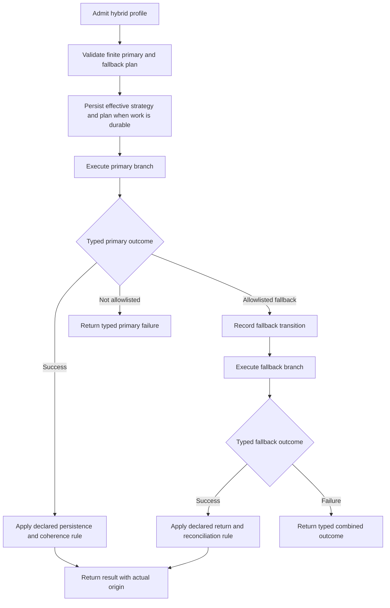

# Hybrid Strategy

> [!WARNING]
> Hybrid is a mandatory built-in V1 strategy and is not implemented in the
> current repository. “Try remote, catch, then use local” is not an acceptable
> hybrid contract.

[Strategy index](./README.md) · [Offline-first](./offline-first.md) ·
[Remote-first](./remote-first.md) · [Cache-first](./cache-first.md) ·
[Adaptive](./adaptive.md)

## Purpose

Choose hybrid when one operation needs a finite, explicit composition of:

- a primary source or path;
- an allowed fallback source or path;
- the typed outcomes that permit fallback;
- the origin that may be returned;
- local persistence/durability behavior; and
- cache coherence and later reconciliation behavior.

Hybrid is a concrete execution profile. Adaptive may select a hybrid profile,
but hybrid itself does not inspect arbitrary runtime conditions and improvise a
new strategy.

Direction, transfer mode, and trigger remain independent. A hybrid profile
applies its declared source/persistence rules to `PUSH`, `PULL`, or
`BIDIRECTIONAL`, with `FULL` or `DELTA` scope, regardless of whether admission
was direct, queued, scheduled, or platform-triggered.

## Current repository

The repository has separate storage, transport, queue, connectivity, retry,
conflict, and pipeline foundations. It can also choose outbound-first or
inbound-first bidirectional order.

It does not currently have a versioned profile that declares:

- primary and fallback branches;
- fallback classifications;
- return-source and partial-result rules;
- branch-specific provider requirements;
- freshness and consistency constraints;
- write-through, write-back, refresh, or reconciliation behavior;
- branch transition persistence; or
- plan/result/event identity.

See [Execution Coordinator](../architecture/execution-coordinator.md),
[Bidirectional Flow](../architecture/bidirectional-flow.md), and
[Connectivity-Aware Execution](../api/connectivity-aware-execution.md).

Current custom pipelines are an extension mechanism, not a standard hybrid
implementation or qualification substitute.

## V1 required behavior

The V1 rule is:

> Execute a validated finite plan whose primary, fallback, return, persistence,
> and coherence transitions are fully declared before the operation begins.

### Required profile fields

A complete hybrid profile identifies:

| Field | Required meaning |
|---|---|
| Primary branch | Concrete source/path and ordered operations attempted first. |
| Fallback branch | Concrete source/path allowed only after a matching primary outcome. |
| Fallback predicate | Closed canonical outcome classifications, not exception matching. |
| Return rule | Which branch result may be returned and how partial/mixed results are represented. |
| Freshness/consistency | Validity and staleness constraints for every local branch. |
| Persistence rule | None, read-through, write-through, write-back, durable outbox, or another versioned declared rule. |
| Coherence rule | How local and remote versions, checkpoints, invalidation, and acknowledgements converge. |
| Reconciliation rule | Whether and how fallback use creates later durable work. |
| Retry/conflict references | Versioned policies applied at named transitions. |
| Capability set | Providers required by each branch and by recovery. |

The graph is finite and acyclic. A fallback branch cannot recursively invoke
the same hybrid plan, and missing providers cannot be used as a hidden
branch-selection mechanism.

## Provider requirements

| Capability | Requirement |
|---|---|
| Primary-branch providers | Required before the primary branch is admitted. |
| Fallback-branch providers | Required when the profile promises that fallback; otherwise the profile must declare explicit degradation. |
| Storage | Required for any local read, persistence, cache, acknowledgement, or reconciliation step. |
| Transport | Required for every remote branch. |
| Queue/outbox | Required for deferred, write-back, refresh, or restart-safe reconciliation. |
| Connectivity | Required when a branch predicate depends on connectivity. |
| Scheduler/background execution | Required for promised later reconciliation or refresh. |
| Retry/circuit and conflict state | Required wherever referenced by the plan. |
| Event/audit state | Required to prove branch selection and durable transitions. |

The orchestrator may resolve/invoke capabilities lazily for the branch that
runs, but admission validates every capability required to honor a promised
fallback or recovery guarantee.

## Guarantees

- Primary and fallback order is deterministic.
- Fallback occurs only after an allowlisted typed primary outcome.
- The profile cannot form a fallback loop.
- The result identifies actual origin and completed/outstanding effects.
- Freshness and consistency are enforced separately for each branch.
- Any promised write-back, refresh, or reconciliation is durable before being
  reported as accepted/scheduled.
- Provider absence, platform limitation, or thrown exception cannot silently
  create a new branch.
- Restart resumes the recorded branch and transition instead of starting again
  from the primary path when that could duplicate effects.

Hybrid offers explicit composition, not automatic best-effort behavior.

## Failure and fallback semantics

| Condition | Required behavior |
|---|---|
| Profile graph invalid, cyclic, or incomplete | Reject configuration before work admission. |
| Required primary capability missing | Reject with typed capability failure; do not jump to fallback. |
| Promised fallback capability missing | Reject or use an explicitly declared degraded profile; record the decision. |
| Primary success | Apply declared persistence/coherence steps; fallback is not evaluated. |
| Primary outcome allowlisted for fallback | Record the transition, then execute fallback exactly once. |
| Primary auth, validation, integrity, conflict, or policy denial | Do not fallback unless the exact classification is explicitly approved. |
| Fallback state missing or too stale | Return the profile's typed fallback-miss outcome; do not widen its constraints. |
| Both branches fail | Return a canonical combined/causal result without losing the primary outcome. |
| Primary remote effect succeeds but later step fails | Preserve receipt and resume the outstanding transition idempotently. |
| Cancellation | Stop execution; do not activate fallback solely because of cancellation. |

## Persistence and restart

Durable hybrid work records:

- requested/effective strategy and profile version;
- immutable configuration and plan identity;
- primary and fallback branch identities;
- current branch and last committed transition;
- typed primary/fallback outcomes and the rule authorizing transition;
- data origin, local/remote versions, acknowledgement, and checkpoint state;
- outstanding write-back, refresh, or reconciliation;
- retry/circuit/conflict state; and
- idempotency, fencing, trigger, event, and audit correlation.

Restart resumes the last incomplete step. If the primary remote effect was
accepted, restart cannot simply call the primary again and then fall back.
Re-evaluation requires an explicit authorized transition and cannot retroactively
change an already returned origin or durability promise.

## Result and event metadata

Results must include:

- effective strategy `HYBRID` and profile/version;
- primary and fallback branch IDs;
- actual origin `LOCAL`, `REMOTE`, or `MIXED`;
- whether the primary was attempted and its typed outcome;
- whether fallback was eligible, activated, completed, or unavailable;
- freshness/consistency evidence for the returned branch;
- persistence, coherence, and reconciliation disposition;
- completed/outstanding effects; and
- decision, plan, configuration, trigger, retry, conflict, and recovery IDs.

Required events include hybrid plan validated/selected, primary started and
classified, fallback authorized/activated/rejected, branch completed,
coherence transition started/completed, reconciliation scheduled/completed,
explicit degradation, and terminal combined outcome.

## Platform parity

Native Android, KMP Android, and KMP iOS execute the same branch graph and
canonical fallback predicates. Platform provider or scheduling differences are
typed inputs/results, not permission to reorder branches or drop coherence
work.

If a platform lacks a capability required by a promised branch, admission
returns unsupported/degraded according to the profile before side effects
begin.

## Acceptance gates

- Configuration/property tests reject cycles, missing transitions, ambiguous
  return rules, and unbounded branch graphs.
- Recording providers prove primary/fallback ordering and every forbidden
  branch call.
- Each allowlisted outcome activates fallback; every non-allowlisted outcome
  proves fallback remains untouched.
- Missing provider never acts as branch selection.
- Dual-failure results preserve both canonical outcomes without exposing
  sensitive exceptions or payloads.
- Process death at every transition resumes without duplicating primary or
  fallback effects.
- Freshness, persistence, coherence, retry, conflict, and cancellation rules
  are enforced on both branches.
- PUSH, PULL, BIDIRECTIONAL, FULL, and DELTA combinations pass for every
  supported profile shape.
- Results/events reconstruct the exact branch path and outstanding work.
- Native Android, KMP Android, and KMP iOS pass one shared branch/recovery
  contract kit.

## Related documentation

- [Strategy decision guide](./README.md)
- [ADR-0002 V1 architecture](../adr/ADR-0002-v1-artifact-and-foundation-architecture.md)
- [Provider Resolution](../architecture/provider-resolution.md)
- [Retry and Rescheduling Flow](../architecture/retry-rescheduling-flow.md)
- [Conflict Detection and Resolution Flow](../architecture/conflict-detection-resolution-flow.md)
- [Runtime Event Integration Flow](../architecture/runtime-event-integration-flow.md)
- [GitHub issue #102: strategy implementation gate](https://github.com/dataloom-sdk/dataloom/issues/102)
