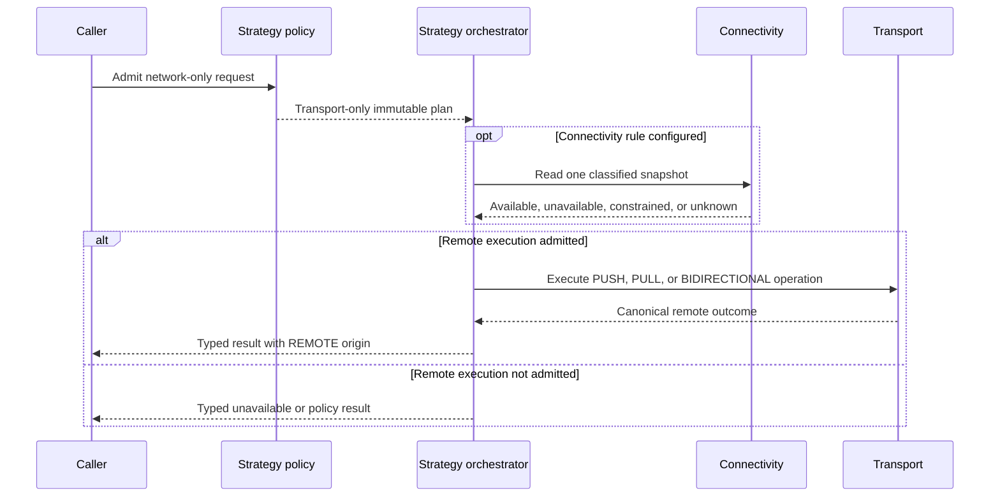

# Network-Only Strategy

> [!WARNING]
> Network-only is a mandatory built-in V1 strategy and is not implemented by
> the current runtime. Current provider resolution requires storage and
> transport, and the built-in pipelines always touch local storage.

[Strategy index](./README.md) · [Remote-first](./remote-first.md) ·
[Hybrid](./hybrid.md) · [Adaptive](./adaptive.md)

## Purpose

Choose network-only when the operation must use the remote transport directly
and must make zero DataLoom storage-provider and queue-provider calls.
Successful remote execution is required; unavailable connectivity or a remote
failure produces a typed outcome rather than local fallback or implicit
queueing.

Network-only is deliberately strict. It is not remote-first with fallback
disabled after the fact: storage and queue are absent from the effective plan.

Direction, transfer mode, and trigger remain distinct:

- `PUSH`, `PULL`, and `BIDIRECTIONAL` describe remote transfer direction.
- `FULL` and `DELTA` describe transfer scope.
- A direct or externally delivered platform trigger can execute a network-only
  plan.
- A DataLoom durable-queue trigger is incompatible because acquiring and
  completing that entry necessarily calls `QueueProvider`. Capability
  validation must reject that combination rather than silently changing the
  strategy.

## Current repository

Current
[`SynchronizationProviderBindings`](../api/provider-bindings.md) requires both
a storage provider ID and a transport provider ID. The coordinator resolves
that complete set before it selects and invokes a direction pipeline. See
[Provider Resolution](../architecture/provider-resolution.md) and
[Execution Coordinator](../architecture/execution-coordinator.md).

The built-in paths then:

- read local storage before PUSH and acknowledge storage after transport; and
- read a local checkpoint before PULL, apply remote changes locally, and write
  the checkpoint.

See [Outbound Push Pipeline](../api/outbound-push-pipeline.md) and
[Inbound Pull Pipeline](../api/inbound-pull-pipeline.md).

A custom pipeline that ignores the resolved storage instance, or a dummy
storage provider, is an application workaround. Neither is supported
network-only product behavior.

## V1 required behavior

The V1 rule is:

> Resolve only remote-plan capabilities, invoke transport without any
> DataLoom storage or queue operation, and return the canonical remote outcome.

The strategy must not invoke storage or queue before, during, or after this
sequence.

### Required plan semantics

1. Validate a transport provider and any explicitly configured connectivity,
   authentication, retry, or policy capabilities.
2. Reject any profile option or trigger that would require storage, cache,
   outbox, checkpoint persistence, or DataLoom queueing.
3. Evaluate and identify the immutable network-only plan.
4. Call transport directly with the operation's explicit input or remote cursor
   contract.
5. Return the canonical remote result and truthful metadata.
6. Permit only bounded in-call retry when explicitly configured; never promise
   restart-safe retry or background completion without changing to a different
   strategy.

For DELTA operations, any continuation/cursor needed after the call must be
supplied by the caller or remote protocol. Network-only cannot persist it
through `StorageProvider`.

## Provider requirements

| Capability | Requirement |
|---|---|
| Transport | Required. |
| Connectivity | Optional as an explicit admission input; remote execution may also provide the canonical unavailable outcome. |
| Authentication/policy | Required when the transport operation depends on them. |
| Clock/randomness | Optional for bounded in-call timeout/retry policy. |
| Storage | Forbidden. |
| Queue / outbox | Forbidden. |
| Scheduler for DataLoom deferred work | Forbidden. An external host may trigger a new call. |
| Cache/checkpoint persistence | Forbidden. |

Circuit and operational state may be provided by dedicated policy/operations
foundations if they do not call `StorageProvider` or `QueueProvider` on behalf
of the operation. Such use must be declared; it cannot introduce local data
fallback, deferred payload work, or a false restart guarantee.

## Guarantees

- Every successful result comes from transport.
- The plan performs zero `StorageProvider` and zero `QueueProvider` calls.
- There is no implicit cache read, local persistence, outbox, checkpoint write,
  fallback, or queue admission.
- Offline, constrained, unknown, or remote-unavailable behavior is typed and
  explicit.
- Cancellation is propagated and does not enqueue work.
- The result never claims durable completion beyond the transport's declared
  acknowledgement boundary.

Network-only does not guarantee operation survival across application process
death. The caller or an external idempotent trigger must admit a new operation.

## Failure and fallback semantics

| Condition | Required behavior |
|---|---|
| Transport provider missing or incompatible | Reject before execution with a typed capability error. |
| Connectivity unavailable or constrained | Return typed unavailable/policy result; do not enqueue or read local state. |
| Connectivity unknown or check failure | Follow an explicit network-only rule, such as attempt transport or reject; never infer a cache fallback. |
| Transient transport failure | Return it or perform only explicitly bounded in-call retry. No durable reschedule. |
| Authentication, authorization, validation, integrity, or policy denial | Return the canonical failure or required-user-action result. |
| Partial remote effect | Return partial/indeterminate state and remote idempotency evidence when available; do not fabricate local recovery. |
| Cancellation or process death | Current call ends; no DataLoom durable work is created. |
| Storage or queue option configured | Reject the invalid profile/trigger combination. |

Network-only has no fallback branch. A requirement for fallback means the
caller should select [Remote-first](./remote-first.md) or
[Hybrid](./hybrid.md).

## Persistence and restart

Network-only creates no per-operation DataLoom storage or queue record. For a
direct call, decision and event evidence may be delivered to configured
observers/exporters, but that does not turn the operation into durable work.

If the host or operating system persistently triggers a later invocation, the
trigger must carry the complete non-sensitive strategy/configuration identity
and an idempotency key. Each delivery is a new network-only admission and still
makes zero queue calls. The result must not promise that a killed in-flight
call will resume.

## Result and event metadata

Results must include:

- effective strategy `NETWORK_ONLY`;
- origin `REMOTE`;
- transport attempted/not-attempted;
- connectivity and remote outcome classification;
- remote acknowledgement/idempotency evidence where available;
- decision, plan, configuration, trigger, direction, and mode; and
- `durable=false`, `queued=false`, `localPersisted=false`, and
  `fallbackActivated=false` or equivalent typed fields.

Required events include network-only plan selected, connectivity decision,
remote attempt started/completed, bounded in-call retry when applicable, and
terminal outcome. There are no cache-served, local-persisted, queued, deferred,
or background-refresh events.

## Platform parity

Native Android, KMP Android, and KMP iOS must make the same forbidden calls and
map equivalent connectivity/transport outcomes identically. Platform
networking stacks may differ, but no platform may add an implicit local cache,
queue, WorkManager job, or iOS background task.

An unavailable platform transport capability returns an explicit unsupported
result instead of selecting remote-first or offline-first.

## Acceptance gates

- Strict spies fail the test on every storage, queue, outbox, checkpoint, or
  DataLoom scheduler call.
- Transport success produces `REMOTE` origin and truthful acknowledgement
  metadata.
- Offline, constrained, unknown, timeout, auth, validation, integrity,
  partial-effect, and cancellation cases return canonical typed outcomes.
- No failure path submits or reschedules queue work.
- A DataLoom durable-queue trigger is rejected before strategy execution.
- Any permitted in-call retry is bounded and disappears on cancellation or
  process death; results never claim restart recovery.
- PUSH, PULL, BIDIRECTIONAL, FULL, and DELTA pass with caller/remote-owned
  inputs and cursors.
- Native Android, KMP Android, and KMP iOS pass identical zero-local-call
  contract tests.

## Related documentation

- [Strategy decision guide](./README.md)
- [ADR-0002 V1 architecture](../adr/ADR-0002-v1-artifact-and-foundation-architecture.md)
- [Provider Bindings](../api/provider-bindings.md)
- [Transport Boundaries](../architecture/transport-boundaries.md)
- [Connectivity Provider](../api/connectivity-provider.md)
- [Error Model](../api/error-model.md)
- [GitHub issue #102: strategy implementation gate](https://github.com/dataloom-sdk/dataloom/issues/102)
