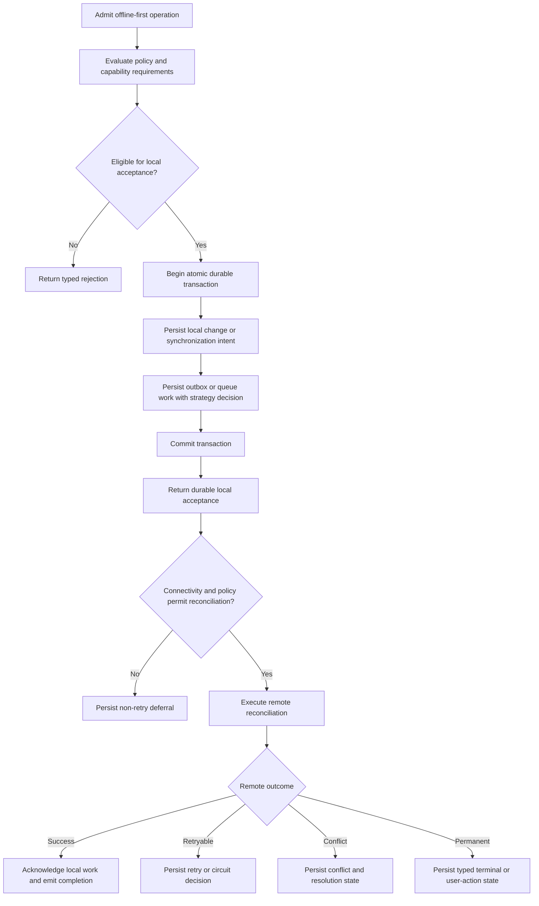

# Offline-First Strategy

> [!WARNING]
> Offline-first is a mandatory built-in V1 strategy. Its versioned profile and
> deterministic local-admission/deferral/reconciliation plan are implemented.
> The runtime still needs atomic execution of local intent plus durable work
> before the offline-first acceptance guarantee is complete.

[Strategy index](./README.md) · [Remote-first](./remote-first.md) ·
[Cache-first](./cache-first.md) · [Hybrid](./hybrid.md)

## Purpose

Choose offline-first when eligible local work must be accepted and protected
without waiting for remote availability. Synchronization reconciles that
durable local intent when connectivity and policy permit.

Offline-first does not mean “ignore the remote” or “retry every failure.” It
means the local acceptance boundary is durable, remote reconciliation is
eventual and observable, constraint deferral does not consume retry budget,
and conflicts cannot silently discard accepted work.

Direction, transfer mode, and trigger remain independent:

- `PUSH` reconciles durable local changes to the remote endpoint.
- `PULL` can durably record a refresh/reconciliation intent while the
  application continues to use its application-owned local repository.
- `BIDIRECTIONAL` protects eligible local changes before remote reconciliation
  and then applies the configured inbound/outbound plan.
- `FULL` and `DELTA` change transfer scope only.
- A direct, queued, scheduled, lifecycle, or connectivity trigger does not
  change the offline-first guarantees.

## Current repository

The repository already has:

- storage and transport provider contracts;
- outbound, inbound, and bidirectional pipelines;
- durable queue models and Room/in-memory queue providers;
- queue processing, worker wake-up planning, and Android WorkManager
  integration;
- connectivity preflight and retry-history-safe queued offline deferral; and
- retry, conflict, and event extension foundations.

See [Storage Provider](../api/storage-provider.md),
[Queue Provider](../api/queue-provider.md),
[Queue Submission](../api/queue-submission.md), and
[Connectivity-Aware Execution](../api/connectivity-aware-execution.md).

It does **not** yet provide the complete strategy because:

- local domain mutation and durable synchronization intent do not share one
  standard atomic transaction;
- queue submission and worker triggering are explicit host actions;
- direct connectivity rejection does not automatically become durable work;
- the request and queued entry do not carry an effective strategy/configuration
  decision;
- the standard built-in retry/circuit engine and its durable policy state are
  not complete; and
- complete conflict persistence, durable event delivery, and restart
  qualification remain release work.

## V1 required behavior

The V1 acceptance boundary is:

> Once DataLoom reports eligible offline-first work as accepted, the local
> intent and the durable reconciliation record survive process death and are
> not lost, duplicated, or silently reclassified.

### Required plan semantics

1. Evaluate eligibility, tenant/workflow policy, provider capabilities, and the
   immutable configuration snapshot.
2. Atomically persist local intent and durable synchronization work before
   returning accepted.
3. Record the effective strategy, plan/configuration version, idempotency key,
   trigger, and non-sensitive decision evidence with the work.
4. Defer while constraints are unmet without creating or consuming a retry
   attempt.
5. Reconcile through typed retry, circuit, and conflict policies.
6. Acknowledge or compact local work only after the configured remote
   durability boundary is proven.
7. Preserve unresolved and user-action-required states until an authorized
   transition resolves them.

DataLoom owns synchronization admission and reconciliation. The application
still owns its domain repository, query API, and UI state. See
[Storage Boundaries](../architecture/storage-boundaries.md).

## Provider requirements

| Capability | Requirement |
|---|---|
| Storage / transactional local state | Required for accepted local changes or synchronization intent. |
| Durable queue or outbox | Required whenever work may complete after the admitting call or survive restart. |
| Transport | Required when reconciliation executes; it need not be available at local acceptance time. |
| Connectivity | Required when policy distinguishes available, constrained, or unavailable execution. Unknown is handled explicitly. |
| Scheduler/background execution | Required when DataLoom promises autonomous reconciliation after the foreground caller exits. |
| Retry/circuit state | Required when remote failures can be retried. |
| Conflict persistence/resolver | Required for operations that can observe concurrent local and remote changes. |
| Event outbox/operations state | Required for durable acceptance, deferral, retry, conflict, and completion evidence. |

The local state change and outbox/queue record must share a transaction or an
equivalent atomic protocol. A best-effort “save, then enqueue” sequence is not
an offline-first guarantee.

## Guarantees

- Accepted eligible local work is durable before success is returned.
- The work has a stable idempotency identity across retries and restart.
- Offline or constrained execution is deferral, not retry.
- Retry N remains retry N across connectivity deferral, lease recovery, and
  process death.
- Remote acknowledgement cannot erase newer or unacknowledged local work.
- Conflicts preserve both sides and decision evidence until policy resolves
  them.
- Restart uses the recorded strategy and plan unless an authorized
  re-evaluation transition is durably recorded.
- Cancellation stops current execution without deleting already accepted
  durable intent.

This is eventual synchronization, not a promise of immediate remote
consistency.

## Failure and fallback semantics

| Condition | Required behavior |
|---|---|
| Local transaction or outbox commit fails | Return a typed failure; do not report accepted and do not attempt remote reconciliation for an uncommitted intent. |
| Connectivity unavailable, constrained, or unknown | Persist a non-retry deferral when allowed; preserve retry history exactly. |
| Connectivity provider missing or fails | Apply an explicit profile rule: typed rejection/degradation or durable deferral. Never guess connectivity. |
| Transient transport failure | Evaluate retry/circuit policy and persist the decision; keep local work pending. |
| Authentication, authorization, validation, or integrity failure | Do not availability-retry indefinitely. Persist a terminal or user-action-required state with redacted diagnostics. |
| Conflict | Persist the conflict and invoke the configured resolver; enforce loop protection and convergence limits. |
| Duplicate or late remote acknowledgement | Apply idempotently and acknowledge only the matching local version. |
| Cancellation | Propagate cancellation; preserve committed local/outbox state for a later authorized execution. |

Offline-first has no fallback to network-only or another strategy unless that
transition is part of an explicit higher-level hybrid/adaptive policy and is
recorded before execution.

## Persistence and restart

The durable record must preserve:

- request/workflow/session and idempotency identities;
- requested and effective strategy;
- configuration and plan versions;
- local change/outbox identity and local version;
- trigger and admission decision evidence;
- current durable state and next availability;
- retry attempt, elapsed budget, and circuit state;
- checkpoint/acknowledgement state;
- conflict and user-action state; and
- redacted event/audit correlation.

Reacquisition resumes from the last committed transition. It does not rerun
already acknowledged effects, clear retry history, or evaluate a different
strategy because connectivity changed. An authorized re-evaluation must record
the old decision, new decision, reason, actor/policy, and fencing/version check.

See [Durable Queue Processing Flow](../architecture/durable-queue-processing-flow.md),
[Queued Synchronization Retry Flow](../architecture/queued-synchronization-retry-flow.md),
and [Queue Worker Wake-Up and Recovery](../architecture/queue-worker-wakeup-recovery-flow.md).

## Result and event metadata

Results must identify:

- effective strategy `OFFLINE_FIRST`;
- `LOCAL`, `REMOTE`, or `MIXED` origin where relevant;
- accepted-local, deferred, reconciling, conflicted, user-action-required, or
  completed disposition;
- durable work and plan IDs;
- local version and acknowledged version without payload disclosure;
- retry/circuit/conflict state; and
- outstanding reconciliation count or state.

Required events include local work accepted, strategy evaluated, plan selected,
constraint deferred, reconciliation started, retry/circuit decision, conflict
persisted/resolved, remote acknowledgement applied, and reconciliation
completed. Events are emitted after the corresponding durable transition and
never from inside a provider transaction or mutex.

See [Runtime Operational Events](../api/runtime-operational-events.md) and
[Observation Boundaries](../architecture/observation-boundaries.md).

## Platform parity

Native Android, KMP Android, and KMP iOS must expose the same durable acceptance,
deferral, retry-history, conflict, and recovery semantics. Room/WorkManager and
iOS storage/background APIs may implement those guarantees differently.
Operating-system scheduling delay is observable timing variation, not
permission to drop work or report false success.

If a platform cannot provide the configured durable/background capability, V1
returns an explicit unsupported or degraded result before acceptance.

## Acceptance gates

- Atomicity tests fail every boundary between local-state and outbox writes and
  prove there is no accepted-but-lost work.
- The initial real failure after any number of offline deferrals is evaluated
  as retry attempt 1.
- Retry N remains N through offline deferral and expired-lease recovery on
  Room and in-memory implementations.
- Process death at every durable transition resumes exactly once without
  duplicating a remote effect.
- Authentication, validation, integrity, cancellation, and conflict outcomes
  never enter an unrestricted availability retry loop.
- Concurrent local edits cannot be erased by an acknowledgement for an older
  version.
- PUSH, PULL, and BIDIRECTIONAL pass with FULL and DELTA transfers.
- Direct and compatible queued/scheduled triggers produce equivalent
  observable semantics.
- Required metadata and durable events survive relaunch.
- Native Android, KMP Android, and KMP iOS pass one shared contract kit and
  end-to-end recovery scenario.

## Related documentation

- [Strategy decision guide](./README.md)
- [ADR-0002 V1 architecture](../adr/ADR-0002-v1-artifact-and-foundation-architecture.md)
- [V1 production-readiness audit](../audits/DL-AUDIT-004-v1-production-readiness.md)
- [Queue Boundaries](../architecture/queue-boundaries.md)
- [Retry Boundaries](../architecture/retry-boundaries.md)
- [Conflict Boundaries](../architecture/conflict-boundaries.md)
- [GitHub issue #94: retry and circuit-breaker engine](https://github.com/dataloom-sdk/dataloom/issues/94)
- [GitHub issue #95: conflict engine and persistence](https://github.com/dataloom-sdk/dataloom/issues/95)
- [GitHub issue #102: strategy implementation gate](https://github.com/dataloom-sdk/dataloom/issues/102)
