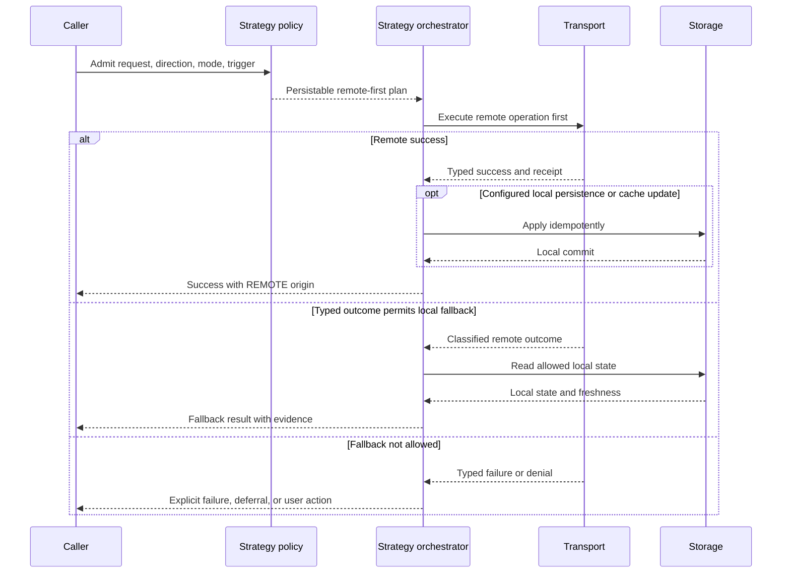

# Remote-First Strategy

> [!IMPORTANT]
> Direct provider-backed remote-first execution is implemented in common
> Kotlin for `PUSH`, `PULL`, and `BIDIRECTIONAL`. Typed local fallback is
> implemented for the pull path. This is not yet the complete V1 gate:
> durable replay, retry/circuit orchestration, conflict persistence, complete
> strategy events, and platform contract-kit qualification remain open.

[Strategy index](./README.md) · [Network-only](./network-only.md) ·
[Cache-first](./cache-first.md) · [Hybrid](./hybrid.md)

## Purpose

Choose remote-first when the remote path is authoritative and must be attempted
before any configured local fallback or local persistence behavior.

Remote-first differs from network-only because a remote-first profile may
declare local fallback, caching, reconciliation, or durable recovery. It
differs from cache-first because local state is never consulted first merely
because it is available.

Direction, mode, and trigger remain orthogonal:

- `PULL` attempts the remote source before any allowed local fallback.
- `PUSH` requires a remote acknowledgement as its configured success boundary;
  a local provider may still supply outbound changes.
- `BIDIRECTIONAL` uses an explicit operation plan; inbound-first ordering alone
  does not define authority or fallback.
- `FULL` and `DELTA` change transfer scope only.
- Direct, queued, scheduled, or platform triggers do not change which source is
  authoritative.

## Current implementation

`DataLoom.synchronize(StrategySynchronizationRequest, StrategyProviderBindings)`
now evaluates the profile before provider resolution and dispatches an admitted
`REMOTE_FIRST` plan to a dedicated executor. The supported direct path:

- resolves only capabilities required by the primary and possible fallback
  branches;
- uses canonical provider-backed pipelines for outbound reads and configured
  inbound persistence;
- permits a transport-only pull when `persistRemoteResult` is `false` and no
  fallback is configured;
- preserves exact provider-backed or pull output;
- classifies provider failures without catching unexpected exceptions;
- activates local state only when the classified outcome is in the immutable
  profile allowlist; and
- records whether transport ran, the primary error, fallback outcome,
  freshness, and completed operations in typed results.

The local fallback adapter implements `StrategyLocalFallbackProvider`. It
reports only `FRESH`, `STALE`, or unavailable synchronized local state;
application repositories continue to own domain queries and payload delivery.
The adapter is validated before the remote attempt whenever the admitted plan
may need it.

The following boundaries remain:

| Area | Current status | Remaining V1 gate |
|---|---|---|
| Direct `PUSH`, `PULL`, `BIDIRECTIONAL` | Implemented | Full cross-platform contract matrix |
| Persisted pull | Uses the canonical inbound pipeline | Crash-safe strategy decision and outstanding-effect replay |
| Typed pull fallback | Implemented for pre-call unavailability and allowlisted provider outcomes | Durable fallback transition/event record |
| Push failure | Always remains a failure; it cannot become local-read success | Retry/circuit and durable rescheduling policy |
| Durable/platform triggers | Rejected by the strategy coordinator | Persisted-plan reacquisition and restart orchestration |
| Conflict | Protected from fallback | Built-in persistence/orchestration around application domain resolvers |
| Events | Existing pipeline lifecycle/phase events run on provider-backed paths | Strategy decision, classification, fallback, and recovery events |

`INBOUND_THEN_OUTBOUND` remains an ordering option in the legacy bidirectional
pipeline. Ordering alone is not a remote-first policy and is not used as proof
of this strategy implementation.

## V1 required behavior

The V1 rule is:

> Attempt the configured remote operation first. Only a typed remote outcome
> explicitly allowlisted by the immutable profile may activate the declared
> local fallback, persistence, or deferral branch.

### Required plan semantics

1. Validate transport and every configured fallback/persistence capability
   before admission.
2. Evaluate and record the strategy/configuration decision.
3. Attempt transport first.
4. Classify the remote outcome through canonical error/policy contracts.
5. On success, perform configured local persistence or reconciliation
   idempotently.
6. On failure, enter only the configured branch: local fallback, durable
   deferral, retry/circuit evaluation, explicit failure, or required user
   action.
7. Report the actual origin and any incomplete local persistence.

Fallback is a policy transition, not a catch block.

## Provider requirements

| Capability | Requirement |
|---|---|
| Transport | Always required and invoked before local fallback. |
| Storage | Required only when outbound input, local fallback, cache update, checkpoint, or reconciliation is in the selected plan. |
| Queue / durable work store | Required only when the profile promises deferred or restart-safe completion. |
| Connectivity | Required when admission distinguishes connectivity states; unknown is a typed input. |
| Scheduler/background execution | Required only for promised deferred retry, persistence, or reconciliation. |
| Retry/circuit state | Required when a remote failure can be retried or circuits affect admission. |
| Conflict state/resolver | Required when remote success or fallback can meet concurrent local changes. |

Unlike the current universal provider binding, a pull with remote success and
no local persistence can be transport-only. A remote-first PUSH may still
require storage as its outbound source; “remote-first” does not erase
operation-specific input requirements.

## V1 target guarantees

- The remote operation is attempted before local fallback.
- A missing or unhealthy transport is not silently treated as local success.
- Fallback occurs only for configured canonical outcome classifications.
- Authentication, authorization, validation, integrity, conflict, and policy
  denial do not become availability fallback by default.
- The result states whether it came from remote, local fallback, or mixed
  reconciliation.
- Configured local persistence is either completed, durably recoverable, or
  reported as incomplete; it cannot disappear behind remote success.
- Durable restart reuses the recorded plan and does not choose a new fallback
  because runtime conditions changed.

Remote-first does not guarantee offline operation unless the profile explicitly
defines and can durably support an offline fallback or deferral branch.

## Failure and fallback semantics

| Condition | Required behavior |
|---|---|
| Connectivity unavailable before remote call | Apply the configured typed branch: fail, defer, or local fallback. Do not claim that the remote path was attempted. |
| Connectivity unknown or connectivity provider failure | Use an explicit rule; never assume available or unavailable. |
| Remote timeout or transient availability failure | Apply retry/circuit policy or an allowlisted fallback. Record the classification and rule. |
| Authentication or authorization failure | Return failure or required user action. Local fallback is disabled unless a narrowly approved policy explicitly allows it. |
| Validation, integrity, or incompatible response | Return typed failure; do not hide corrupt or invalid remote state with cached data. |
| Remote no-change/empty success | Treat as a successful remote outcome, not as fallback permission. |
| Local fallback missing or too stale | Return the configured miss/stale outcome; never silently relax freshness. |
| Remote succeeds, local persistence fails | Return partial/recoverable persistence state or fail according to the declared consistency boundary. Preserve the remote receipt/idempotency evidence. |
| Conflict with local changes | Persist and resolve through the configured conflict policy before reporting convergence. |
| Cancellation | Propagate cancellation; do not activate fallback. |

### Failure classification contract

Transport adapters should return an error implementing
`ClassifiedStrategyRemoteError` when they can prove an exact
`StrategyRemoteOutcome`, such as `TIMEOUT`, `RATE_LIMITED`, or
`SERVER_FAILURE`. Generic errors are mapped conservatively:

- authentication, authorization, validation, integrity/security, and conflict
  categories map to their protected outcomes;
- everything else maps to `UNKNOWN_FAILURE`; and
- no message parsing, exception-name matching, or platform heuristic is used.

`UNKNOWN_FAILURE` can activate fallback only when the application explicitly
places that outcome in `fallbackOn`. A missing fallback capability is rejected
before transport, rather than failing after a remote side effect.

## Persistence and restart

A direct non-durable remote call may have no restart guarantee; cancellation or
process death leaves the caller responsible for an idempotent new admission.
That limitation must be explicit in the plan and result.

If the profile promises local persistence, deferred fallback, retry, or
reconciliation, V1 must durably record:

- strategy/configuration/plan identity;
- the typed primary outcome and fallback rule, if activated;
- remote request idempotency key and non-sensitive receipt;
- completed and outstanding effects;
- local version/checkpoint state;
- retry/circuit/conflict state; and
- current disposition and event correlation.

After remote acknowledgement, any required local apply step must be atomic with
a recovery record or be completed before terminal success. Restart resumes that
step without repeating a non-idempotent remote effect.

## Result and event metadata

Results must include:

- requested and effective strategy `REMOTE_FIRST`;
- origin `REMOTE`, `LOCAL`, or `MIXED`;
- whether the remote operation was attempted;
- remote outcome classification;
- fallback rule and reason, when activated;
- local freshness when fallback data was used;
- remote receipt and outstanding persistence state in non-sensitive form; and
- decision, plan, configuration, trigger, retry, and conflict identities.

Required events include remote-first plan selected, remote attempt started,
remote outcome classified, fallback activated/rejected, local persistence
started/completed, recovery required, and final completion. A fallback event is
emitted only after the transition allowing fallback is recorded.

See [Synchronization Result](../api/synchronization-result.md) and
[Synchronization Events](../api/synchronization-events.md).

## Platform parity

Native Android, KMP Android, and KMP iOS use the same remote-first
classification and fallback rules. Platform connectivity APIs or background
limits may produce different evidence, but equivalent evidence must map to the
same typed policy result.

No platform may use local state first, relax freshness, or enable fallback
merely because its transport or scheduler implementation differs.

## Acceptance gates

- A recording provider proves transport is called before every local fallback
  read.
- Remote success without configured persistence makes zero storage calls.
- Every allowlisted failure class activates exactly the declared branch.
- Auth, validation, integrity, conflict, cancellation, and policy-denial tests
  prove fallback is not activated accidentally.
- Remote success plus local-persistence crash recovers without repeating the
  remote effect or reporting false convergence.
- Local fallback miss and stale-state cases return typed outcomes.
- Results and events identify whether the remote call occurred and why fallback
  was permitted.
- PUSH, PULL, and BIDIRECTIONAL pass with FULL and DELTA modes.
- Direct and every compatible durable trigger preserve the same authority and
  fallback semantics after restart.
- Native Android, KMP Android, and KMP iOS pass the shared contract kit.

## Related documentation

- [Strategy decision guide](./README.md)
- [ADR-0002 V1 architecture](../adr/ADR-0002-v1-artifact-and-foundation-architecture.md)
- [Execution Coordinator](../architecture/execution-coordinator.md)
- [Inbound Pull Pipeline](../api/inbound-pull-pipeline.md)
- [Bidirectional Pipeline](../api/bidirectional-pipeline.md)
- [Connectivity-Aware Execution](../api/connectivity-aware-execution.md)
- [GitHub issue #102: strategy implementation gate](https://github.com/dataloom-sdk/dataloom/issues/102)
